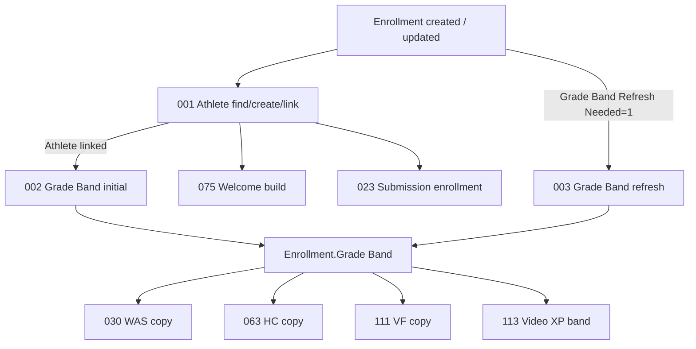
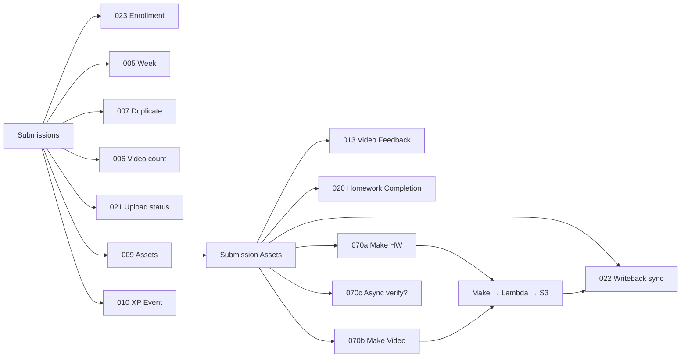
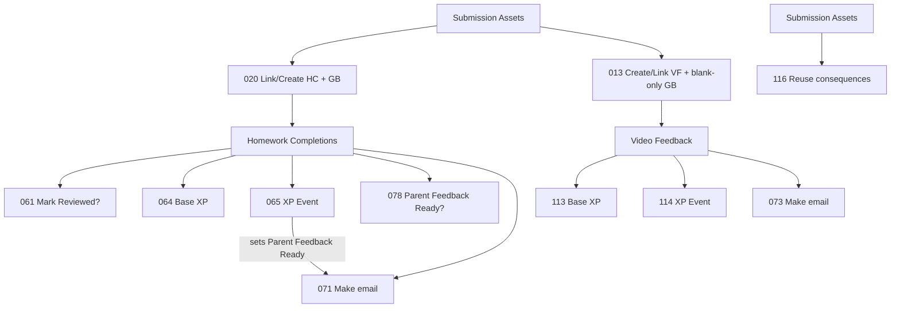

# Airtable Automation Dependency Map — DEV

**As-of:** 2026-07-14 · Stage S21 · Analysis only  
**Companion:** [INVENTORY](./AIRTABLE-AUTOMATION-INVENTORY.md)

---

## How to read this map

- **Edges** are field writes / formula flags / view entries — Airtable does not hard-chain automations.
- Triggers marked **docs** come from the Automations documentation table (may drift from UI).
- External systems: **Make**, **Lambda**, **S3**, **Fillout**, optional email webhooks.

---

## Folder 01 — Enrollment (deep dive)

| Dependency | Type | Risk if broken |
|------------|------|----------------|
| 001 → 002 | Soft (Athlete must exist) | 002 throws / skips |
| 002 ↔ 003 | Lifecycle split | Lost grade-change refresh |
| Docs 001/002 conditions | **Suspected swap** vs scripts | Orchestrator premature |

**Orchestrator note:** One enrollment orchestrator is **Combine with conditions** long-term, but **blocked** until Mike verifies live 001/002 views.

---

## Submission intake → assets → XP

| Pair | Relation | Orchestrator? |
|------|----------|---------------|
| 006 + 021 | Same table prep | **Combine safely** |
| 009 → 013 / 020 | Asset fan-out | Keep separate |
| 070a / 070b / 070c / 022 | Upload path | **Needs investigation** — do **not** merge near-term |
| 010 ↔ 041 | XP → level flag | **Keep separate** |

---

## Homework + video XP

| Edge | Note |
|------|------|
| 065 → 071 | 065 already arms Parent Feedback Ready — **078 likely redundant** |
| 064 ≠ 065 | Prep vs award — do not merge |
| 113 ≠ 114 | Same |
| **013 ← 111** | Phase C2 IN FLIGHT — GB blank-only repair in 013; retire 111 after post-paste PASS |
| **020 ← 063** | Phase C1 COMPLETE — GB repair in 020; 063 deleted |

---

## Weekly Athlete Summary

| Automation | Depends on | Feeds |
|------------|------------|-------|
| 031 | Counted Submission | WAS create |
| **030** (combined) | Enrollment.Grade Band; then Week+GB | WAS.Grade Band → Goal → Homework |
| 034 | Enrollment + Week | Prior-week helpers |
| 057 → 058 | Perfect Week queue | Unlock → 059 |

**Phase B COMPLETE:** former 032/033 absorbed into **030**; deleted from DEV UI. Keep 031 and 034 separate.

---

## Levels

| Automation | Role | Dependency |
|------------|------|------------|
| 041 | Sets Level Recalc Needed from XP | After XP Events |
| 042 | Assigns Current/Next Level **and Level Gate Rule** | After 041 |
| 043 | Sets Level Gate Rule from Next Level | Fold into **042** only with replacement evidence — **not** because OFF |

---

## Zoom

| Automation | Path | Notes |
|------------|------|-------|
| 101 | Live meeting XP | Keep separate |
| **117** (OFF) | Recording Quiz orchestrator A→F | Present in DEV; blank webhook; trigger not configured |

---

## Email / Make external map

| Cluster | Automations | External |
|---------|-------------|----------|
| Upload | 070a, 070b, (070c) | Make → Lambda → S3 |
| HW email | 071 (+078?) | Make webhook |
| VF email | 073 | Make webhook |
| Weekly | 072 build → 074 send | Make |
| Daily | 076 build → 077 send | Make |
| Welcome | 075 | Package; send may be separate/Make |

**EMC orchestrator:** 071–077 → 2 builders/senders long-term (high regression surface).

---

## Test harness

| Automation | Depends on | Rule |
|------------|------------|------|
| 115 | Testing Scenarios + intake ON | **Never** retire for capacity |

---

## Safe orchestrator groupings (evaluated)

| Group | Verdict | Slots |
|-------|---------|------:|
| Folder 01 enrollment monolith | **Blocked** — trigger investigation first | 0 now |
| 006+021 submission prep | **Safe** — first capacity phase | +1 |
| 030+032+033 WAS bootstrap | **Conditional** — confirm fire order | +2 |
| 063→020 / 111→013 | **Conditional** — create-path audit | +2 |
| 043→042 | Replacement evidence only — **not because OFF** | +1 optional |
| 061 / 078 | **Keep** — required; not deletable for OFF/missing GH | 0 |
| 070a/b/c+022 | Keep separate; OFF intentional; no upload orchestrator | 0 |
| 117 recording | Paste after consolidation frees +1 | −1 net after Phase A |
| 072∪074 (then EMC) | Later consolidation among required email autos | +1 (+more) |

Full migration order: [REFACTOR-PLAN](./AIRTABLE-AUTOMATION-REFACTOR-PLAN.md).
