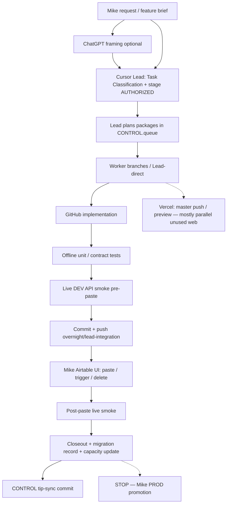

# Delivery System — Current-State Review

**Status:** Historical analysis (basis for v2.0)  
**Date:** 2026-07-15  
**Superseding OS:** [DELIVERY-SYSTEM-V2-PROPOSAL.md](./DELIVERY-SYSTEM-V2-PROPOSAL.md) — **governs entire remaining V2 rebuild**; pilot is validation only  
**Worker model:** [DELIVERY-SYSTEM-WORKER-AGENT-MODEL.md](./DELIVERY-SYSTEM-WORKER-AGENT-MODEL.md)  
**Evidence window:** Overnight Desktop v1 (2026-07-12+) through S29 / Phase D closeout (2026-07-15)

**Companion docs:**

| Doc | Purpose |
|-----|---------|
| [DELIVERY-SYSTEM-V2-PROPOSAL.md](./DELIVERY-SYSTEM-V2-PROPOSAL.md) | Active operating model |
| [DELIVERY-SYSTEM-WORKER-AGENT-MODEL.md](./DELIVERY-SYSTEM-WORKER-AGENT-MODEL.md) | Lead/worker first-class |
| [DELIVERY-SYSTEM-V2-PILOT.md](./DELIVERY-SYSTEM-V2-PILOT.md) | Validation charter |
| [DELIVERY-SYSTEM-ROLE-MATRIX.md](./DELIVERY-SYSTEM-ROLE-MATRIX.md) | Roles |
| [DELIVERY-SYSTEM-TEST-GATES.md](./DELIVERY-SYSTEM-TEST-GATES.md) | Test hierarchy |
| [DELIVERY-SYSTEM-HANDOFF-TEMPLATE.md](./DELIVERY-SYSTEM-HANDOFF-TEMPLATE.md) | Mike UI handoff |
| [DELIVERY-SYSTEM-STATE-MODEL.md](./DELIVERY-SYSTEM-STATE-MODEL.md) | State model |
| [../deploy-checklists/DELIVERY-SYSTEM-MIKE-DECISION-SHEET.md](../deploy-checklists/DELIVERY-SYSTEM-MIKE-DECISION-SHEET.md) | Locked decisions |

---

## Executive verdict

The project has evolved a **real, evidence-backed delivery operating system** that is stronger than the written five-phase theory alone. Recent Phase A–D automation consolidation (006→021, 032/033→030, 063→020, 111→013, 074→072) demonstrates a repeatable pattern: authorize → implement in GitHub → offline contracts → pre-paste live smoke → Mike paste OFF → post-paste smoke → retire absorbed slot → rollback package on disk → CONTROL tip sync.

The same system is **documentation-heavy, UI-gate heavy, and multi-source-of-truth fragile**. GitHub leads for scripts; Airtable DEV holds the true deployed/ON-OFF truth with **no automation API inventory**; `PROJECT_STATE.md` lags CONTROL by days; Lead frequently finishes worker work; tip-sync commits dilute history; and Mike remains the mandatory deploy actuator for paste/trigger/delete actions.

**Reuse thesis:** The *pattern* (feature-once DEV approval, CONTROL queue, rollback folders, capacity ledger, Mike one-sheet UI gates, LIVE DEV smoke with blank webhooks) is portable to other Airtable/Vercel apps. The *branch proliferation and multi-doc state* should not be copied as-is.

---

## 1. Current operating model (actual)

### 1.1 End-to-end flow (as practiced July 2026)

| Step | What actually happens | Evidence |
|------|----------------------|----------|
| **Mike request** | Feature outcome + acceptance once (DEV execution model); later “Authorize Phase X UI” signals | `DEV-EXECUTION-AND-PROMOTION-MODEL.md`; Phase D Mike signal |
| **ChatGPT framing** | Architecture / catalogs / owner decisions for C-025/C-027; not always in the critical path for overnight stages | Config catalog stage16; doc 04 |
| **Cursor authorization** | Stage `S*-AUTHORIZED.md` + CONTROL `auth` / queue state | S24–S29 AUTHORIZED docs |
| **Lead planning** | Queue packages in CONTROL; often Lead-direct instead of 4 workers | CONTROL `claimed_by: lead`; S29 “Lead-direct” |
| **Agent assignment** | Worker branches `overnight/v2-run/worker-{a-d}-sN-scope` + worktrees; frequently lag | Branches behind Lead by 2–15 commits; S27/S29 notes |
| **Implementation** | Scripts in `airtable/automations/…`, tools, deploy checklists | Phase A–D combined scripts |
| **Testing** | Offline unittest + dedicated live smoke Python suites | Phase D 20/20 offline; CRITICAL_PASS live JSON |
| **Integration** | Merge to `overnight/lead-integration`; regression noted in CONTROL.tests | CONTROL.tests block |
| **GitHub commit/push** | Lead pushes tip; frequent `docs: tip-sync CONTROL` | ≥9 tip-sync commits in recent log; ~256 commits ahead of `master` |
| **Mike Airtable UI** | Paste script (skip GH header), configure trigger/inputs, ON/OFF, delete retired | `PHASE-*-mike-ui-actions.md`; `AUTOMATION-117-mike-activation-sheet.md` |
| **Live DEV smoke** | Agent-run suites after Mike paste; blank webhook / no-send | Post-paste smoke JSON under `docs/audits/` |
| **Closeout** | Migration record + closeout MD + capacity ledger update | `S28-phase-d-closeout.md` |
| **PROD promotion** | Explicitly blocked; packages exist, not executed | CONTROL `C-023-prod-automation-paste` BLOCKED_PROD |
| **Vercel** | Parallel web work (`/dashboard`, athlete profile); not gate for Airtable phases | `website-overnight-build` COMPLETE; build PASS |

### 1.2 Documented vs actual — deltas

| Documented (doc 04 / overnight OS) | Actual July 13–15 | Delta |
|-----------------------------------|-------------------|-------|
| Five phases P1→P5 with ChatGPT always in P2/P4 | Overnight Lead runs often skip ChatGPT mid-flight after feature brief | ChatGPT underused in stage loops; overloaded at planning |
| Workers implement; Lead integrates | Lead-direct completion is default when workers stall | Worker specialization weaker than designed |
| One write lane; workers for inventory | Multi-worker branches created; Lead still writes primary path | Branch noise without proportional parallelism payoff |
| OMNI first for in-Airtable | Approved features use Cursor + Meta API where possible; Mike still pastes automations | OMNI vs Cursor boundary muddy for formulas vs scripts |
| CONTROL is overnight SoT | CONTROL rich and current; `PROJECT_STATE.md` last major update **2026-07-11** | Dual “start here” docs diverge |
| Local=remote for DoD | Usually true on Lead tip; worker worktrees often **behind** | Path/SHA advice can point at stale worktree |
| Automation ON/OFF inventoriable | Capacity is **estimated**; “no visible Airtable counter”; View API unavailable | Deployed truth not machine-readable |
| Feature-once DEV autonomy | Honored for schema/API work; UI paste/delete still Mike every phase | Correct safety, high friction |

### 1.3 Component interaction map

| Actor | Writes | Reads | Blocks |
|-------|--------|-------|--------|
| **Mike** | Airtable UI (paste, triggers, delete, rename); approvals | Sheets, ChatGPT summaries | PROD, sends, archive |
| **ChatGPT** | Plans (outside repo) | Briefs, recovery packages | Must not invent paths/triggers |
| **Cursor Lead** | Repo + CONTROL + smoke | Full repo + DEV API | Must stop on hard gates |
| **Worker agents** | Bounded branch files | Assignment docs | No Lead merge authority |
| **GitHub** | Commits on overnight branches | CI none/minimal for AT scripts | Does not deploy Airtable |
| **Airtable DEV** | Records, formulas (API); automations (UI) | Meta API schemas | Automation script body not exportable via API today |
| **Airtable PROD** | Mike-only | Promotion docs | Cursor stops |
| **Vercel** | Deploy from `web/` on push | Env vars | Untied from AT capacity work |
| **Make/AWS** | External; blank webhook = no-send | Webhooks from AT | Real sends blocked |

---

## 2. What is working (strengths)

### 2.1 Bounded authorization + hard stops

Overnight OS + DEV execution model cleanly separates **standing DEV work** from **PROD / archive / real sends / credentials**. CONTROL `gates` and `pending_approvals` encode this. Phase A–D never touched PROD; 117 stays OFF with blank webhook — repeated explicitly in sheets.

### 2.2 Rollback discipline

Every consolidation ships `_rollback/phase-*-YYYY-MM-DD/` with prior scripts + restore procedure (Phase D README is exemplary: OFF combined → restore both → restore triggers → leave OFF). Critical-fail stop conditions appear in migration records.

### 2.3 Live DEV testing with no-send defaults

Pattern matured across C1/C2/D: offline contracts → pre-paste live suite → Mike paste → post-paste suite → JSON evidence under `docs/audits/`. Blank webhook / `sendMode=test` / `autoSendAfterBuild=false` is institutionalized.

### 2.4 Automation-capacity management

Capacity ledger + corrected rule **OFF ≠ deletable** prevented bad deletions (061/078 retraction). Path A–E consolidation freed slots 50→45 estimated with evidence trail. Inventory + dependency map + refactor plan form a reusable Airtable architecture pack.

### 2.5 Source-of-truth rules for scripts

GitHub remains SoT for shippable automation JS. Paste boundary (“skip GitHub header”) is consistent. Version fields in docblocks (072 v4.0.0, 117 v1.0.1) enable human drift checks.

### 2.6 Parallel website work without blocking capacity

Website packages (`website-overnight-build`, S27/S29 athlete profile) progressed on same Lead branch while Airtable UI gates waited — correct use of unused surface for agent capacity without Airtable mutations.

### 2.7 CONTROL + handoff tracking

CONTROL queue states, deliverables[], notes, next_action, and tests block give a single resume surface for Lead. Morning handoffs (S26, S29) now increasingly compress to tables + one next action.

**Concrete win:** Phase A→D over ~2 calendar days moved DEV capacity from 0 free to **5 free**, with offline + live CRITICAL PASS each wave, under explicit Mike UI authorizations.

---

## 3. What is inefficient or error-prone

| # | Issue | Root cause | Impact | Recommended correction |
|---|-------|------------|--------|------------------------|
| 1 | **Inaccurate / relative file paths in advice** | ChatGPT or workers invent paths; Windows vs repo-relative mix | Mike paste fails or wrong file | Handoff template requires absolute Windows path + Lead `Test-Path` before present |
| 2 | **Stale branches / worktrees not matching Lead tip** | Workers created from earlier tip; Lead-direct finishes without merging workers | Local open file ≠ pushed SoT; “behind N commits” | Max 2 workers; auto-reset worktrees from Lead tip each stage; discard unused worker branches weekly |
| 3 | **Unclear Cursor / OMNI / ChatGPT / Mike** | Documented OMNI-first conflicts with feature-once Cursor ownership | Wrong tool used; duplicated planning | Role matrix: ChatGPT plans; Cursor owns approved DEV; OMNI only Mike-led ad-hoc; Mike only UI gates listed |
| 4 | **Inconsistent trigger instructions** | Multiple sheets + ChatGPT paraphrase + Airtable UI vocabulary drift | Wrong conditions; accidental fires | One sheet per UI gate; ChatGPT forbidden to invent triggers; cite sheet SHA |
| 5 | **Incorrect Airtable UI assumptions** | Agents assume View API / automation API / visible slot counter | False “blocked” or invented UI | Document capability matrix (API vs UI-only); verify UI with Mike when unknown |
| 6 | **Repeated copy/paste handoffs** | Verbosity across AUTHORIZED + handoff + action sheet + CONTROL notes | Mike fatigue; contradictory snippets | Single Mike sheet = only human-facing artifact; others are agent audit |
| 7 | **Overly verbose / too many status docs** | Stage auth + result + closeout + migration + morning report + tip-sync | Stale contradictions; scan cost | Keep auth+migration+mike-sheet+CONTROL; demote results to optional |
| 8 | **CONTROL tip-sync commits** | CONTROL embeds SHA → every push needs follow-up tip sync | History noise; SHA mismatch windows | Store `sha` as optional lagging pointer OR auto-update in same commit as feature |
| 9 | **Duplicated planning** | ChatGPT brief + backlog + CONTROL + Master Plan Brief | Conflicting priority | Backlog + CONTROL only; Brief is generated view |
| 10 | **Agents stalling; Lead finishes workers** | Subagent latency / path confusion / approval friction | Parallelism theater | Default Lead-direct; spawn workers only for true path-disjoint work |
| 11 | **No Airtable automation API** | Platform limitation | Cannot verify paste/ON-OFF/triggers programmatically | Deployment manifests + checksum fields + periodic Mike export; explore enterprise API / browser automation later |
| 12 | **GitHub vs Airtable deployed gap** | Paste is manual; no checksum in base | Unknown deployed version | Add Config / Automation Registry fields: Script Version, Content SHA, Pasted At |
| 13 | **Unclear live-test ownership** | Both Mike (trigger fire) and Cursor (API smoke) | Double-wait or skipped smoke | Cursor owns API smoke; Mike owns only UI actions + reply phrase |
| 14 | **Excessive manual UI work** | Every slot change needs paste/delete | Throughput bound by Mike | Batch UI gates; prefer Meta API for schema; orchestrators reduce future pastes |
| 15 | **Weak deployed-version visibility** | Version only in script comments | Hard audits | Registry table + paste verification checklist with SHA compare |
| 16 | **`PROJECT_STATE.md` stale vs CONTROL** | Two “read first” docs | Wrong startup context | Project state = quarterly/static IDs; CONTROL = live ops tip |
| 17 | **Lead branch drift from `master` (~256 commits)** | Overnight integration never squash-merged / promoted | Harder PR hygiene; recovery confusion | Periodic squash PR of docs+approved code to `master` after Mike gate |
| 18 | **Retracted advice risk (e.g. 112 DEV delete, OFF=deletable)** | Inventory without UI confirm | Dangerous recommendations | “UI-confirmed” flag before any delete recommendation |

---

## 4. Role clarity gaps (current misassignment)

| Work currently done by wrong role | Should be |
|-----------------------------------|-----------|
| ChatGPT writing long paste/trigger runbooks that Cursor already owns | ChatGPT: outcome + acceptance; Cursor: sheet |
| Mike asked to explore schema when Meta API available under approved feature | Cursor API in DEV |
| Lead implementing worker-assigned packages after spawn | Either don’t spawn, or wait/timeout then Lead with audit note |
| CONTROL + PROJECT_STATE both claiming “live” tip | Split static vs ops tip (see State Model) |
| Capacity estimated by math without UI confirmation | Mike supplies count OR UI export once per phase |

Full ideal matrix: [DELIVERY-SYSTEM-ROLE-MATRIX.md](./DELIVERY-SYSTEM-ROLE-MATRIX.md).

---

## 5. Airtable deployment problem (current)

**Fact:** GitHub owns script source. Airtable Automation Script editor is the runtime. Public Meta API supports schema and records; **does not expose automation script bodies / triggers / ON-OFF as first-class managed inventory** in this project’s tooling.

**Workarounds already in use:**

- Mike UI action sheets with absolute paths and paste boundaries  
- Rollback folders  
- Post-paste live smoke as behavioral proof  
- Library stubs for retired automations  
- Orchestrator 117 (+1 slot vs 117a–f) to reduce future pastes  

**Still missing:** checksum registry, automatic drift detection, exported trigger JSON, reliable free-slot counter.

Detailed recommendations: V2 proposal § Deployment model + Test Gates.

---

## 6. Website / Vercel (current)

Web work is intentionally decoupled and health-checked (`web_build` PASS, vitest 46/46 in CONTROL.tests). Production `/shoot` remains secondary for V2. Risk: schemas and Airtable views assume live adapters without a stable mock boundary — future integration debt. See V2 proposal § Website workflow.

---

## 7. ChatGPT integration (current)

Strengths when used as planner/reviewer (C-025/C-027 config decisions). Failures when guessing paths, inventing Airtable UI, or paraphrasing triggers. Context packages are ad-hoc (Master Plan Brief, recovery zip, SESSION_HANDOFF). See Role Matrix § ChatGPT.

---

## 8. Metrics snapshot (qualitative, 2026-07-14–15)

| Signal | Observation |
|--------|-------------|
| Features / consolidations closed | Phase A, B, C1, C2, D COMPLETE in ~2 days |
| Agent stall → Lead rework | Documented S27, S29 Lead-direct |
| UI gates per consolidation | Typically 1 authorize + paste + retire delete (~2–3 Mike actions) |
| Rollback activations | 0 observed in this window (packages prepared) |
| Tip-sync overhead | Multiple commits per stage |
| Source/deployed drift incidents | Mitigated by post-paste smoke; version registry still absent |
| Automation slots | 50 → 45 estimated |
| Website build health | PASS while Airtable phases run |

Formal KPI definitions: V2 proposal § Metrics.

---

## 9. Reusable takeaways for other Airtable/Vercel apps

**Copy:**

1. Feature-once DEV approval with hard stop list  
2. CONTROL-like machine-readable queue (phase, SHA, next Mike action)  
3. Rollback packages before consolidations  
4. One Mike UI sheet per gate (absolute paths)  
5. Offline contracts + blank-webhook live smoke  
6. Capacity ledger with OFF≠delete rule  
7. GitHub SoT + CHANGELOG for production pastes  

**Do not copy as-is:**

1. Four perpetual worker worktrees  
2. Triple status docs per stage  
3. Tip-sync commit pattern  
4. Dual live state files without owner  
5. Assuming automation API exists  

---

## 10. Evidence index (primary)

| Artifact | Path / note |
|----------|-------------|
| CONTROL | `docs/overnight-runs/CONTROL.json` (S29 COMPLETE; next 117 activation) |
| Capacity | `docs/architecture/AIRTABLE-AUTOMATION-CAPACITY-LEDGER.md` |
| Inventory | `docs/architecture/AIRTABLE-AUTOMATION-INVENTORY.md` |
| Phase D closeout | `docs/overnight-runs/results/S28-phase-d-closeout.md` |
| S29 handoff | `docs/overnight-runs/results/S29-MORNING-HANDOFF.md` |
| 117 sheet | `docs/deploy-checklists/AUTOMATION-117-mike-activation-sheet.md` |
| Rollback | `airtable/automations/shooting-challenge/_rollback/` |
| DEV execution | `docs/development/DEV-EXECUTION-AND-PROMOTION-MODEL.md` |
| AI standards | `docs/v2/04-ai-development-standards.md` |
| Lead tip vs master | `overnight/lead-integration` ≈256 commits ahead of `master` (2026-07-15) |

---

*End of current-state review.*
