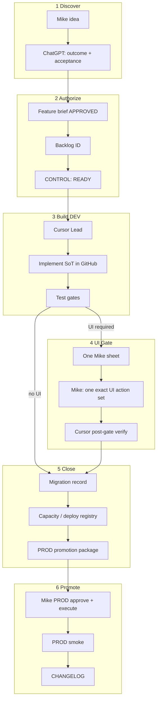
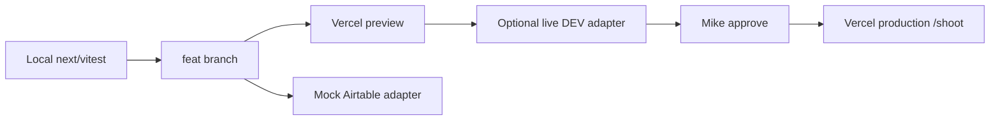

# Mike–ChatGPT–Cursor Delivery System v2.0 — Proposal

**Status:** Proposed (docs only)  
**Date:** 2026-07-15  
**Supersedes (as operating system):** Ad-hoc overnight Desktop v1 habits where they conflict  
**Does not supersede:** Engineering Constitution, XP engine rules, PROD/archive hard stops  
**Based on:** [DELIVERY-SYSTEM-CURRENT-STATE-REVIEW.md](./DELIVERY-SYSTEM-CURRENT-STATE-REVIEW.md)

---

## 1. Purpose

Define a **versioned, reusable** delivery operating system Mike can apply to Shooting Challenge and future Airtable + Vercel applications.

Goals:

- Maximize completed DEV features per week without weakening safety  
- Minimize Mike UI interventions and copy-paste ambiguity  
- One authoritative ops tip; one Mike-facing handoff format  
- Clear ChatGPT vs Cursor vs Mike vs OMNI boundaries  
- Portable lifecycle for app refactors  

---

## 2. Workflow diagram (v2.0)

**Rule:** ChatGPT never issues UI steps that are not already in a Cursor-verified sheet. Cursor never asks Mike for routine DEV API repairs under an approved brief.

---

## 3. Role matrix (summary)

Full detail: [DELIVERY-SYSTEM-ROLE-MATRIX.md](./DELIVERY-SYSTEM-ROLE-MATRIX.md)

| Role | Authority | Primary artifact |
|------|-----------|------------------|
| Mike | Product, UI gates, PROD, sends, archive | Decision sheet / reply phrase |
| ChatGPT | Planning, review, Mike translation | Feature brief, architecture notes |
| Cursor Lead | DEV implementation, state tip, tests | GitHub + CONTROL |
| Worker agents | Path-disjoint bounded tasks | Worker result (optional) |
| GitHub | SoT for shippable code/docs | Commits / tags |
| Airtable DEV | Lab + live proof | Deployed automations/schema |
| Airtable PROD | Live season | Promotion checklist only |
| Vercel | Web deploy | Preview → prod gate |
| Make/AWS | External I/O | Dev scenarios + blank webhook default |

---

## 4. Stage gates

| Gate | Enter | Exit | Owner |
|------|-------|------|-------|
| **G0 Intake** | Mike request | Task Classification + backlog ID | Cursor |
| **G1 Brief** | Classification | Approved outcome + AC + restrictions | Mike (+ChatGPT draft) |
| **G2 Repo DoD** | Brief | GitHub complete + offline tests PASS | Lead |
| **G3 Live pre** | Repo DoD | Pre-UI live DEV smoke PASS (if applicable) | Lead |
| **G4 UI** | Sheet verified paths | Mike reply phrase | Mike |
| **G5 Post** | UI done | Post-paste/post-schema smoke PASS | Lead |
| **G6 Close** | G5 | Migration + CONTROL update + promotion doc | Lead |
| **G7 PROD** | G6 + Mike approve | PROD smoke + CHANGELOG | Mike + Lead support |

Hard stop anytime: real sends, PROD without approve, archive write, secrets, destructive outside DEV.

---

## 5. Branch model (v2.0)

| Branch | Purpose | Lifetime |
|--------|---------|----------|
| `master` (or `main`) | Production-ready; Vercel prod | Permanent |
| `integration/<app>` (here: `overnight/lead-integration` → rename to `integration/shooting` when stabilized) | Active DEV integration tip | Permanent long-lived |
| `feat/<id>-<slug>` | Single feature or consolidation | Delete after merge to integration |
| `chore/docs-*` | Docs-only | Short |

**Rules:**

- Default concurrent agents: **Lead + ≤2 workers**  
- Workers only when file paths are disjoint and stage >45 minutes of separable work  
- Lead may finish stalled worker after **15 minutes no productive commit** OR explicit worker FAIL — record in closeout  
- Squash feature branches when merging to integration if >3 WIP commits  
- Integration → `master`: **squash or merge PR** on Mike cadence (weekly or after each feature close) so overnight tip never becomes sole recovery path  
- Forbidden: force push to master; deleting integration without backup tag  

**Worker naming:** `feat/<backlog>-worker-<a|b>-<slug>` (drop overnight-specific vocabulary for reusable OS).

---

## 6. Agent model

| Mode | When | Writes |
|------|------|--------|
| **Lead-direct (default)** | Most phases | Lead worktree only |
| **2-agent split** | Script + tests OR web + Airtable docs | Two feat branches |
| **Research-only subagent** | Inventory, grep, readonly | No integration commits |

Workers never: push to integration, edit CONTROL tip, author Mike sheets that Lead has not path-verified.

---

## 7. Testing matrix

See [DELIVERY-SYSTEM-TEST-GATES.md](./DELIVERY-SYSTEM-TEST-GATES.md).

Mandatory summary:

| Work type | Min gates |
|-----------|-----------|
| Docs-only | Link/path verify |
| Website-only | typecheck + unit + build (+ a11y for UI) |
| Airtable script | offline contracts + pre/post paste policy |
| Consolidation | + rollback package + capacity update |
| Schema migration | schema tests + fixture smoke |
| Webhook/email | no-send live + blank webhook proof |
| PROD promote | full promo package + PROD smoke |

Automatic rollback if critical live smoke FAIL after UI change.

---

## 8. Handoff template

Canonical: [DELIVERY-SYSTEM-HANDOFF-TEMPLATE.md](./DELIVERY-SYSTEM-HANDOFF-TEMPLATE.md)

**Principle:** Exactly one human-facing sheet per gate. Nine numbered fields only. Cursor must `Test-Path` + verify `git ls-remote` tip before presenting paths/SHAs.

---

## 9. State-file architecture

Canonical: [DELIVERY-SYSTEM-STATE-MODEL.md](./DELIVERY-SYSTEM-STATE-MODEL.md)

| Concern | Canonical file |
|---------|----------------|
| Phase / queue / next Mike action / tip SHA | `CONTROL.json` (or app-named `DELIVERY-STATE.json`) |
| Static bases, URLs, env inventory | `PROJECT_STATE.md` (slow-changing) |
| Backlog IDs | `docs/v2-change-backlog.md` |
| Capacity | Capacity ledger (synced from CONTROL `capacity`) |
| Deployed script versions | New: `DEPLOYMENT-REGISTRY` (proposed) |
| Tests last run | CONTROL.tests |
| Blockers | CONTROL.pending + queue states |

---

## 10. Deployment model

### 10.1 Possible now (no new Airtable API)

1. **Deployment manifests** per package (`docs/deploy-checklists/{id}-manifest.json`): script paths, versions, expected triggers (declarative), ON/OFF target, rollback path  
2. **Paste verification script** that: exists(path), sha256(file), prints paste boundary line numbers, compares to registry expectation  
3. **Post-paste behavioral smoke** (already proven) as deploy acceptance  
4. **Mike confirmation phrase** as state transition  

### 10.2 Requires schema / process in base (doable now via Meta API for fields)

5. **Automation Registry table** (or Config rows): Automation Number, GitHub Path, Version, Content SHA, Pasted At, Base ID, ON/OFF (Mike-maintained or smoke-inferred)  
6. **Source version comment** already in scripts — also write registry on closeout  

### 10.3 Requires tooling / elevated API / future

7. Full **automation trigger/action export API** (not available in current tooling)  
8. **Browser automation** for paste (feasible technically; high flakiness/security cost — defer)  
9. Official **Airtable Automations Management API** if/when GA for workspace  

### 10.4 Structural reduction (now)

10. Prefer **orchestrators** (117 pattern) and **combine-with-conditions** to cut paste count  
11. Schema via Meta API instead of OMNI paste when approved  

---

## 11. Website workflow (ideal)

Because `/shoot` is underused today, agents should:

- Prefer **mock adapters** for pages not yet integrated  
- Keep **contracts** for Airtable field names in one module  
- Not invent PROD views until a web integration backlog ID exists  
- Always run build+vitest; a11y checks on interactive routes  
- Never point preview at PROD Airtable token  

---

## 12. ChatGPT integration (v2.0)

**Do:** strategic planning, Mike-facing translation of CONTROL next_action, review Cursor plans against AC, cross-project memory, architecture critique, simplify UI steps that already exist in sheets.

**Stop:** guessing paths, inventing Airtable UI, duplicating Cursor handoffs, conflicting trigger advice, assigning Mike work agents can do via API under approved features.

**Session start package (standard):**

1. Backlog ID + approved brief excerpt  
2. CONTROL tip (`next_action`, `canonical.sha`, `tests`)  
3. Relevant Mike sheet path (if any)  
4. Hard constraints (no PROD / no send / DEV base ID)  
5. Capacity summary line  
6. Explicit “do not invent file paths”  

---

## 13. Reusable app-refactor lifecycle

| Stage | Entry | Exit | Required docs | Tests | Approval |
|-------|-------|------|---------------|-------|----------|
| **1 Discovery** | Existing app | Problem/outcome list | Discovery notes | — | Mike ok to proceed |
| **2 Inventory** | Discovery | Automation/schema/web inventory | Inventory + capacity | Schema export | — |
| **3 Architecture** | Inventory | Target architecture ADR | ADR | — | Mike architecture OK |
| **4 Backlog** | ADR | Prioritized IDs | Backlog | — | Mike priority |
| **5 DEV setup** | Backlog | DEV base + isolation | DEV runbook | Clone smoke | Mike DEV ready |
| **6 Agent implementation** | Brief G1 | Repo DoD G2 | Scripts + tests | Offline | Feature brief |
| **7 Testing** | G2 | G3/G5 PASS | Smoke plans | Per Test Gates | — |
| **8 Migration** | G5 | Capacity + registry update | Migration record + rollback | Live | UI gates as needed |
| **9 PROD promotion** | G6 | Live PROD | Promotion checklist | PROD smoke | Mike |
| **10 Operations** | PROD live | Steady weekly hygiene | Ops checklist | Weekly smoke | — |
| **11 Season rollover** | Ops | New season readiness | Season ADR + cutover | Full regression | Mike |

---

## 14. Incident / rollback process

1. **Detect:** smoke FAIL, escaped defect, send panic, data corruption  
2. **Stop:** freeze further UI gates; set CONTROL `run.state=blocked`  
3. **Classify:** script / schema / trigger / external  
4. **Rollback:**  
   - Script: restore `_rollback/` paste OFF, then smoke  
   - Schema: reverse Meta API change from snapshot if safe  
   - External: disable webhook / Make scenario  
5. **Record:** incident note + cause  
6. **Resume:** only after Mike “Resume authorized”  

---

## 15. Performance indicators (v2.0)

| KPI | Definition | Target (initial) |
|-----|------------|------------------|
| Features completed / week | G6 closes | Track baseline first 2 weeks |
| Agent success rate | Worker commits merged without Lead rewrite | ≥70% when workers used |
| Agent stall rate | Workers with no commit by T+15m | ≤30% |
| Lead rework rate | Packages finished Lead-direct after assign | ≤40% |
| Tests pass ratio | CONTROL.tests.pass true at close | 100% of closes |
| UI gates / feature | Mike sheets executed | ≤3 for consolidations |
| Mike interventions / feature | Approvals + UI + decides | Trend down |
| Rollback rate | Rollback packages activated | <10% of consolidations |
| Escaped defects | Issues found in PROD after promote | 0 for safety classes |
| Stale docs incidents | Contradictions Mike hits | 0 per week |
| Source/deployed drift | Registry SHA ≠ file SHA after paste claim | Detect within 24h |
| Automation slots used | Ledger occupied | Explicit headroom ≥5 for V2 |
| Website build health | `web` build+test on tip | Always green on tip |

---

## 16. Proposed adoption path (this repo)

| Step | Action | Effort |
|------|--------|--------|
| A | Adopt handoff template for next Mike gate (117) | Immediate |
| B | Collapse STATE ownership per State Model | Immediate docs |
| C | Stop creating 4-worker stages; Lead+2 max | Immediate process |
| D | End tip-sync as separate commit (same-commit CONTROL) | Immediate habit |
| E | Add paste-verify SHA helper script | Small tool |
| F | Automation Registry table in DEV | Schema + process |
| G | Weekly integration→master PR | Process |
| H | Browser paste automation | Defer |
| I | Rename overnight → integration vocabulary | After Mike OK |

---

## 17. Relationship to existing law

v2.0 **implements** doc 04 / DEV execution model more tightly; it does not repeal them. Where overnight Desktop v1 conflicts (4 workers always, many status docs), prefer v2.0.

---

*End of v2.0 proposal.*
