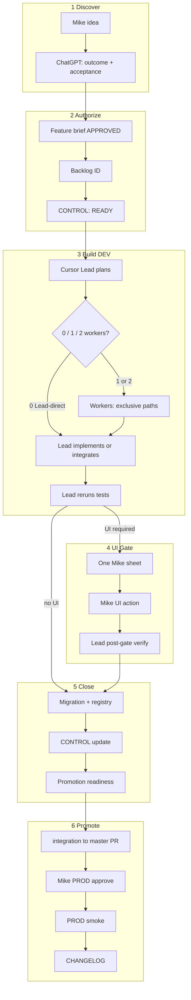

# Mike–ChatGPT–Cursor Delivery System v2.0 — Proposal

**Status:** **ACTIVE operating model** for remaining Shooting Challenge V2 rebuild · **reusable** for Mike’s other Airtable/Vercel apps · validation pilot in progress (not a scope limit)  
**Date:** 2026-07-15 (revised — full V2 scope + first-class worker-agent efficiency)  
**Does not supersede:** Engineering Constitution, XP engine rules, PROD/archive hard stops  
**Based on:** [DELIVERY-SYSTEM-CURRENT-STATE-REVIEW.md](./DELIVERY-SYSTEM-CURRENT-STATE-REVIEW.md)  
**Pilot (validation only):** [DELIVERY-SYSTEM-V2-PILOT.md](./DELIVERY-SYSTEM-V2-PILOT.md)  
**Lead/Worker (first-class):** [DELIVERY-SYSTEM-WORKER-AGENT-MODEL.md](./DELIVERY-SYSTEM-WORKER-AGENT-MODEL.md)

---

## 1. Purpose and scope

Define a versioned delivery operating system that:

1. **Governs the entire remaining Shooting Challenge V2 rebuild** — every backlog item, website package, migration, DEV deployment, PROD promotion, and season rollover  
2. **Becomes the reusable OS** for Mike’s future Airtable + Vercel application refactors  
3. Treats **worker-agent efficiency** as a first-class property (parallelism without Lead rework / conflicts / state corruption)  

### Pilot vs governance

| Concept | Meaning |
|---------|---------|
| **Governance** | v2.0 rules apply **now** to all remaining V2 work |
| **Validation pilot** | First two packages (117 + next consolidation) score process health; unlock “permanent adopted” label |
| **Not a scope limit** | Pilot success metrics ≠ “only two packages use v2.0” |

Goals:

- Maximize completed DEV features per week without weakening safety  
- Minimize Mike UI interventions and copy-paste ambiguity  
- One ops tip (CONTROL); one Mike-facing handoff format  
- Clear Mike / ChatGPT / Lead / Worker / OMNI boundaries  
- Measurable Lead/worker performance  

---

## 2. Workflow diagram (v2.0)

**Rules:** ChatGPT never invents UI steps outside a verified sheet. Workers never own CONTROL/registry/Mike sheets/closeout. Lead never accepts worker output without independent diff review + test re-run.

---

## 3. Role matrix (summary)

Full detail: [DELIVERY-SYSTEM-ROLE-MATRIX.md](./DELIVERY-SYSTEM-ROLE-MATRIX.md) · Worker depth: [DELIVERY-SYSTEM-WORKER-AGENT-MODEL.md](./DELIVERY-SYSTEM-WORKER-AGENT-MODEL.md)

| Role | Authority | Primary artifact |
|------|-----------|------------------|
| Mike | Product, UI gates, PROD, sends, archive | Decision / reply phrase |
| ChatGPT | Planning, review, Mike translation | Briefs + session pack |
| **Cursor Lead** | Integration, verification, state, Mike surface, promotion readiness | GitHub tip + CONTROL + sheets |
| **Cursor workers** | Bounded path-disjoint deliverables only | Assignment + result artifact |
| GitHub | SoT for shippable code/docs | Commits / PRs |
| Airtable DEV / PROD | Lab vs season SoR | Runtime |
| Vercel | Web deploy | Preview → prod |
| Make/AWS | External I/O | Blank/no-send first |

---

## 4. Stage gates

| Gate | Enter | Exit | Owner |
|------|-------|------|-------|
| **G0 Intake** | Mike request | Task Classification + backlog ID | Lead |
| **G1 Brief** | Classification | Approved outcome + AC + restrictions | Mike (+ChatGPT draft) |
| **G2 Repo DoD** | Brief | GitHub complete + offline tests PASS | Lead (workers may contribute slices) |
| **G3 Live pre** | Repo DoD | Pre-UI live DEV smoke PASS (if applicable) | Lead |
| **G4 UI** | Sheet verified paths | Mike reply phrase | Mike |
| **G5 Post** | UI done | Post-paste/post-schema smoke PASS | Lead |
| **G6 Close** | G5 | Migration + CONTROL + registry + promotion doc | **Lead only** |
| **G7 PROD** | G6 + Mike approve | PROD smoke + CHANGELOG | Mike + Lead support |

Hard stop anytime: real sends, PROD without approve, archive write, secrets, destructive outside DEV.

---

## 5. Branch model (v2.0)

| Branch | Purpose | Lifetime |
|--------|---------|----------|
| `master` | Production-ready; Vercel prod | Permanent |
| Integration (`overnight/lead-integration` → future `integration/<app>`) | Active DEV tip | Long-lived |
| `feat/<id>-worker-{a\|b}-<slug>` | Worker exclusive slice | Delete after merge |
| `feat/<id>-<slug>` | Lead feature branch if needed | Short |

**Rules:**

- Lead-direct default; max **Lead + 2 workers**  
- Workers merge **only** into integration  
- After each G6 functional close: **per-feature** PR integration → `master` (D7)  
- CONTROL.`canonical.sha` = **lagging** previous verified/package commit; `git rev-parse HEAD` = tip SoT; **no tip-sync-only commits** (D4)  
- Forbidden: force push to master; workers editing state files  

---

## 6. Lead & worker agent model (first-class)

**Canonical detail:** [DELIVERY-SYSTEM-WORKER-AGENT-MODEL.md](./DELIVERY-SYSTEM-WORKER-AGENT-MODEL.md)

### Lead (revised)

- Plans package; chooses 0/1/2 workers using concurrency rules  
- Writes assignment contracts (paths, tests, AC, stops)  
- Owns integration, independent diff review, **test re-run**, CONTROL/registry, Mike sheets, G6, promotion readiness  
- Takeover on stall  

### Workers (revised)

- Only for genuinely parallel, path-disjoint, independently testable deliverables  
- Every assignment defines: branch/worktree, writable / read-only / prohibited paths, bounded deliverable, AC, test commands, result artifact, stop conditions  
- **Do not** update CONTROL, capacity, deployment registry, Mike sheets, or final closeout  

### Concurrency snapshot

| Count | Use |
|------:|-----|
| 0 | Tight coupling / shared files / UI-dominated / unclear split |
| 1 | One exclusive parallel slice |
| 2 | Two exclusive slices; Lead integrates |

### Stall / takeover

**15 minutes** without productive progress → Lead takeover (see worker model doc).

---

## 7. Testing matrix

See [DELIVERY-SYSTEM-TEST-GATES.md](./DELIVERY-SYSTEM-TEST-GATES.md).

Lead always re-runs package-critical tests after accepting worker merges.

---

## 8. Handoff template

Canonical: [DELIVERY-SYSTEM-HANDOFF-TEMPLATE.md](./DELIVERY-SYSTEM-HANDOFF-TEMPLATE.md)

**Hybrid (D2):** short Mike status message + link to one nine-field sheet. Do **not** duplicate sheet fields in chat.

---

## 9. State-file architecture

Canonical: [DELIVERY-SYSTEM-STATE-MODEL.md](./DELIVERY-SYSTEM-STATE-MODEL.md)

| Concern | Canonical |
|---------|-----------|
| Ops tip / queue / next action / tests | CONTROL.json (SHA lagging pointer) |
| Infrastructure IDs | PROJECT_STATE.md |
| Deployed script claims | `docs/delivery/DEPLOYMENT-REGISTRY.json` |
| Backlog | `docs/v2-change-backlog.md` |
| Worker assignments/results | assignments/ + results/ (not SoT for tip) |

---

## 10. Deployment model

Prioritize: manifests, content hashing, paste boundaries, post-paste verification, drift detection in JSON registry.  
Browser paste automation: **research only** (D10). No paste bot build during pilot/V2 without separate Mike authorize.

---

## 11. Website workflow

**Mock-default (D8).** Separate mock / DEV / protected PROD adapters. Website packages are excellent **worker** candidates when limited to `web/**` exclusive paths while Lead owns Airtable.

---

## 12. ChatGPT integration

Mandatory session pack: [docs/delivery/CHATGPT-SESSION-PACK.md](../delivery/CHATGPT-SESSION-PACK.md)

Stop: inventing paths/triggers; duplicating Mike sheets; asking Mike for Lead-owned API work.

---

## 13. Application across full V2 rebuild

v2.0 applies to **all** remaining work:

| Category | Examples |
|----------|----------|
| Backlog | C-009, C-010, C-011, C-019, C-023+, C-025 remaining, C-026, C-027, V2-013/014/… |
| Website | `/shoot` routes, adapters, a11y, preview |
| Migrations | Automation consolidations, schema, capacity phases |
| DEV deployment | Pastes, triggers, smokes, registry updates |
| PROD promotion | Promotion packages, CHANGELOG, L9 smoke |
| Season rollover | Program Instance / cutover ADR execution |

Reuse: copy Lead/Worker model + CONTROL + registry + handoff + session pack into each future app repo.

---

## 14. Incident / rollback

Unchanged hard pattern: stop → classify → restore `_rollback/` or schema snapshot → record → Mike resume.

---

## 15. Performance indicators

### Delivery KPIs

| KPI | Target (initial) |
|-----|------------------|
| Features G6 / week | Baseline then improve |
| UI gates / feature | ≤3 |
| Tip-sync-only commits | 0 |
| Source/deployed drift detect | ≤24h via registry |
| Safety escapes (PROD/send) | 0 |

### Worker-agent KPIs (first-class)

| KPI | Target |
|-----|--------|
| Accepted without rework | ≥60% when workers used |
| Accepted with rework | Track |
| Rejected | Track |
| Stalled | Track |
| Lead takeover rate | ≤25% |
| Merge conflicts | ≤1 / two-worker stage |
| Post-integration defects | 0 critical |
| Handoff overhead | &lt;30% of slice calendar time |

---

## 16. Adoption path

| Step | Status |
|------|--------|
| Lock D1–D10 + clarifications | Done |
| JSON registry + strip PROJECT_STATE | Done |
| Worker-agent model first-class | Done (this revision) |
| Validation pilot packages 1–2 | In progress |
| Label “permanent adopted” | After pilot review PASS only |
| Operate under v2.0 for all V2 work | **Now** |

---

## 17. Relationship to existing law

v2.0 implements doc 04 / DEV execution model more tightly. Where Desktop v1 overnight habits conflict (4 workers, tip-sync-only commits, dual live PROJECT_STATE, workers editing state), **prefer v2.0**.

---

*End of v2.0 proposal.*
