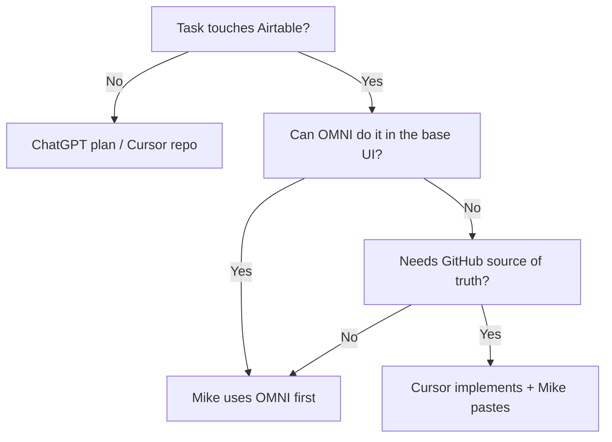
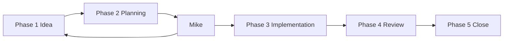

# 04 — AI Development Standards

**Status:** **Active** — permanent operating procedure for this project.

**Last updated:** 2026-07-05 (OMNI-first in-Airtable priority)

---

## Purpose

Define how **Mike**, **ChatGPT**, and **Cursor** work together to develop the 127 Sports Intensity Shooting Challenge platform. Every task flows through three roles and five phases. This document is the authority for who does what, when, and how work is handed off.

**Related docs:**

| Doc | Role |
|-----|------|
| [01-constitution.md](./01-constitution.md) | What must never change (Engine layer) |
| [03-business-rules.md](./03-business-rules.md) | Platform behavior contract |
| [../v2-change-backlog.md](../v2-change-backlog.md) | **Live backlog** — add and update change IDs here |
| [../CHATGPT-MASTER-PLAN-BRIEF.md](../CHATGPT-MASTER-PLAN-BRIEF.md) | Aggregated planning view for ChatGPT |
| [../../AGENTS.md](../../AGENTS.md) | Cursor agent startup and hard constraints |

---

## Three roles

Every task involves three roles. No role skips another without Mike's explicit approval.

| Role | Responsibility |
|------|----------------|
| **Mike** | **Product Owner and final decision maker** — proposes ideas, approves scope, resolves open questions, accepts Definition of Done |
| **ChatGPT** | **Architect, planner, reviewer, documentation writer, business analyst** — ideas, requirements, copy, architecture, review; **no repo edits** |
| **Cursor** | **Software engineer, repository maintainer** — code, schema, automations, audits, tests, commits; **no unapproved architecture changes** |

**GitHub** is the source of truth for everything that ships. ChatGPT drafts; Cursor applies; Mike approves.

**OMNI** (Airtable's in-base AI) is Mike's **first choice** for work that can stay inside Airtable — use those credits before opening Cursor or asking ChatGPT to simulate base work.

---

## Tool priority: OMNI first (in-Airtable work)

**Mike's preference:** Whenever a task can be done **inside Airtable**, try **OMNI** first. OMNI credits are a priority resource — do not route in-base work to Cursor or ChatGPT when OMNI can handle it.

### Decision order (in-Airtable tasks)



### Use OMNI first (Mike in Airtable)

| Task type | Examples |
|-----------|----------|
| **Data exploration** | "How many submissions this week?", find gaps, summarize a view |
| **Formulas & fields** | Draft or fix a formula, suggest field types, explain rollup behavior |
| **Views & filters** | Build coach/ops views, sort groups, conditional filters |
| **Interfaces** | Layout tweaks, record detail pages, dashboard blocks |
| **One-off record ops** | Guided bulk updates, linking records, cleaning bad rows |
| **Native automations (draft/prototype)** | Simple trigger → action flows to test before GitHub hardening |
| **Base Q&A** | "Which table links Enrollment to Athlete?", schema questions in context |
| **Ops triage** | Interpret a failed automation run, suggest next filter on a view |

### Still use Cursor (even if OMNI could draft)

| Task type | Why GitHub / Cursor |
|-----------|---------------------|
| **Production automations `001`–`114`** | Versioned source in `airtable/automations/shooting-challenge/`; paste after commit |
| **Audit & backfill extensions** | `CONFIRM_WRITE` / dry-run patterns; not OMNI one-offs |
| **XP / idempotency logic** | Engine rules — must match GitHub scripts and Source Key patterns |
| **Web app (`web/`)** | Not in Airtable |
| **Python tools (`tools/airtable/`)** | Not in Airtable |
| **Make blueprints** | External to base |
| **Schema snapshots & field-map docs** | Repo is documentation source of truth |

**Rule:** OMNI may **prototype** in Airtable; **production** automations and Engine behavior still flow through GitHub → paste → CHANGELOG.

### How ChatGPT and Cursor treat OMNI

| Role | OMNI behavior |
|------|---------------|
| **ChatGPT** | In planning, ask: *"Can Mike do this in OMNI first?"* Do not write long formula/automation instructions when OMNI in-base is enough. Flag when OMNI prototype → Cursor GitHub sync is needed. |
| **Cursor** | Before editing repo for an Airtable-only task, output **Workspace Check** → recommend **OMNI** unless GitHub is required. After Mike uses OMNI for a production automation draft, offer to pull into GitHub. |
| **Mike** | Open the base → OMNI → describe the task. Escalate to Cursor only when the table above says GitHub is required. |

### Task Classification — `Correct tool` values

Include **`OMNI`** when the next step is in-base work Mike should do with Airtable credits:

```
Correct tool for this step: OMNI
Mike's role right now: Run OMNI in [base name] to [specific action]
```

---

## Five-phase workflow

Every improvement follows these phases in order. A phase may be brief, but it is never skipped.



### Phase 1 — Idea

**Trigger:** Mike thinks of an improvement (feature, fix, doc, rule change).

**Owner:** ChatGPT (facilitate) · Mike (decide)

**ChatGPT:**

- Discusses and sharpens the idea
- Identifies dependencies and wave placement
- Determines whether it belongs in the backlog
- Drafts documentation outline if needed

**Output:**

- Decision (proceed / defer / reject)
- Backlog item (new or existing ID) in [v2-change-backlog.md](../v2-change-backlog.md)
- High-level implementation plan

**No code changes.**

---

### Phase 2 — Planning

**Owner:** ChatGPT

**ChatGPT produces:**

- Requirements
- Acceptance criteria
- Business rules (if Engine or Configuration layer affected)
- UI ideas (if web affected)
- Architecture changes (if schema, storage, or integrations affected)
- Risks and dependencies
- Definition of Done

**Mike reviews and approves** before Phase 3 begins.

**No code changes.**

---

### Phase 3 — Implementation

**Owner:** Cursor

**Cursor reads before editing:**

1. [../PROJECT_STATE.md](../PROJECT_STATE.md)
2. Relevant backlog item in [v2-change-backlog.md](../v2-change-backlog.md)
3. Relevant architecture docs (see [CHATGPT-MASTER-PLAN-BRIEF.md](../CHATGPT-MASTER-PLAN-BRIEF.md) cross-reference index)
4. [03-business-rules.md](./03-business-rules.md) if behavior changes
5. [01-constitution.md](./01-constitution.md) if layer boundaries are touched

**Cursor then:**

- Changes code, schema notes, automations, Make docs, web, tools
- Runs audits (dry-run first)
- Updates `CHANGELOG.md` if production-impacting
- Updates backlog item **status** in `v2-change-backlog.md` (does not rewrite scope without Mike)

**Cursor does not commit** until Mike requests it (see Phase 5).

---

### Phase 4 — Review

**Owner:** ChatGPT (facilitate) · Mike (accept)

**Back in ChatGPT.** Review against Phase 2 plan:

- Was the original goal met?
- Is documentation affected? (update `docs/` or `docs/v2/` as needed)
- Does another backlog item need updating?
- Are business rules still correct?
- Does the [Constitution](./01-constitution.md) need updating?

**Output:** Accept · Rework (return to Phase 3) · Follow-up backlog item

---

### Phase 5 — Close

**Owner:** Cursor (execute) · Mike (approve commit)

1. **Cursor** commits (when Mike asks)
2. Re-sync ChatGPT Project Sources:

```powershell
.\tools\docs\sync-chatgpt-sources.ps1
```

3. Re-import changed files into ChatGPT Project Sources
4. Mark backlog item `done` (or `monitoring`) in [v2-change-backlog.md](../v2-change-backlog.md)
5. Move on

---

## Task classification (required before work starts)

**Rule:** Every new task must be classified **before anyone starts work**. When Mike or an AI brings a new task, the **first response** must include this header:

```
Task Classification

Type:
Priority:
Difficulty:
Owner:
Dependencies:
Backlog ID:
Estimated Scope:
```

### Example

```
Task Classification

Type: Architecture Improvement
Priority: High
Difficulty: Medium
Owner: ChatGPT (Planning) → Cursor (Implementation)
Dependencies: C-012, C-024
Backlog ID: V2-015 (new)
Estimated Scope: 4 documents, 3 automations, 1 web page
```

This immediately signals whether the session is planning, documenting, or coding.

**Extend Task Classification with workspace fields** (both ChatGPT and Cursor use these on every new task):

```
Phase:
Correct tool for this step:
Repo:
Mike's role right now:
```

### Example (full block)

```
Task Classification

Type: Architecture Improvement
Priority: High
Difficulty: Medium
Owner: ChatGPT (Planning) → Cursor (Implementation)
Dependencies: C-012, C-024
Backlog ID: V2-015 (new)
Estimated Scope: 4 documents, 3 automations, 1 web page

Phase: 2 — Planning
Correct tool for this step: ChatGPT
Repo: 127-si-shooting-challenge
Mike's role right now: Approve scope before Phase 3
```

### Classification by task type

| Type | Primary owner | Notes |
|------|---------------|-------|
| Planning | ChatGPT | Phases 1–2 |
| Documentation | ChatGPT draft → Cursor commit | `docs/`, `docs/v2/`, media copy |
| Business Rules | ChatGPT | Updates to [03-business-rules.md](./03-business-rules.md) — Mike approves |
| Constitution | ChatGPT | Updates to [01-constitution.md](./01-constitution.md) — rare; Mike approves |
| Parent Communication | ChatGPT | Emails, letters, game manual prose |
| Website Copy | ChatGPT | Public-facing text; Cursor wires into components |
| UX brainstorming | ChatGPT | Wireframes, flows, page plans |
| Bug Investigation | **Shared** | Cursor reproduces; ChatGPT analyzes root cause and fix plan |
| In-Airtable ops (views, formulas, data, interfaces) | **OMNI first** → Cursor if GitHub needed | Mike uses OMNI credits before repo work |
| Code Changes | Cursor | Automations, web, tools, scripts |
| Airtable Schema | Cursor | Schema notes, field-map; Mike approves base changes |
| Make.com | Cursor | Blueprints, scenario docs in `make/` |
| GitHub | Cursor | Commits, PRs, repo structure |
| Testing | Cursor | Audits, dry-runs, extension scripts |
| Deployment | Cursor | Vercel, Airtable paste, Make publish |
| Final QA | **Shared** | Cursor runs checks; ChatGPT reviews against acceptance criteria |

**Shared** means ChatGPT and Cursor both contribute; Mike decides when done.

---

## Workspace guardrails (do not work in the wrong area)

**Both ChatGPT and Cursor must actively prevent Mike from working in the wrong place.** When a request looks misrouted, respond with a **Workspace Check** (below) and a clear redirect — do not silently proceed in the wrong tool, phase, repo, or layer.

### Workspace Check (required when redirecting)

```
Workspace Check

You are in the wrong area if you proceed here.

Current request:
Correct phase:
Correct tool:
Correct repo:
What Mike should do instead:
What to open / paste:
```

### Wrong tool — redirect immediately

| Mike is trying to… | Wrong tool | Say this | Send to |
|--------------------|------------|----------|---------|
| Plan a feature, write requirements, draft parent copy | **Cursor** | "This is Phase 1–2 — use **ChatGPT**, not Cursor." | ChatGPT + `12-ai-development-standards.md` |
| Edit automations, run audits, commit code | **ChatGPT** | "This is Phase 3 — use **Cursor**, not ChatGPT." | Cursor + backlog ID + approved plan |
| Build a view, fix a formula, explore base data | **Cursor** or **ChatGPT** | "Try **OMNI in Airtable first** — Mike priority for in-base credits." | Open base → OMNI |
| Review completed work against acceptance criteria | **Cursor** | "This is Phase 4 — use **ChatGPT** for review." | ChatGPT + implementation summary |
| Add a new backlog item by editing only the Master Plan Brief | **Either** | "Edit **v2-change-backlog.md** first; the brief is read-only aggregate." | `docs/v2-change-backlog.md` |

### Wrong phase — redirect immediately

| Situation | Problem | Redirect |
|-----------|---------|----------|
| Code changes before Mike approved Phase 2 plan | Phase skip | Stop. Complete planning in ChatGPT; Mike must approve DoD first. |
| Planning session but Mike asks Cursor to implement | Phase skip | Classify task; if plan missing, return to ChatGPT Phase 2. |
| Wave 1+ work while Wave 0 close-out items still open | Wave skip | Flag open C-001–C-008; confirm Mike wants to defer close-out. |
| Production Airtable paste before GitHub commit | Deploy order | GitHub first → Airtable paste → CHANGELOG ([monorepo rule](../../.cursor/rules/monorepo.mdc)). |
| Audit/backfill with writes and no dry-run | Safety | Dry-run first; require `CONFIRM_WRITE` / `CONFIRM_DELETE`. |
| Constitution or business-rules change during a code-only task | Layer violation | Stop. Route to ChatGPT; Mike must approve [01](./01-constitution.md) / [03](./03-business-rules.md) edits. |

### Wrong repo — redirect immediately

| Mike mentions… | Correct location |
|----------------|------------------|
| Hoop landing page, marketing site root | **`hoopchallenges-landing`** — not this repo |
| JR Ref app, referee tools | **`127-si-jr-ref`** — not this repo |
| Team Shot Tracker | **Not in this monorepo** |
| Shooting Challenge automations, `/shoot`, audits | **`127-si-shooting-challenge`** ✓ |

### Wrong path within this repo

| Task | Correct path | Wrong path (do not use) |
|------|--------------|-------------------------|
| Live backlog edits | `docs/v2-change-backlog.md` | `CHATGPT-MASTER-PLAN-BRIEF.md` (aggregate only) |
| Production automation source | `airtable/automations/shooting-challenge/` | Pasting only in Airtable without GitHub |
| Web app | `web/` (Vercel Root Directory = `web`) | Editing deployed Softr (legacy — Phase 6 cutover) |
| Season publicity assets | `media/{season}/` | `tools/airtable/_preview/` (legacy preview) |
| ChatGPT planning docs | Draft in ChatGPT → commit via Cursor to `docs/` | Editing `docs/chatgpt-sources/` directly (synced export) |
| Make scenarios | `make/blueprints/` + `make/documentation/` | Undocumented one-off Make changes |

### What Mike should do vs delegate

| Mike should… | OMNI (first) | ChatGPT | Cursor |
|--------------|--------------|---------|--------|
| Decide priorities and approve waves | — | Plan, document, review | — |
| Explore data, build views, fix formulas | ✓ | Interpret / plan if complex | GitHub sync if production script |
| Write first draft of parent/editor copy | — | ✓ | Wire into templates/code |
| Prototype simple native automation | ✓ | Design + idempotency rules | Harden in GitHub before production |
| Run audit/backfill extensions | — | Interpret results | Prepare scripts, dry-run first |
| Paste production automation after GitHub review | — | — | Prepare paste-ready docblock |
| Edit Airtable schema / production automations | Discuss in OMNI | Discuss design | GitHub first, then paste |
| Commit and push | — | — | ✓ (when Mike asks) |

**Cursor rule:** If Mike asks for planning, copy, or architecture decisions, output **Workspace Check** and recommend ChatGPT — do not draft long plans in Cursor unless Mike explicitly says "stay in Cursor for a quick draft."

**Cursor rule (OMNI):** If Mike asks for in-Airtable work that does not require GitHub (views, formulas, data exploration, interfaces, one-off fixes), output **Workspace Check** → recommend **OMNI first** — do not jump to repo edits.

**ChatGPT rule:** If Mike asks to run audits, edit code, or commit, output **Workspace Check** and recommend Cursor with the backlog ID — do not pretend repo changes happened.

**ChatGPT rule (OMNI):** If Mike asks for in-base exploration or UI work, recommend **OMNI first** before detailed step-by-step Airtable instructions.

---

## When to use ChatGPT

Use ChatGPT for:

- Phase 1 (Idea) and Phase 2 (Planning)
- Phase 4 (Review)
- Master plan and wave sequencing ([CHATGPT-MASTER-PLAN-BRIEF.md](../CHATGPT-MASTER-PLAN-BRIEF.md))
- Drafting or expanding `docs/v2/` numbered docs
- Game manual, parent copy, editor emails, radio/newspaper prose
- Business rules and architecture discussion
- Prompt templates for repeatable content (media kits, articles)
- "Should we?" and dependency questions

**ChatGPT Project Sources:** Import all files in [../chatgpt-sources/](../chatgpt-sources/). Refresh after doc commits via sync script.

**ChatGPT does not:** edit the repo, run audits, paste into Airtable, or commit to GitHub.

**For in-Airtable work:** recommend **OMNI first** (Mike's credit priority) before long Airtable how-to answers.

---

## When to use OMNI (Airtable in-base AI)

**Owner:** Mike (in the Airtable base UI)

Use OMNI **first** when the task stays inside Airtable and does not require GitHub as source of truth:

- Explore and summarize live data
- Formulas, rollups, lookups (explain or draft)
- Views, filters, grouped ops views
- Interfaces and layout
- One-off or guided bulk record fixes
- Prototype native automations before Cursor hardens them for production
- Ops triage on failed runs or messy views

**Escalate to Cursor** when the task hits production scripts `001`–`114`, audit/backfill extensions, XP/idempotency Engine logic, web, tools, Make, or schema docs in repo.

**After OMNI prototypes a production automation:** Cursor copies logic into GitHub → Mike reviews → paste → CHANGELOG.

---

## When to use Cursor

Use Cursor for:

- Phase 3 (Implementation) and Phase 5 (Close — commits)
- All code: `airtable/automations/`, `web/`, `tools/`, extension scripts
- Running audit and backfill extensions (dry-run first)
- Schema export, media kit builders, docx export scripts
- Updating backlog **status** and `CHANGELOG.md`
- Git operations (only when Mike requests)

**Cursor startup (every session):**

1. [../PROJECT_STATE.md](../PROJECT_STATE.md)
2. [../v2-change-backlog.md](../v2-change-backlog.md) — find active ID
3. [../../AGENTS.md](../../AGENTS.md)
4. This document ([04-ai-development-standards.md](./04-ai-development-standards.md))
5. Relevant deep-dive doc for the active backlog item

**Cursor does not:** approve scope, change Constitution without Mike, skip dry-run on production audits, or replace **OMNI** for in-base work Mike can do with Airtable credits.

---

## How work flows between tools

| Step | Who | Action |
|------|-----|--------|
| 1 | Mike | Proposes idea |
| 2 | ChatGPT | Phase 1 — classify task, backlog ID, dependencies |
| 3 | Mike | Approves proceed to planning |
| 4 | ChatGPT | Phase 2 — requirements, DoD, risks |
| 5 | Mike | Approves plan |
| 6 | Cursor | Phase 3 — implement in GitHub |
| 7 | ChatGPT | Phase 4 — review against plan |
| 8 | Mike | Accepts or sends back |
| 9 | Cursor | Phase 5 — commit, sync sources, update backlog |

**Handoff artifacts:**

| From → To | Artifact |
|-----------|----------|
| ChatGPT → Mike | Task Classification block, plan, acceptance criteria |
| Mike → Cursor | Approved backlog ID + "implement per plan" |
| Cursor → ChatGPT | Summary of files changed, audit results |
| Cursor → GitHub | Commits, CHANGELOG, doc updates |

---

## Documentation standards

| Rule | Detail |
|------|--------|
| **Live backlog** | [v2-change-backlog.md](../v2-change-backlog.md) only — one row per request |
| **Planning aggregate** | [CHATGPT-MASTER-PLAN-BRIEF.md](../CHATGPT-MASTER-PLAN-BRIEF.md) — refresh when backlog changes materially |
| **V2 pack** | Numbered docs in `docs/v2/` — ChatGPT drafts, Cursor commits |
| **Long-form docs** | `docs/*.md` remain until fully absorbed into v2 pack |
| **Production history** | [CHANGELOG.md](../../CHANGELOG.md) — Cursor updates on production-impacting ship |
| **ChatGPT sync** | Run `tools/docs/sync-chatgpt-sources.ps1` after doc commits |

**Docblock rule:** Airtable automation changes → GitHub first → paste docblock through end into Airtable → CHANGELOG.

---

## Automation rewrite standards

All automation work follows [../../airtable/automations/AUTOMATION_SCRIPT_STANDARD.md](../../airtable/automations/AUTOMATION_SCRIPT_STANDARD.md) and [../../.cursor/rules/airtable-automation-scripts.mdc](../../.cursor/rules/airtable-automation-scripts.mdc).

| Rule | Requirement |
|------|-------------|
| Source of truth | GitHub `airtable/automations/shooting-challenge/{nnn}-{kebab}.js` |
| Deploy | Paste docblock through end into Airtable (skip GitHub header) |
| Structure | `async function main()`, CONFIG block, SECTION blocks, required outputs |
| Idempotency | Source Key patterns; one source → one XP Event; skip vs error |
| Schema | Validate fields early; never write formula/rollup/lookup fields |
| Version | Preserve Date Written; update Last Updated on logic edits |

**Planning automations in ChatGPT:** describe trigger, inputs, outputs, and idempotency rule. **Implementing in Cursor:** match production patterns (114, 034, 005, 063, 101, 072, 074).

---

## Versioning standards

| Artifact | Versioning |
|----------|------------|
| Automation scripts | Docblock Version + CONFIG.version; semantic bump on logic change |
| Web app | Git commits; Vercel deploy from `master`; Root Directory = `web` |
| Airtable base | Archive + clone per season (V2-001); schema snapshots in `airtable/schema/snapshots/` |
| Docs | Git history; Last updated date in doc header where applicable |
| Media kits | Season folder `media/{season}/`; manifest JSON for audit trail (V2-028 target) |

---

## Prompt conventions

### ChatGPT — new task intake

When Mike describes a new task, ChatGPT responds first with **Task Classification** (including Phase, Correct tool, Repo, Mike's role), then asks clarifying questions if Type or Backlog ID is unclear.

**If the request belongs in Cursor** (code, audits, commits, Airtable paste prep), output **Workspace Check** and stop — do not simulate implementation.

### ChatGPT — wrong-area redirect

When Mike is in the wrong tool, phase, repo, or path, respond with **Workspace Check** (see [Workspace guardrails](#workspace-guardrails-do-not-work-in-the-wrong-area)) before anything else.

### ChatGPT — paste into Project Instructions (optional)

Mike can add this to ChatGPT Project custom instructions so every session enforces guardrails:

```
You are the Architect for 127 SI Shooting Challenge. Follow docs/v2/04-ai-development-standards.md.

On every new task: output Task Classification first (include Phase, Correct tool, Repo, Mike's role).

For in-Airtable work (views, formulas, data, interfaces): recommend OMNI first — Mike priority for Airtable credits.
If Mike asks for code, audits, commits, or repo edits → Workspace Check → send to Cursor with backlog ID.
If Mike is planning before Phase 2 approval → no implementation advice that skips Mike's sign-off.
Live backlog: docs/v2-change-backlog.md only (not CHATGPT-MASTER-PLAN-BRIEF.md).
Wrong repos: hoopchallenges-landing, 127-si-jr-ref — redirect if mentioned.
You do not edit GitHub, run audits, or paste into Airtable.
```

### ChatGPT — planning session

```
Context: Backlog ID [ID], wave [N], docs [list].
Produce: requirements, acceptance criteria, risks, Definition of Done.
Do not write code. Flag Constitution or business-rules changes for Mike.
```

### ChatGPT — review session

```
Context: Backlog ID [ID] implemented in GitHub [branch/commit summary].
Review against Phase 2 plan. List doc updates needed. Accept or rework?
```

### Cursor — implementation session

```
Implement backlog [ID] per approved plan.
Read PROJECT_STATE, relevant docs, business rules.
Dry-run audits first. Update CHANGELOG if production-impacting.
Do not commit unless Mike asks.
```

### Cursor — wrong-area redirect

When Mike asks for planning, copy drafts, architecture decisions, or Phase 4 review, output **Workspace Check** and recommend ChatGPT — do not proceed with a long plan unless Mike says "stay in Cursor for a quick draft."

When Mike asks to implement without an approved backlog ID or Phase 2 plan, stop and ask for backlog ID + plan approval before editing files.

When Mike asks for in-Airtable work that OMNI can handle (views, formulas, data exploration, interfaces, one-off record fixes), output **Workspace Check** → recommend **OMNI first** unless GitHub source of truth is required.

---

## Review process checklist

Use in Phase 4 (ChatGPT + Mike):

- [ ] Acceptance criteria from Phase 2 met
- [ ] Backlog status accurate in `v2-change-backlog.md`
- [ ] `CHANGELOG.md` updated if production-impacting
- [ ] `docs/PROJECT_STATE.md` updated if ops snapshot changed
- [ ] Business rules unchanged OR [03-business-rules.md](./03-business-rules.md) updated with Mike approval
- [ ] Constitution unchanged OR [01-constitution.md](./01-constitution.md) updated with Mike approval
- [ ] ChatGPT Sources sync scheduled after commit
- [ ] No secrets in diff

---

## Hard constraints (all roles)

These apply to ChatGPT, Cursor, and Mike's production actions:

- **Never commit secrets** — `.env`, PATs, webhook URLs with tokens
- **Airtable production writes** — GitHub first → paste into Airtable → CHANGELOG
- **Audits/backfills** — dry-run first; explicit `CONFIRM_WRITE` / `CONFIRM_DELETE` for writes
- **Web** — Airtable reads server-side only; never expose `AIRTABLE_API_TOKEN` to the browser
- **XP idempotency** — one source record → one XP Event
- **Wave approval** — nothing ships to production until Mike approves the wave ([v2-change-backlog.md](../v2-change-backlog.md))

---

## Canonical Cursor rules (implementation detail)

| Area | Rule file |
|------|-----------|
| Monorepo navigation | [../../.cursor/rules/monorepo.mdc](../../.cursor/rules/monorepo.mdc) |
| Airtable automations | [../../.cursor/rules/airtable-automation-scripts.mdc](../../.cursor/rules/airtable-automation-scripts.mdc) |
| Web UI | [../../.cursor/rules/web-ui-brand.mdc](../../.cursor/rules/web-ui-brand.mdc) |
| Web-specific notes | [../../web/docs/cursor-instructions.md](../../web/docs/cursor-instructions.md) |

---

## Revision log

| Date | Notes |
|------|-------|
| 2026-07-05 | Promoted from shell to **Active** — three-role, five-phase permanent operating procedure |
| 2026-07-05 | Added workspace guardrails, Workspace Check, extended Task Classification |
| 2026-07-05 | **OMNI-first** priority for in-Airtable work (Mike's Airtable credits) |
