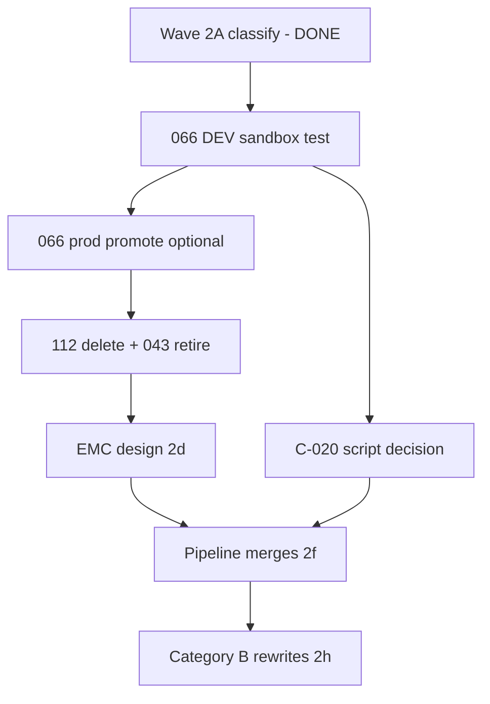

# Phase 2B — Engineering review (2026-07-06)

**Session:** Phase 2B — documentation only. **No Airtable changes. No script implementation.**

**Authority:** [ENGINEERING_CONSTITUTION.md](./ENGINEERING_CONSTITUTION.md)

---

## 1. V2-014 roadmap review

Source: [v2-014-automation-modernization-roadmap.md](./v2-014-automation-modernization-roadmap.md) + [v2-014-wave-2a-classification.md](./v2-014-wave-2a-classification.md)

### Retirement order (confirmed)

| Order | Automation | Action | Depends on | Slots | Risk |
|-------|------------|--------|------------|------:|------|
| **1** | **012** | Delete | — | +1 | **Done** |
| **2** | **112** | Delete after monitor | **013** proven sole VF path; no 112 runs in history | +1 | **Low** — Mike approved; maintenance window only |
| **3** | **043** | Retire | **042** assigns gate rule in prod | +1 | **Low** — verify 042 docblock + live trigger before delete |

**Do not retire 112 or 043** until Mike-approved production maintenance window.

### Merge order (confirmed — clarity first)

| Wave | Merge | Prerequisite | Slots (secondary) | Risk |
|------|-------|--------------|------------------:|------|
| **2f-a** | **006 + 021** | Confirm same trigger timing on Submissions | +1 | **Medium** — double-fire if triggers differ |
| **2f-b** | **111 → 013** | 013 rewrite scheduled; grade band at VF create | +1 | **Low** — copy-only helper |
| **2f-c** | **063 → 020** | 020 rewrite scheduled | +1 | **Low** |
| **2f-d** | **030 + 032 + 033** | **Confirm identical WAS trigger timing** | +2 | **High** — Mike flagged timing may differ |
| **2e+** | **EMC (071–077 → 2)** | EMC schema + Email Key registry (V2-014b) | +5 net | **High** — largest architectural change |

### Explicit do-not-merge (confirmed)

| Pair | Reason |
|------|--------|
| **041 ↔ 010** | Recalc flag vs XP award — different triggers |
| **064 ↔ 065** | HW prep vs XP create |
| **113 ↔ 114** | Video XP prep vs award |
| **057 ↔ 058** | Eligibility calc vs unlock create |

### Dependencies (critical path)

**Current gate:** **066 DEV sandbox** pending OMNI pipeline confirm — blocks V2-015 `done` and informs C-020 sequencing.

### Expected slot recovery (secondary)

| Source | Slots |
|--------|------:|
| **012** deleted | +1 (realized) |
| **112** retire | +1 |
| **043** retire | +1 |
| **006+021** | +1 |
| **030+032+033** | +2 |
| **111→013, 063→020** | +1–2 |
| **EMC 7→2** | +5 net |
| **Total potential** | **~12** |

**Target:** ~37–38 automations with headroom — **consequence** of clarity work, not the primary goal.

### Risks identified

| Risk | Severity | Mitigation |
|------|----------|------------|
| **030+032+033** merged with different triggers | **High** | OMNI confirm trigger parity; **do not merge** if timing differs |
| **006+021** same trigger assumption | **Medium** | OMNI confirm; test on DEV with multi-attachment submission |
| **112 delete** while old VF rows reference 112-era keys | **Medium** | Monitor period + 090F audit before delete |
| **043 retire** while enrollments still depend on 043-only path | **Medium** | Verify **042** writes gate rule on all recalc paths |
| **EMC** scope creep | **High** | Design wave only until schema approved |
| **~17 legacy scripts** without `main()` | **Medium** | Rewrite in approved waves only — no emergency mass migration |
| **`*confirm in Airtable*` triggers** | **Medium** | OMNI Wave 2a checklist still partially open |
| **066 / C-020 chicken-and-egg** | **Medium** | Pipeline-ready submission path before meaningful 066 test |
| **DEV automations OFF after clone** | **Medium** | Checklist: verify ON before pipeline tests (documented) |
| **Slot pressure drives bad merges** | **High** | Constitution priority: understandability > capacity |

---

## 2. C-020 documentation review

Sources: [testing-and-intake-architecture.md](./testing-and-intake-architecture.md), [C-020-testing-scenarios-script-checklist.md](./deploy-checklists/C-020-testing-scenarios-script-checklist.md), DEV schema `dev-20260706/`

### What is complete

| Area | Status |
|------|--------|
| Architecture (no pipeline test fields) | ✓ |
| OMNI correction (rejected test flags) | ✓ |
| DEV field list (24 fields + IDs) | ✓ |
| Script behavior checklist (7 steps) | ✓ |
| Downstream automation map | ✓ |
| Future enhancements deferred | ✓ |
| C-020 justification (manual submissions) | ✓ |
| DEV schema snapshot includes Testing Scenarios | ✓ |

### Gaps before implementation (document — not code)

| # | Gap | Owner | Priority |
|---|-----|-------|----------|
| **G1** | **Fillout field map** — exact Submission fields/values per Scenario Type (Daily, HW, 3-video, etc.) | ChatGPT + Cursor | **P0** |
| **G2** | **Automation trigger design** — extension-only vs Airtable automation on `Run Test?`; uncheck behavior | ChatGPT + Mike | **P0** |
| **G3** | **Allowed test enrollment list** — `rec…` IDs for Schmidt + 5 DEV enrollments (C-019) | OMNI / Mike | **P0** |
| **G4** | **Scenario Type → expected downstream map** (which automations must fire per type) | ChatGPT | **P1** |
| **G5** | **Promotion doc template** for Testing Scenarios table → Production mirror | Cursor | **P1** (before prod) |
| **G6** | **Make/webhook DEV isolation checklist** per scenario run | Mike | **P1** |
| **G7** | **Dry Run?** semantics — log destination, no-write guarantees | Cursor at implement | **P2** |
| **G8** | **Homework / reflection paths** — `Pipeline Entity Linked`, `Relevant Homework Completion` usage per scenario | ChatGPT | **P2** |
| **G9** | **Script numbering** — new automation number vs extension-only (capacity) | Mike + ChatGPT | **P2** |
| **G10** | Rename primary **Test Intake Name** → **Scenario Name** (cosmetic) | OMNI optional | **P3** |

**Verdict:** Architecture and checklist are **implementation-ready at the framework level**. **G1–G3** block meaningful script work. **Sequencing:** resolve 066 DEV path first OR approve C-020 ahead of 066 per Mike.

---

## 3. Phase 2B deliverables (this session)

| # | Deliverable | Path |
|---|-------------|------|
| 1 | Engineering Constitution | [ENGINEERING_CONSTITUTION.md](./ENGINEERING_CONSTITUTION.md) |
| 2 | Permanent SCRIPT + CONFIG header | [v2/06-automation-standards.md](./v2/06-automation-standards.md) § Permanent automation header |
| 3 | Roadmap + C-020 review | This document |

---

## Revision log

| Date | Notes |
|------|-------|
| 2026-07-06 | Phase 2B engineering review — no code changes |
