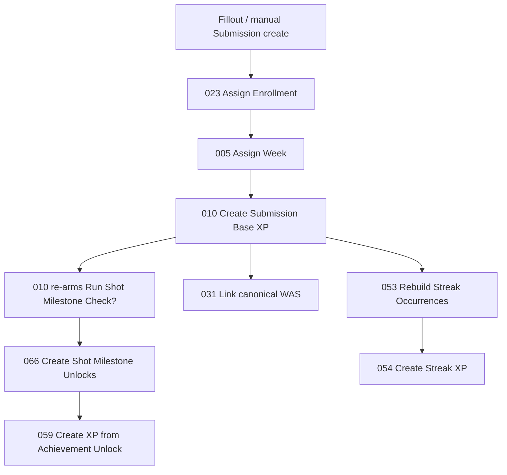

# Automation Launch Closeout — Production Promotion & Live-Test Runbook

**Date:** 2026-08-10  
**PROD base:** `appn84sqPw03zEbTT`  
**Controlled Enrollment:** `recCyFEPeATOVNlr9` (Schmidt, Testing — 2026-2027)  
**Program Instance:** `rec5mEM0YPqPqq0hZ`  
**Do not use for current tests:** `recgP9qZYjAhE7NXm` (legacy 2025–26 Schmidt)

**Controlling reconciliation:** [`docs/prod-completion/2026-08-08/PROD-STATE-RECONCILIATION-010-031-066-118-119-043.md`](../prod-completion/2026-08-08/PROD-STATE-RECONCILIATION-010-031-066-118-119-043.md) supersedes older paste-pending dashboards for 010, 031, 066, 118, 119, and 043.

**Offline test bundle:** `bash tests/automation-contracts/run-assigned-automation-tests.sh` (all PASS at repo tip).

---

## Verified promotion order (dependency-backed)

Install/paste only when upstream gates are green. Order reflects **runtime dependencies**, not file numbers alone.

| Order | Automation | Why this position |
|------:|------------|-------------------|
| 1 | **005** v5.1 | Week assignment scoped by Enrollment → PI; blocks 010/031 WAS identity |
| 2 | **023** v3.1 | Enrollment assignment with Week→PI isolation |
| 3 | **010** v10.6 | Submission Base XP; re-arms `Run Shot Milestone Check?` on Enrollment |
| 4 | **031** v3.5 | Canonical WAS link (find-only; never creates duplicates) |
| 5 | **053** v5.3 | Streak Occurrence rebuild; Week scoped to Enrollment PI |
| 6 | **066** v3.5 | Shot Milestone unlocks; triggered by 010 re-arm |
| 7 | **059** v3.5 | XP from unlocks (downstream of 066; not Worker-1-owned but required for milestone XP) |
| 8 | **118** v1.7 | Sunday 5:00 AM build scheduler |
| 9 | **119** v1.7 | Sunday 10:00 AM send armer |
| — | **020** v3.4.0 | Homework HC pipeline — **parallel** to shooting intake; paste after PHA rows verified |
| — | **043** | **Do not install** — superseded by 042 v3.3 |

Historical order `053 → 066 → 118 → 119 → 043-if-Live` is **superseded** for items already reconciled 2026-08-08.

---

## Status table (evidence-backed)

| # | Repo version | Expected PROD | Installed PROD | Live tested | Offline tests | Remaining uncertainty |
|---|-------------|---------------|----------------|-------------|---------------|----------------------|
| **023** | v3.1 | v3.1 | **Yes** | **PASS** — Week→PI assign + replay | 19/19 `test_023_offline` | None for PI path |
| **010** | **10.6** | 10.6 | **Yes** | **PASS** — replay/update idempotency | 9/9 `test_010_offline` | First-create on v10.6 not separately proven |
| **031** | **v3.5** | v3.5 | **Yes** | **PASS** — empty-link canonical resolution | 13/13 `test_031_offline` | Already-linked stale-summary repair offline-only |
| **053** | **5.3** | 5.3 | **Unverified** | **Not attested** for v5.3 PI scope | Static PI contract PASS | **Editor version + controlled replay required** |
| **066** | **v3.5** | v3.5 | **Yes** | **PASS** — 8/8 existing unlocks skipped | 13 harness tests | New-milestone first-create path needs fresh threshold crossing |
| **118** | **v1.7** | v1.7 | **Yes** | **Partial** — `skipped_no_target_week` fail-safe | unload + schedule contracts | Positive `build_armed` awaits eligible completed Week |
| **119** | **v1.7** | v1.7 | **Yes** | **Partial** — `skipped_no_target_week` fail-safe | unload + send contracts | Positive send-arm awaits eligible WAS package |
| **043** | v2.1 | — | **No native automation** | N/A | legacy classification | **Retired** — 042 owns gate assignment |
| **020** | **v3.4.0** | v3.2.0+ (stale attest v3.0.0) | **Present** (version drift) | **Not attested** for v3.4.0 | SC-016 identity PASS | **Paste v3.4.0 + re-submit merge proof** |

---

## Per-automation runbook

### 023 — Assign Enrollment to Submission — COMPLETE

| Field | Value |
|-------|-------|
| File | `airtable/automations/shooting-challenge/023-submission-intake-and-asset-creation-assign-enrollment-to-submission.js` |
| Version | **v3.1** |
| Airtable name | `023 - Submission Intake and Asset Creation - Assign Enrollment to Submission` |
| Trigger | Submissions · Athlete present · Enrollment empty (recommended view) |
| Input | `recordId` |
| Enable | **ON** |
| Test fixture | Submission `recElDBcFvuE6jWwc` |
| Expected | `programInstanceSource=submission-week`; Enrollment `recCyFEPeATOVNlr9` |
| Replay | Same submission with Enrollment set → `existing-valid-enrollment`, `wroteUpdate=false` |
| Duplicate query | One Enrollment per Athlete+PI; ambiguous → skip |
| Rollback | Restore prior script from Airtable version history; re-run replay |
| Evidence | [`2026-08-06-PROGRAM-INSTANCE-ISOLATION-PASTE.md`](./2026-08-06-PROGRAM-INSTANCE-ISOLATION-PASTE.md) |

---

### 010 — Create XP Event from Submission

| Field | Value |
|-------|-------|
| File | `airtable/automations/shooting-challenge/010-submission-intake-create-xp-event.js` |
| Version | **10.6** |
| Airtable name | `010 - Submission Intake and Asset Creation - Create XP Event from Submission` |
| Trigger | Submissions · `Count This Submission?` checked · XP path |
| Input | `recordId` |
| Enable | **ON** |
| Test fixture | Submission `recElDBcFvuE6jWwc` (stage XP Award Status Pending for controlled run) |
| Expected | `statusOut=updated`; Source Key `SUBMISSION_XP\|{submissionId}`; one XP Event; WAS linked; `Run Shot Milestone Check?` checked on Enrollment |
| Replay | Second run updates same XP Event — `candidateEventCount=1` |
| Duplicate query | `XP Events` where Source Key = `SUBMISSION_XP\|{submissionId}` → exactly 1 active |
| Rollback | Turn OFF; restore script; delete errant XP if created; restore Submission XP Award Status |
| Evidence | [`AUTOMATION-010-V10.6-LIVE-REPLAY-PROOF.md`](../prod-completion/2026-08-08/AUTOMATION-010-V10.6-LIVE-REPLAY-PROOF.md) |

---

### 031 — Find or Create WAS from Submission

| Field | Value |
|-------|-------|
| File | `airtable/automations/shooting-challenge/031-weekly-summary-and-goal-logic-find-or-create-weekly-athlete-summary-from-submission.js` |
| Version | **v3.5** |
| Airtable name | `031 - Weekly Summary and Goal Logic - Find or Create Weekly Athlete Summary from Submission` |
| Trigger | Submissions · counted · WAS empty (view) |
| Input | `recordId` |
| Enable | **ON** |
| Test fixture | Submission `recvLva39Dt1FUgv9` or any counted submission with empty WAS |
| Expected | `found_existing_summary`; canonical WAS `recMMeJENu6Pg8l58`; Summary Key `ATH-recgqVstObQRzgXJF\|2026-2027\|2026-2027\|Early Bird` |
| Replay | Idempotent link; no second WAS |
| Duplicate query | `Weekly Athlete Summary` filtered by Enrollment+Week → exactly 1 valid row |
| Rollback | Restore script; manually unlink if wrong summary linked |
| Evidence | [`AUTOMATION-031-V3.5-CANONICAL-RESOLUTION-LIVE-PROOF.md`](../prod-completion/2026-08-08/AUTOMATION-031-V3.5-CANONICAL-RESOLUTION-LIVE-PROOF.md) |

---

### 053 — Streak Occurrences Rebuild — **ACTION REQUIRED**

| Field | Value |
|-------|-------|
| File | `airtable/automations/shooting-challenge/053-achievements-and-milestones-streak-occurrences-rebuild-and-upsert-from-submissions.js` |
| Version | **5.3** |
| Airtable name | `053 - Achievements and Milestones - Streak Occurrences - Rebuild and Upsert From Submissions` |
| Trigger | Submissions · valid counted submission changes (confirm live conditions) |
| Input | `recordId` (Submission) |
| Enable | **ON** after paste proof |
| Test fixture | Submission `recElDBcFvuE6jWwc` on Enrollment `recCyFEPeATOVNlr9` |
| Expected | Only submissions for that Enrollment counted; Week link PI-scoped; `Source Status` = `Ready for XP` on new occurrences |
| Replay | Rerun same submission → no duplicate Streak Occurrences for same Enrollment+Achievement+Streak End Date |
| Duplicate query | Streak Occurrences for Enrollment `recCyFEPeATOVNlr9` — no duplicate keys for same end date |
| Rollback | Restore prior script; deactivate errant occurrences |
| Evidence | **Missing v5.3 editor attestation** — inventory still shows v5.0 stored snapshot |

---

### 066 — Shot Milestone Unlocks — COMPLETE (replay path)

| Field | Value |
|-------|-------|
| File | `airtable/automations/shooting-challenge/066-achievements-and-milestones-create-shot-milestone-unlocks.js` |
| Version | **v3.5** |
| Airtable name | `066 - Achievements and Milestones - Create Shot Milestone Unlocks` |
| Trigger | Enrollments · `Run Shot Milestone Check?` checked |
| Input | `recordId` (Enrollment) |
| Enable | **ON** |
| Test fixture | Enrollment `recCyFEPeATOVNlr9` |
| Expected | `success`; `skipped_existing` when all milestones already unlocked; `createdUnlocksOut=0` on replay |
| Replay | Check flag → run → flag cleared; no duplicate `SHOT_MILESTONE\|{enr}\|{milestoneId}` unlocks |
| Duplicate query | Athlete Achievement Unlocks where Milestone Source Key starts with `SHOT_MILESTONE\|recCyFEPeATOVNlr9\|` |
| Rollback | Restore script; delete errant unlocks (not XP — handle via 059 separately) |
| Evidence | [`AUTOMATION-066-V3.5-LIVE-PROOF.md`](../prod-completion/2026-08-08/AUTOMATION-066-V3.5-LIVE-PROOF.md) |

---

### 118 — Schedule Weekly Summary Email Build

| Field | Value |
|-------|-------|
| File | `airtable/automations/shooting-challenge/118-email-notifications-and-external-handoffs-schedule-weekly-summary-email-build.js` |
| Version | **v1.7** |
| Airtable name | `118 - Email - Schedule Weekly Summary Email Build` |
| Trigger | Scheduled · Sunday 5:00 AM America/Denver |
| Inputs | `dryRun`, `sendMode`, `includeSchmidt`, `excludedEnrollmentIds`, `emptyWeekPolicy` |
| Enable | **ON** — production: `dryRun=false`, `sendMode=Live`, `includeSchmidt=false` |
| Test fixture | Controlled: `dryRun=true`, `sendMode=Test`, `includeSchmidt=true` |
| Expected (no week) | `skipped_no_target_week`; zero writes |
| Expected (positive) | WAS ensured; `Build Weekly Email Now?` armed for PI-matching enrollments only |
| Replay | Idempotent WAS arms per Enrollment+Week |
| Rollback | Restore inputs; turn schedule OFF; restore script |
| Evidence | PROD reconciliation 2026-08-08 |

---

### 119 — Schedule Weekly Summary Email Send

| Field | Value |
|-------|-------|
| File | `airtable/automations/shooting-challenge/119-email-notifications-and-external-handoffs-schedule-weekly-summary-email-send.js` |
| Version | **v1.7** |
| Airtable name | `119 - Email - Schedule Weekly Summary Email Send` |
| Trigger | Scheduled · Sunday 10:00 AM America/Denver |
| Inputs | `dryRun`, `includeSchmidt`, `excludedEnrollmentIds`, `emptyWeekPolicy` |
| Enable | **ON** — production: `dryRun=false`, `includeSchmidt=false` |
| Test fixture | Controlled: `dryRun=true`, `includeSchmidt=true` |
| Expected (no week) | `skipped_no_target_week`; zero writes; **does not fetch/webhook** |
| Expected (positive) | Arms `Send to Make?` only on ready WAS rows |
| Replay | Does not re-arm already-sent rows |
| Rollback | Restore inputs; turn schedule OFF; restore script |
| Evidence | PROD reconciliation 2026-08-08 |

---

### 020 — Homework Link or Create HC — **ACTION REQUIRED**

| Field | Value |
|-------|-------|
| File | `airtable/automations/shooting-challenge/020-homework-link-or-create-homework-completion.js` |
| Version | **v3.4.0** (repo) — PROD attested **v3.0.0** |
| Airtable name | `020 - Homework - Link or Create Homework Completion` |
| Trigger | Submission Assets · homework asset ready for HC prep |
| Input | `recordId` (Submission Asset) |
| Enable | **ON** |
| Test fixture | New homework asset on Enrollment `recCyFEPeATOVNlr9` with active PHA row |
| Expected | One HC per Enrollment+Week+Homework+Slot; PHA link written; re-submit merges |
| Replay | Second asset same week → same HC, no duplicate |
| Duplicate query | Homework Completions for Enrollment+Week+Homework+Slot → 1 |
| Rollback | Restore prior script; consolidate duplicate HCs per SC-016 audit |
| Evidence | Offline: `tests/homework/automation-020-sc016-identity.test.js` |

---

### 043 — Level Gate Rule — **RETIRED**

| Field | Value |
|-------|-------|
| File | `airtable/automations/shooting-challenge/043-levels-and-progression-set-level-gate-rule-from-next-level.js` |
| Version | v2.1 (repo only) |
| Status | **No native Airtable automation found in PROD UI** |
| Action | **Do not create or enable.** Automation 042 v3.3 assigns Level Gate Rules directly. |
| Evidence | [`PROD-STATE-RECONCILIATION`](../prod-completion/2026-08-08/PROD-STATE-RECONCILIATION-010-031-066-118-119-043.md) |

---

## Natural milestone path — shooting submission → XP

### Offline-provable (repository tests)

| Step | Proof |
|------|-------|
| 023 PI isolation | `test_023_offline.mjs` — 7 cases |
| 010 XP idempotency + milestone re-arm code | `test_010_offline.mjs` — 9 cases |
| 031 canonical WAS | `test_031_offline.mjs` — 13 cases |
| 066 crossing + createRecords contract | `066-*-harness.test.js` — 13 cases |
| 053 PI week scoping | Static contract in `program-instance-isolation.test.js` |
| 020 HC identity | `automation-020-sc016-identity.test.js` |

### Requires Airtable PROD live proof

| Step | What to observe |
|------|-----------------|
| Full chain on new counted submission | Enrollment+Week set; XP Event created; WAS linked; milestone flag set |
| 066 first-create | New athlete crossing a threshold → unlock row + 059 XP Event |
| 053 v5.3 replay | Streak occurrence Week matches Enrollment PI only |
| 118/119 positive path | After first real completed week — build armed, send armed, 072→074 handoff |
| 020 v3.4.0 re-submit | Second homework asset merges to one HC |

### Controlled live-test procedure (milestone path)

1. Use Enrollment `recCyFEPeATOVNlr9` only (not `recgP9qZYjAhE7NXm`).
2. Create or select a counted Submission with Activity Date in Early Bird week `recWeVrSabnsYaHc2`.
3. Confirm automations **023, 005, 010, 031, 066** are **ON**.
4. Clear Enrollment link on test submission (if safe) → run **023** → expect `recCyFEPeATOVNlr9`.
5. Confirm Week assigned by **005** → `recWeVrSabnsYaHc2`.
6. Set `Count This Submission?` → trigger **010** → capture console JSON.
7. Verify: one `SUBMISSION_XP\|{id}` XP Event; WAS `recMMeJENu6Pg8l58` or canonical for that week; `Run Shot Milestone Check?` checked.
8. Run **066** on Enrollment (or wait for trigger) → capture `createdUnlocksOut` / `skippedExistingUnlocksOut`.
9. If new unlock created, confirm **059** fires → XP Event with `SHOT_MILESTONE\|{enr}\|{milestoneId}`.
10. Replay steps 6–8 → zero new unlocks, zero new XP Events.

---

## Global rollback procedure

1. Turn OFF the affected automation in Airtable UI.
2. Open script step → version history → restore last known-good body (or re-paste from prior git tag).
3. For XP/unlock errors: deactivate errant XP Events (do not delete without audit).
4. Re-run controlled fixture; capture console JSON before re-enabling.
5. Update evidence doc with date, record IDs, and pass/fail.

---

## Evidence capture checklist (every paste)

- [ ] Screenshot or copy of script header version string in Airtable editor
- [ ] Full Test action console JSON (`version`, `statusOut`, `actionOut`, `errorOut`, `debugStep`)
- [ ] Before/after record field values for test fixture
- [ ] Duplicate-prevention query result (count = expected)
- [ ] Replay run console JSON
- [ ] Automation ON/OFF state after test
