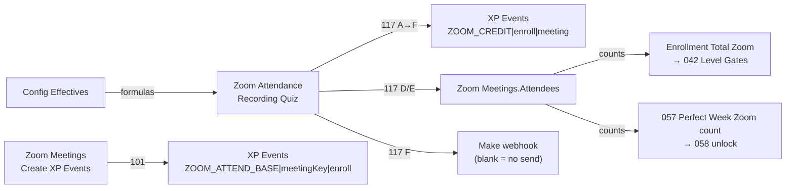

# Automation 117 — interaction map

**Status:** READY_FOR_MIKE_ACTIVATION (analysis only)  
**Date:** 2026-07-14 · Workstream 3 / S26  
**Orchestrator:** `117-zoom-recording-credit-orchestrator.js` **v1.0.1** (A→F)  
**Related:** 101 live XP · Zoom Meetings.Attendees · XP Events · Level gates (042) · Perfect Week (057/058) · Config Effectives · email send keys

---

## System sketch

---

## Ownership boundaries

| System | Owner | Table trigger | XP Source Key family |
|--------|-------|---------------|----------------------|
| **117 orchestrator** | Recording credit | Zoom Attendance (Recording Quiz) | `ZOOM_CREDIT\|{Enrollment RID}\|{Zoom Meeting RID}` from field `Zoom Credit Key` |
| **101** | Live + supplemental meeting XP | Zoom Meetings (`Create XP Events`) | `ZOOM_ATTEND_BASE\|{Zoom Meeting Key}\|{enrollmentId}` (+ bonus2/3 keys) |
| **117a–f** | Library only | Do **not** paste ×6 | Same as 117 steps |

117 and 101 **must never write the same Source Key**. Key prefixes are disjoint → **no double create of one XP Event row**. Separate risk: stacking two XP rows for one enrollment×meeting (see below).

---

## Double-award proof (and the residual hazard)

### Safe by design (same Event)

| Claim | Proof |
|-------|-------|
| 117 will not create a second `ZOOM_CREDIT|…` row | Step C indexes by Source Key; exists → `skipped_exists` / `updated`; **v1.0.1** rechecks immediately before `createRecordAsync` |
| 101 will not create `ZOOM_CREDIT|…` | 101 only builds `ZOOM_ATTEND_*` keys |
| Live rows never get recording XP | Step A aborts `skipped_not_recording_quiz`; trigger Method = Recording Quiz |
| Live vs recording mutually exclusive credit | `Zoom Credit Conflict?` formula + Approved gate; conflict → deactivate `ZOOM_CREDIT` XP |

### Residual hazard (two different XP Events)

| Hazard | Mechanism | Activation rule |
|--------|-----------|-----------------|
| **ZOOM_CREDIT + ZOOM_ATTEND_BASE for same athlete×meeting** | 117 D/E adds Enrollment to `Zoom Meetings.Attendees` for gate/PW counting; **101** supplemental re-run (documented “add recording watchers”) awards **full** base XP to every Attendee missing `ZOOM_ATTEND_BASE` | During 117 DEV test: **do not** re-check `Create XP Events` on the fixture meeting after gate/PW link. Recording XP = **117 only**. |
| Historical pre-C-025 path | Older ops used Attendees + 101 for recording watchers | C-025 replaces that with % credit via `ZOOM_CREDIT`; treat 101 supplemental as **live-only** unless Mike explicitly redesigns |

**PASS criteria for “no double award” in DEV:** after Satisfactory + Approved, exactly **one** active XP Event whose Source Key starts with `ZOOM_CREDIT|` for that pair; zero new `ZOOM_ATTEND_BASE|…` for that enrollment on that meeting attributable to the 117 run.

---

## Interactions by subsystem

### 101 — Award Meeting XP

| Topic | Detail |
|-------|--------|
| Trigger independence | 101 fires from Zoom Meetings; 117 from Zoom Attendance — no shared automation slot |
| Attendees | 117 D/E may append Enrollment; 101 reads Attendees when Create XP Events checked |
| Conflict with recording | If a Live ZA row exists for same pair, Conflict/Approved formulas block 117 award; 101 still awards live attendees as today |
| Activation test | Leave fixture meeting `Create XP Events` **unchecked** after 117 runs |

### Zoom Meetings.Attendees / level gates / Perfect Week

| Step | Writes | Downstream |
|------|--------|------------|
| D | Idempotent Attendees add + `Gate Credit Applied?` | Feeds Enrollment `Total Zoom Attendances` → **042** gate progress |
| E | Same Attendees add (if missing) + `Perfect Week Credit Applied?` | Feeds **057** PW Zoom count → **058** unlocks |
| Idempotency | Independent applied flags; Attendees add is dedupe-by-id | Re-run safe |
| Rollback | Uncheck applied flags; remove Enrollment from Attendees **only if both flags false** |

### XP Events

| ActionOut | When |
|-----------|------|
| `created` | Approved, not conflict, amount > 0, no key match (after recheck) |
| `updated` | Key exists; points differ or `Active?` false → true (reactivate) |
| `skipped_exists` | Key exists, active, points match |
| `deactivated_on_conflict` | Not approved **or** conflict **or** amount ≤ 0, and active XP exists |
| `skipped_not_approved` / `skipped_zero_amount` | No create; no active XP to deactivate |

### Config / formulas

| Effective / formula | Role |
|---------------------|------|
| `Zoom Credit Approved?` / `Conflict?` / `Zoom XP Amount` / `Zoom Credit Key` | Gate C |
| `Zoom Gate Credit Earned?` | Gate D |
| `Effective Recording Counts for Perfect Week?` | Gate E |
| `Effective Recording Approval Email Enabled?` / Timing / Template Key | Gate F |
| Post-B reload | Orchestrator reloads ZA so formulas see `Satisfactory?` before C–F; if Airtable lag, next matches-conditions re-fire completes credit |

### Email send keys (F)

| Guard | ActionOut |
|-------|-----------|
| Not Satisfactory | `skipped_not_satisfactory` |
| Not Approved / Conflict | `skipped_not_approved` |
| Enabled null | `skipped_config_missing` |
| Enabled false | `skipped_disabled` |
| Blank template | `skipped_missing_template_key` |
| Send Key already `ZOOM_REC_EMAIL\|enroll\|meeting` | `skipped_already_sent` |
| Blank `webhookUrl` | `skipped_no_webhook` (**DEV default**) |
| Webhook 2xx | `sent` + stamp Send Key / Sent At |

**Activation:** blank webhook → never stamps → F always skip-safe.

---

## Recursive retrigger risks

| Cause | Risk | Mitigation |
|-------|------|------------|
| A/B/D/E/F write ZA fields | Second 117 run | Per-step skips |
| D/E write Meeting Attendees | Could affect other automations watching Meetings | Does not retrigger 117 (ZA trigger); avoid 101 Create XP Events |
| Formula cascade after Satisfactory | Extra 117 runs | Expected; idempotent |
| F stamps Send Key with live webhook | Extra run → `skipped_already_sent` | Keep webhook blank until email wave |

---

## Idempotency per step

| Step | Skip / idempotent signals | Mutating actions |
|------|---------------------------|------------------|
| **A** | `skipped_already_normalized`, `skipped_duplicate_pair`, `skipped_missing_links`, `skipped_not_recording_quiz` | `normalized` |
| **B** | `skipped_unchanged`, `skipped_not_recording_quiz` | `marked_satisfactory`, `marked_needs_correction` |
| **C** | `skipped_exists`, `skipped_not_approved`, `skipped_zero_amount`, `skipped_not_recording_quiz` | `created`, `updated`, `deactivated_on_conflict` |
| **D** | `skipped_already_applied`, `skipped_no_gate_credit`, `skipped_conflict`, `skipped_not_recording_quiz` | `linked_attendee_for_gate` |
| **E** | `skipped_already_applied`, `skipped_flag_off`, `skipped_conflict`, `skipped_not_recording_quiz` | `linked_attendee_for_perfect_week` |
| **F** | all `skipped_*` including `skipped_no_webhook` / `skipped_disabled` / `skipped_already_sent` | `sent` only |

Composite `actionOut` = `A|B|C|D|E|F`. `statusOut=success` if any non-`skipped_*` action; else `skipped`.

---

## Folder / PROD / Folder 07

| Area | Interaction |
|------|-------------|
| Folder `17 - Zoom Recording Credit` | 117 lives here |
| Folder `10 - Zoom Attendance XP` | 101 — do not disable for 117 tests |
| Folder 07 email | Out of scope; **do not** change ON/OFF for this package |
| PROD | Untouched |

---

## Mike watchpoints during first ON

1. Confirm Run History shows Recording Quiz only.
2. Confirm one `ZOOM_CREDIT|…` XP Event; no surprise `ZOOM_ATTEND_BASE` from the test.
3. Confirm Conflict fixture deactivates XP without deleting it.
4. Confirm F output is never `sent` while webhook blank.
5. Restore Schmidt fixture after sequence (see smoke plan).
