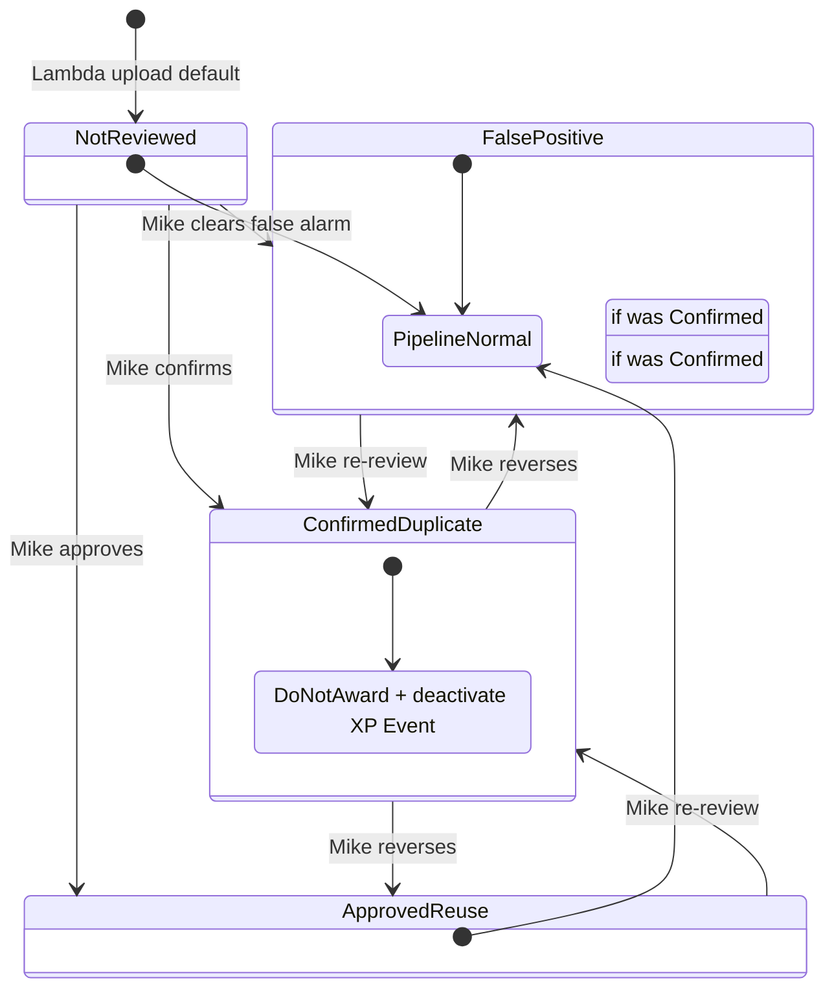

# C-023 Stage 5 — DEV duplicate consequence workflow

**Status:** Implemented in GitHub (2026-07-10) · DEV automation paste pending Mike  
**Depends on:** H3b–H3p matrix 16/16 PASS (`f5f6fb0`) · Stage 3 C-023 fields on DEV Submission Assets  
**Out of scope:** Production paste · 070a/070b/Make changes · athlete/parent notifications · S3 deletion

---

## Owner-approved policy (summary)

| Principle | Rule |
|-----------|------|
| Default | Pipeline continues; exact-file matches presumed legitimate until Mike reviews |
| Blocking | No automatic block for same- or cross-enrollment matches |
| Cross-enrollment | Informational only unless Mike sets `Confirmed Duplicate` |
| Reviewer | Mike via `Asset Reuse Decision` (operator field; detection stays Lambda-owned) |
| Confirmed duplicate | Activity stays visible; earns **0 XP**; all evidence retained |
| XP ledger | Deactivate (never delete) XP Events; one source → one event |
| Reversal | `Approved Reuse` or `False Positive` restores eligibility without duplicate XP |
| Student label | Neutral: `Confirmed Duplicate — 0 XP` |

---

## Schema impact assessment

### Reuse (no new writer conflicts)

| Table | Field | Role |
|-------|-------|------|
| **Submission Assets** | `Potential Asset Reuse?`, review reason fields, hash/S3 fields | Lambda detection — **read-only** for 116 |
| **Submission Assets** | `Asset Reuse Decision` | Mike operator decision (**canonical**) |
| **Submission Assets** | `Duplicate Resolution Applied?`, `Applied At`, `Error` | Stage 5 idempotency + audit (116 writes) |
| **Submission Assets** | `Asset Reuse Review Notes`, `Reviewed At`, `Reviewed By` | Mike + audit append |
| **Video Feedback** | `Do Not Award XP?` | Blocks 113/114 when confirmed |
| **Video Feedback** | `Award Status` | Preserved; 116 does not overwrite `Awarded` rows except via `Do Not Award XP?` |
| **Homework Completions** | `Award Status` | `Do Not Award` blocks 065 when confirmed |
| **Homework Completions** | `Satisfactory?`, `Review Complete`, links | Stay visible — **not cleared** |
| **XP Events** | `Active?`, `Duplicate Status`, `Active XP Points` (formula) | Deactivate on confirm; reactivate on reversal |
| **XP Events** | `Source Key` | `VIDEO_SUBMISSION\|{vfId}` · `HOMEWORK_XP\|{hcId}` |
| **Enrollments** | `Level Recalc Needed?` | 116 sets after XP deactivate/reactivate (041 may not fire on deactivate alone) |
| **Weekly Athlete Summary** | `XP Earned This Week` (rollup of `Active XP Points`) | Recalcs automatically when XP deactivated |

### New DEV fields (116 + display)

| Table | Field | Type | Writer | Required for |
|-------|-------|------|--------|--------------|
| **Submission Assets** | `Duplicate Resolution Last Applied Decision` | singleLineText | 116 | Reversal idempotency |
| **Homework Completions** | `Linked Asset Reuse Decision` | lookup → Submission Assets.`Asset Reuse Decision` | schema | Student label (K) |
| **Video Feedback** | `Linked Asset Reuse Decision` | lookup → Submission Asset.`Asset Reuse Decision` | schema | Student label (K) |
| **Homework Completions** | `Activity XP Display Label` | formula | schema | Student label (K) |
| **Video Feedback** | `Activity XP Display Label` | formula | schema | Student label (K) |

Setup: `tools/airtable/c023_dev_stage5_schema_setup.py` (DEV only).

### `Asset Reuse Decision` option alignment

Operator field remains **`Asset Reuse Decision`** (not a separate `Duplicate Review Decision` field — avoids duplicate semantics).

| Owner state | DEV option(s) | 116 behavior |
|-------------|---------------|--------------|
| Not Reviewed | `Not Reviewed` | No consequence apply; no XP suppression |
| Approved Reuse | `Approved Reuse` **(new)**, `Allowed — Legitimate Reuse`, `Allowed — Correction/Resubmission` | Clear suppress flags; restore XP if last applied was Confirmed |
| Confirmed Duplicate | `Confirmed Duplicate` | Apply zero-XP consequences |
| False Positive | `False Positive` **(new)**, `Unable to Determine`, `Resolved — Duplicate Record Error` | Same as Approved Reuse (restore path) |

H3n–H3p legacy options remain valid.

### No writes to computed fields

116 never writes formulas, rollups, lookups, or `Active XP Points`.

---

## State machine

| Transition | XP | Activity records | S3 / asset |
|------------|-----|------------------|------------|
| → Not Reviewed | Unchanged | Unchanged | Unchanged |
| → Approved / False Positive | Restore if previously deactivated by 116 | Visible; clear suppress flags | Unchanged |
| → Confirmed Duplicate | 0 (`Active?` false; 113/114/065 blocked) | Visible | Unchanged |
| Same decision re-selected | **No-op** (idempotent) | Unchanged | Unchanged |

---

## Automation design — **116**

| Item | Value |
|------|-------|
| **File** | `airtable/automations/shooting-challenge/116-submission-assets-apply-asset-reuse-decision-consequences.js` |
| **Folder** | 12 - Asset Reuse Review |
| **Trigger table** | Submission Assets |
| **Trigger** | When `Asset Reuse Decision` is updated (any option) |
| **Input** | `recordId` |
| **070a/070b/Make** | **Not used** |

### Processing steps

1. Load Submission Asset; validate `recordId`.
2. Read `Asset Reuse Decision` → categorize (`not_reviewed` \| `approved` \| `confirmed` \| `false_positive`).
3. Resolve activity target from links:
   - `Upload Destination = Video Feedback` → Video Feedback row + `VIDEO_SUBMISSION\|{id}`
   - `Upload Destination = Homework Completions` → Homework Completion row + `HOMEWORK_XP\|{id}`
4. **Not Reviewed:** skip (no consequence mutation).
5. **Confirmed Duplicate:**
   - If `Duplicate Resolution Last Applied Decision = Confirmed Duplicate` and applied flag set → skip (idempotent).
   - Video: `Do Not Award XP? = true`
   - Homework: `Award Status = Do Not Award`
   - Find XP Event by Source Key; if found → `Active? = false`, `Duplicate Status = Duplicate - Remove`, append `[C-023-S5]` debug note
   - Asset: `Duplicate Resolution Applied? = true`, timestamps, last-applied decision, audit note append
   - Enrollment: `Level Recalc Needed? = true` when enrollment resolvable
6. **Approved / False Positive:**
   - If last applied ≠ Confirmed Duplicate → skip restore (nothing to undo)
   - Video: `Do Not Award XP? = false`
   - Homework: `Award Status = Pending` (if was Do Not Award) or leave `Awarded` if XP exists
   - XP Event: reactivate only if `[C-023-S5]` marker present → `Active? = true`, `Duplicate Status = Unique`
   - Clear resolution applied flags; update last-applied decision
7. Required outputs: `statusOut`, `actionOut`, `errorOut`, `debugStep`.

### Lambda

**No change.** Detection/classification contract from H3 matrix preserved.

---

## Files to modify / add

| Path | Action |
|------|--------|
| `airtable/automations/shooting-challenge/116-submission-assets-apply-asset-reuse-decision-consequences.js` | **Add** |
| `tools/airtable/c023_dev_stage5_apply.py` | **Add** — DEV invoke mirror of 116 |
| `tools/airtable/c023_dev_stage5_matrix_run.py` | **Add** — S5A–S5L matrix |
| `tools/airtable/c023_dev_stage5_schema_setup.py` | **Add** — DEV schema helpers |
| `airtable/extension-scripts/audits/audit-c023-stage5-duplicate-consequences.js` | **Add** — dry-run audit |
| `docs/deploy-checklists/C-023-dev-stage5-duplicate-consequences.md` | **Add** (this doc) |
| `docs/deploy-checklists/C-023-production-duplicate-policy.md` | Update Stage 5 status |
| `docs/v2-change-backlog.md` | Update C-023 |
| `docs/automation-index.md` | Add 116 |
| `CHANGELOG.md` | Stage 5 entry |

---

## DEV test matrix (S5A–S5L)

| ID | Scenario | Path | Pass criteria |
|----|----------|------|---------------|
| **S5A** | Not Reviewed + same-enrollment match | Video | XP path not blocked; no resolution applied |
| **S5B** | Approved Reuse | Video | Normal XP eligible; suppress flags clear |
| **S5C** | Confirmed before XP | Video | Activity visible; no XP Event; Do Not Award set |
| **S5D** | Confirmed after XP | Video | XP Event inactive; Active XP Points = 0 |
| **S5E** | Repeated Confirmed | Video | Second apply no-op |
| **S5F** | Confirmed → Approved Reuse | Video | Same XP Event reactivated; no duplicate |
| **S5G** | Confirmed → False Positive | Video | Same restore as S5F |
| **S5H** | Cross-enrollment Not Reviewed | Video | Normal XP; informational only |
| **S5I** | Confirmed homework | Homework | Award Status Do Not Award; 0 XP |
| **S5J** | Confirmed video | Video | Do Not Award XP; 0 XP |
| **S5K** | Student display label | Both | `Activity XP Display Label` = `Confirmed Duplicate — 0 XP` |
| **S5L** | Evidence retention | Both | Canonical URL, S3 key, submission links unchanged |

**Harness:** `python tools/airtable/c023_dev_stage5_matrix_run.py all`  
**Dry-run audit:** Extension `audit-c023-stage5-duplicate-consequences.js` with `CONFIRM_WRITE` unset.

**DEV paste gate:** Mike creates automation in DEV from script docblock → optional re-run with live trigger.

---

## 2026-07-10 — Stage 5 matrix results (S5A–S5L)

**Harness:** `python tools/airtable/c023_dev_stage5_matrix_run.py all` (116 mirror via API; 070a/070b/Make **OFF**)

| ID | Result | Asset | Notes |
|----|--------|-------|-------|
| **S5A** | **PASS** | `recF86pJTIMFoEypJ` | Not Reviewed — no suppress |
| **S5B** | **PASS** | `recF86pJTIMFoEypJ` | Approved Reuse — normal path |
| **S5C** | **PASS** | `recF86pJTIMFoEypJ` | Confirmed before XP — Do Not Award |
| **S5D** | **PASS** | `recF86pJTIMFoEypJ` | Confirmed after XP — deactivated ledger |
| **S5E** | **PASS** | `recF86pJTIMFoEypJ` | Repeated confirm idempotent |
| **S5F** | **PASS** | `recF86pJTIMFoEypJ` | Confirmed → Approved — same XP Event restored |
| **S5G** | **PASS** | `recF86pJTIMFoEypJ` | Confirmed → False Positive — restored |
| **S5H** | **PASS** | `recQcpLCsYFrYYH7w` | Cross-enrollment Not Reviewed — unblocked |
| **S5I** | **PASS** | `rec1PzA7th0qJbsN4` | Homework Do Not Award |
| **S5J** | **PASS** | `recF86pJTIMFoEypJ` | Video confirmed path |
| **S5K** | **PASS** | `recF86pJTIMFoEypJ` | Display label proxy (formula fields pending OMNI) |
| **S5L** | **PASS** | `recF86pJTIMFoEypJ` | Canonical URL + storage key unchanged |

**Verdict:** **12/12 PASS.** Artifacts: `tools/airtable/_preview/c023-dev-stage5-*.json`

**OMNI follow-up (DEV):** add lookup `Linked Asset Reuse Decision` + formula `Activity XP Display Label` on HC/VF; optional text field `Duplicate Resolution Last Applied Decision` on Submission Assets.

Production remains **untouched**. Before prod: separate approval, schema promotion per C-023 policy §19, paste 116, run prod dry-run audit only.
