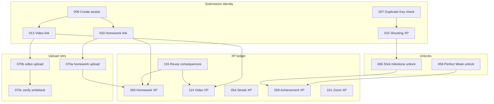

# C-024 — Dedupe field + automation dependency inventory (Stage 2)

**Worker:** A  
**Backlog:** C-024 (rock-solid dedupe keys + safe backfill reruns)  
**Branch:** `overnight/v2-run/worker-a-s2-c024-inventory`  
**Base SHA:** `c59dca8`  
**Authorization:** [LEAD-STAGE2-AUTHORIZED.md](../overnight-runs/2026-07-12/LEAD-STAGE2-AUTHORIZED.md)  
**Environment:** Repo / DEV documentation only — **no PROD**, **no schema API writes**, **no automation logic edits**

---

## Purpose

Inventory every **record-identity** dedupe field and automation writer dependency across five core tables. This complements **C-023** (file-byte / hash layer). Cross-link: C-023 owns `File Content Hash`, `Duplicate File Status`, `Asset Reuse Decision`; C-024 owns **Source Key** patterns and **recheck-before-create** behavior on XP and unlock writers.

**Schema sources cited:**

| Source | Role |
|--------|------|
| [airtable/schema/current/field-map.md](../../airtable/schema/current/field-map.md) | Living field names + C-013 ownership |
| [airtable/schema/current/automation-trigger-map.md](../../airtable/schema/current/automation-trigger-map.md) | Pipeline triggers + idempotency summary |
| [airtable/schema/current/table-map.md](../../airtable/schema/current/table-map.md) | Table relationships |
| `airtable/schema/snapshots/schema_doc_appn84sqPw03zEbTT_20260629_045741.md` | PROD field types + formulas (Submission → Achievement Unlocks) |
| `airtable/schema/snapshots/dev-20260706/schema_doc_appTetnuCZlCZdTCT_20260706_161606.md` | DEV C-023 hash/duplicate fields |

---

## Layer model

| Layer | Identity | Primary fields | Primary writers / detectors |
|-------|----------|----------------|----------------------------|
| **L1 — Submission row** | Same athlete + date + stat fingerprint | `Duplicate Key`, `Duplicate Review Status` | **007** |
| **L2 — Asset row (intake)** | Same Airtable attachment on same submission | `Source Attachment ID` | **009** |
| **L2b — Asset row (file bytes)** | SHA-256 / match graph | `File Content Hash`, `Duplicate File Status`, `Duplicate Match Record` | Lambda / C-023 audit (not in writer list) |
| **L2c — Asset row (upload retry)** | Drive URL / upload state | `Google Drive File URL`, `Send to Make Trigger`, `Upload Status` | **070a**, **070b**, **070c** |
| **L3 — XP ledger** | One business award per source record | `Source Key`, `XP Dedupe Key`, `Duplicate Status`, `Active?` | **010**, **054**, **059**, **065**, **101**, **114**, **116** |
| **L4 — Achievement unlock** | One unlock per milestone / perfect week | `Milestone Source Key`, `Source Key` (unlock table) | **058**, **066** → **059** |

---

## Table 1 — Submissions

**Dedupe-related field count: 8**

| Field | Type | Layer | Writer(s) | Reader(s) / downstream | Notes |
|-------|------|-------|-----------|--------------------------|-------|
| `Duplicate Key` | formula | L1 | — (computed) | **007** (read), audits | Formula: `Enrollment \| YYYY-MM-DD Activity Date \| Submission Stat Mode \| stats…` — [PROD schema snapshot](../../airtable/schema/snapshots/schema_doc_appn84sqPw03zEbTT_20260629_045741.md) |
| `Duplicate Review Status` | singleSelect | L1 | **007** | `Count This Submission?`, coach review | Choices: `Needs Review`, `Count It`, `Exclude It` — 007 docblock v2.0 |
| `Count This Submission?` | formula | L1 | — | **010**, **031**, streak/milestone chains | 0 when `Duplicate Review Status` ∈ {`Exclude It`, `Needs Review`} |
| `XP Award Status` | singleSelect | L3 gate | **010** | XP pipeline | 010 does **not** skip solely because already `Awarded` (repair allowed) — 010 docblock v10.4 |
| `XP Events` | link | L3 | **010** (link back) | Audits, rollups | One counted submission → one shooting-base XP row expected |
| `Submission Key` | formula/text | L3 legacy | — | **010** (legacy match) | 010 also matches `SUBMISSION_XP\|{submissionId}` and legacy submission key |
| `Total Shots Counted` | formula | L3 gate | — | **010** | Must be > 0 for XP |
| `Submission Assets` | link | L2 | **009** (creates children) | **070a/b**, C-023 | Asset duplicate fields roll up via lookups on children |

**007 dependency chain:** `Duplicate Key` → scan peers → write `Duplicate Review Status` → `Count This Submission?` gates **010**.

---

## Table 2 — Submission Assets

**Dedupe-related field count: 24**

| Field | Type | Layer | Writer(s) | Reader(s) | Notes |
|-------|------|-------|-----------|-----------|-------|
| `Source Attachment ID` | singleLineText | L2 | **009** | **009** (recheck set) | 009 skips create when same submission already has asset with same attachment ID — 009 docblock |
| `Airtable Attachment` | attachment | L2 | **009** | **020**, **070a/b** | Transient intake; not cleared until Slice 4 — [field-map.md](../../airtable/schema/current/field-map.md) |
| `Upload Status` | singleSelect | L2c | **009** (Pending Link), **070a/b**, Make/Lambda | **070** triggers, **022**, **070c** | Ladder exists on DEV; do not change — field-map |
| `Send to Make Trigger` | checkbox | L2c | **020** (homework ready), **070a/b** (clear on success), **070c** (clear on verify) | **070a/b/c** | Retained on failure for retry — 070a/b docblock v4.4 |
| `Google Drive File URL` | singleLineText | L2c | Make/Lambda writeback | **070a/b** (pre-send guard) | If URL or File ID present → `skipped_already_uploaded` — 070a/b v4.1+ |
| `Google Drive File ID` | singleLineText | L2c | Make/Lambda | **070a/b** | Same guard as URL |
| `Canonical File URL` | url | L2b | Make S3 / Lambda | **070c**, audits, web | **Missing on DEV** per field-map — add before cutover |
| `Storage Key` | singleLineText | L2b | Make S3 / Lambda | C-023 duplicate detection | **Missing on DEV** per field-map |
| `File Content Hash` | singleLineText | L2b | Lambda (Slice 2) | C-023 audit, duplicate lookups | Exists on DEV; population pending upload wiring — field-map |
| `File Hash Algorithm` | singleSelect | L2b | Lambda | C-023 audit | `SHA-256` option |
| `File is Duplicate?` | checkbox | L2b | C-023 detector | Homework/Video lookups | PROD snapshot |
| `Duplicate File Status` | singleSelect | L2b | C-023 detector | Linked lookups on HC/VF | Choices include `Exact Duplicate`, `Allowed Reuse`, `Needs Review` |
| `Duplicate Match Strength` | singleSelect | L2b | C-023 detector | Review UI | e.g. `Exact SHA-256 Hash`, `Same Source Attachment ID` |
| `Duplicate Match Notes` | multilineText | L2b | C-023 detector | Review UI | |
| `Duplicate Checked At` | dateTime | L2b | C-023 detector | Audits | |
| `Duplicate Check Error` | singleLineText | L2b | C-023 detector | Audits | |
| `Duplicate Review Status` | singleSelect | L2b | Operator / 116 aftermath | Linked lookups | Distinct from Submissions homonym |
| `Duplicate Match Record` | link (self) | L2b | C-023 detector | Graph traversal | Self-link — PROD snapshot warning |
| `From field: Duplicate Match Record` | link (self) | L2b | — | Inverse self-link | |
| `Asset Reuse Decision` | singleSelect | L2b | Operator | **116** trigger | DEV C-023; not in June PROD snapshot |
| `Duplicate Resolution Applied?` | checkbox | L3 | **116** | Audits | 116 docblock v1.0.1 |
| `Duplicate Resolution Applied At` | dateTime | L3 | **116** | Audits | |
| `Duplicate Resolution Error` | multilineText | L3 | **116** | Audits | |
| `Duplicate Resolution Last Applied Decision` | singleLineText | L3 | **116** | Idempotency | Same decision re-run → `skipped_idempotent_same_decision` |

**Upload idempotency (not Source Key):** **070a/b** block duplicate **uploads** via Drive URL/File ID; **070c** idempotently clears trigger when writeback already complete — no XP Source Key involved.

---

## Table 3 — Homework Completions

**Dedupe-related field count: 11**

| Field | Type | Layer | Writer(s) | Reader(s) | Notes |
|-------|------|-------|-----------|-----------|-------|
| `Homework Completion Key` | formula | L3 helper | — | Rollups, audits | `Enrollment + Week + Homework` — PROD snapshot formula index |
| `Award Status` | singleSelect | L3 gate | **065** | **071** trigger | `Pending` → `Awarded`; **116** can set `Do Not Award` on linked path |
| `XP Events` | link | L3 | **065** (link) | **059**-style guards | 065 errors if >1 linked XP Event |
| `Base XP Awarded` / `Extra Credit XP Awarded` | number | L3 | **064** prep, **065** | `Total Homework XP Awarded` formula | XP amount source for **065** |
| `Satisfactory?` / `Review Complete?` | checkbox | L3 gate | Coach / **064** | **065** trigger | |
| `Linked Asset Duplicate?` | lookup | L2b | — | Coach review, **116** context | From `Submission Assets.File is Duplicate?` |
| `Linked Asset Duplicate Status` | lookup | L2b | — | Review queues | |
| `Linked Asset Duplicate Match Record` | lookup | L2b | — | C-023 review | |
| `Linked Asset Duplicate Notes` | lookup | L2b | — | Review UI | |
| `Linked Asset Duplicate Match Strength` | lookup | L2b | — | Review UI | |
| `Linked Asset Duplicate Review Status` | lookup | L2b | — | Review UI | |

**065 Source Key:** `HOMEWORK_XP|{homeworkCompletionRecordId}` — 065 docblock / CONFIG `sourceKeyPrefix`.

---

## Table 4 — XP Events

**Dedupe-related field count: 12**

| Field | Type | Layer | Writer(s) | Reader(s) | Notes |
|-------|------|-------|-----------|-----------|-------|
| `Source Key` | singleLineText | L3 | **010**, **054**, **059**, **065**, **101**, **114** | All XP writers, **116** lookup | Canonical automation-written identity — field-map lists pattern; PROD snapshot |
| `XP Dedupe Key` | formula | L3 | — | **010**, audits | `LOWER(enrollmentId \| eventIdentity \| xpSource)` — uses `Source Key` fallback |
| `XP Dedupe Key Normalized` | formula | L3 | — | **010**, **114** | Normalizes `Source Key` or legacy submission/streak/week keys |
| `Duplicate Count` | count/formula | L3 audit | — | `Needs Dedupe Review` | |
| `Duplicate Status` | singleSelect | L3 audit | **054** (implicit), **116** | Rollups / `Effective XP` | `Unique`, `Duplicate - Remove`, etc. |
| `Needs Dedupe Review` | formula | L3 audit | — | Ops views | When `Duplicate Count` > 1 |
| `Active?` | checkbox | L3 | All XP writers, **116** | Level recalc, totals | **054** deactivates duplicate rows; **116** deactivates on confirmed duplicate |
| `Enrollment` | link | L3 | All XP writers | Dedupe formulas | |
| `Submission` | link | L3 | **010** | **010** match fallback | |
| `Achievement Unlock` | link | L3 | **059** | **059** duplicate check | |
| `Video Feedback` | link | L3 | **114** | **114** match | |
| `Streak Occurrence` | link | L3 | **054** | **054** match fallback | |

**Formula dependency (audit):** `XP Dedupe Key` depends on `Enrollment Record ID`, `XP Source`, `Event Identity ID`, `Source Key` — PROD snapshot §6862+.

---

## Table 5 — Athlete Achievement Unlocks

**Dedupe-related field count: 8**

| Field | Type | Layer | Writer(s) | Reader(s) | Notes |
|-------|------|-------|-----------|-----------|-------|
| `Milestone Source Key` | singleLineText | L4 | **066** | **066** (index), **059** (fallback) | Pattern: `SHOT_MILESTONE\|{enrollmentId}\|{shotMilestoneId}` — 066 docblock v3.2 |
| `Source Key` | singleLineText | L4 | **058** (optional field) | **058**, **059** (fallback) | Perfect week: `PERFECT_WEEK\|{enrollmentId}\|{weekId}` — 058 docblock |
| `Unlock Key` | formula | L4 | — | Display only | **066 must NOT write** — computed — 066 design rules |
| `XP Award Status` | singleSelect | L4→L3 | **058**, **066**, **059** | `Ready for 059 XP?` | Pending until **059** awards |
| `XP Events` | link | L4→L3 | **059** | `Ready for 059 XP?` formula | Empty required for trigger formula = 1 |
| `Ready for 059 XP?` | formula | L4 gate | — | **059** trigger | Pending + no XP link — PROD snapshot |
| `Source Status` | singleSelect | L4 | **058** | Pipeline | `Ready for XP` on create — 058 |
| `Shot Milestone` / `Week` / `Enrollment` / `Achievement` | links | L4 | **058**, **066** | **058** composite dedupe fallback | 058 matches Source Key **or** enrollment+week+achievement triple |

---

## Writer matrix — Source Key / dedupe pattern + recheck behavior

**Writer count: 13** (per LEAD-STAGE2-AUTHORIZED)

| # | Script | Trigger table | Writes to | Source Key / dedupe pattern | Recheck-before-create evidence | On duplicate |
|---|--------|---------------|-----------|------------------------------|--------------------------------|--------------|
| **007** | `007-…-duplicate-checker-for-submissions.js` | Submissions | `Duplicate Review Status` | **L1:** peer match on formula `Duplicate Key` (not a Source Key) | Loads all submissions; compares `Duplicate Key` excluding self — §7 docblock | `Count It` if none; `Needs Review` if matches; respects `Exclude It` unless `overwriteExcludeIt` |
| **009** | `009-submission-intake-create-submission-assets.js` | Submissions | Submission Assets | **L2:** `Source Attachment ID` per submission+file | Pre-loads existing assets for submission into `existingAssetKeys` Set — lines 264–280 | Skip create (`Asset already exists`); does not touch hash/reuse fields |
| **010** | `010-submission-intake-create-xp-event.js` | Submissions | XP Events | **L3:** `SUBMISSION_XP\|{submissionId}`; also `XP Dedupe Key` = `{enrollment}\|{submission}\|Submission Base` | Queries linked + scans candidates for sourceKey, dedupeKey, normalizedKey, submission link — §duplicate-safe checks | Repair canonical row; **error** if multiple matches; no named "last-chance" step |
| **054** | `054-…-create-or-repair-streak-xp-event.js` | Streak Occurrences | XP Events | **L3:** `STREAK_XP\|{enrollmentId}\|{achievementId}\|{streakEndDateKey}` | Full-table scan; match on Source Key **or** Streak Occurrence link **or** pre-linked IDs — §8 | First match = canonical; **deactivates** additional matches (`duplicateXpEventsMarkedInactive`) |
| **058** | `058-…-create-perfect-week-unlock.js` | Weekly Athlete Summary | Achievement Unlocks | **L4:** `PERFECT_WEEK\|{enrollmentId}\|{weekId}` on unlock `Source Key` | Scans unlocks for Source Key **or** enrollment+week+achievement — §6 | Links existing unlock to WAS; no second create |
| **059** | `059-…-create-xp-event-from-achievement-unlock.js` | Achievement Unlocks | XP Events | **L3:** `PERFECT_WEEK\|{enrollment}\|{week}` or `SHOT_MILESTONE\|{enrollment}\|{shotMilestone}`; falls back to unlock `Milestone Source Key` / `Source Key` | Early exit if `XP Events` already linked; §10 full scan for Source Key or Achievement Unlock link | `linked_existing_duplicate_xp_event`; marks unlock Awarded |
| **065** | `065-…-create-homework-xp-event.js` | Homework Completions | XP Events | **L3:** `HOMEWORK_XP\|{homeworkCompletionId}` | §8: `selectRecordsAsync` on XP Events + find by Source Key; also checks linked XP on HC | Repair/link existing; **error** if >1 linked XP; no post-query recheck immediately before `createRecordAsync` |
| **066** | `066-…-create-shot-milestone-unlocks.js` | Enrollments | Achievement Unlocks | **L4:** `SHOT_MILESTONE\|{enrollmentId}\|{shotMilestoneId}` → `Milestone Source Key` | Builds `existingUnlockBySourceKey` Map before create loop — §unlock index | `skipped_existing` + optional repair update; never writes `Unlock Key` |
| **101** | `101-zoom-attendance-xp-award-meeting-xp.js` | Zoom Meetings | XP Events | **L3:** `ZOOM_ATTEND_BASE\|{meetingKey}\|{enrollmentId}`; bonuses `ZOOM_ATTEND_BONUS_2\|{enrollmentId}`, `ZOOM_ATTEND_BONUS_3\|{enrollmentId}` | In-memory `sourceKeyIndex` Map built once per run; `findExistingXpEventForSourceKey` before each create/update | `createOrUpdateXpEvent` updates existing row |
| **114** | `114-…-create-or-update-video-xp-event.js` | Video Feedback | XP Events | **L3:** `VIDEO_SUBMISSION\|{videoFeedbackRecordId}` | **Explicit** `debugStep = "10a - Last-Chance XP Event Recheck Before Create"` — 114 docblock v3.x | Update/repair; refuses cross-VF reuse; errors on multiple matches |
| **116** | `116-…-apply-asset-reuse-decision-consequences.js` | Submission Assets | XP Events, VF/HC flags | Resolves `VIDEO_SUBMISSION\|{vfId}` or `HOMEWORK_XP\|{hcId}` | `findXpEventBySourceKey` scan; `applyConfirmedDuplicate` checks `resolutionLastApplied` | Deactivate XP + `Duplicate Status = Duplicate - Remove`; idempotent same decision → skip |
| **070a** | `070a-…-send-homework-asset-payload-to-make.js` | Submission Assets | Upload fields / trigger | **L2c:** Drive URL/File ID presence (not Source Key) | Pre-flight: if `googleDriveFileId` or `googleDriveFileUrl` → `skipped_already_uploaded` | Retains `Send to Make Trigger` on failure; Lambda `skipped_already_uploaded` path |
| **070b** | `070b-…-send-video-asset-payload-to-make.js` | Submission Assets | Upload fields / trigger | **L2c:** same as 070a | Same shared contract as 070a v4.4 | Same; async path retains trigger for **070c** |
| **070c** | `070c-…-verify-async-video-asset-upload.js` | Submission Assets | `Send to Make Trigger` | **L2c:** writeback field verification (Canonical URL, Storage Key, hash, etc.) | Idempotent: full writeback + trigger already clear → `async_upload_already_verified` — v1.1 docblock | Clears trigger only when writeback passes; never double-award XP |

---

## Automation dependency graph (dedupe path)

---

## Gaps flagged for Stage 3 `audit-dedupe-key-coverage.js`

| ID | Gap | Severity | Suggested audit check |
|----|-----|----------|---------------------|
| G1 | [field-map.md](../../airtable/schema/current/field-map.md) lists `Dedupe Key` on XP Events; live field is **`Source Key`** + formula `XP Dedupe Key` | Doc drift | Assert field names against snapshot; fail if doc-map diverges |
| G2 | **010**, **065**, **059** use **full-table** XP Event scans — no indexed view filter | Performance / race | Dry-run: count XP rows per Source Key prefix; flag >1 per key |
| G3 | **010** lacks explicit last-chance recheck step (**114** has `10a`) | Race window | Audit: concurrent double-create scenario; recommend recheck pattern |
| G4 | **065** queries all XP Events once; no second query immediately before `createRecordAsync` | Race window | Spec: recheck-by-Source-Key immediately before create (114 pattern) |
| G5 | `Canonical File URL` / `Storage Key` **missing on DEV** per field-map | C-023/C-024 cross-layer | Audit skips hash+storage checks until DEV fields confirmed |
| G6 | June PROD snapshot lacks C-023 **Asset Reuse Decision** fields; DEV snapshot has hash/status only | Schema drift | Parameterize base ID; compare field presence per environment |
| G7 | No single registry of all Source Key prefixes in repo (scattered in CONFIG blocks) | Contract | Emit matrix: prefix → writer → table → example |
| G8 | **058** `Source Key` on unlock table is **optional** (`fieldExists` guard) | Coverage | Audit: unlock rows missing Source Key but matching composite triple |
| G9 | **054** deactivates duplicate XP rows but may not set `Duplicate Status` | Ledger hygiene | Audit: multiple active rows per `STREAK_XP\|*` prefix |
| G10 | Homework/Video **Linked Asset Duplicate*** lookups depend on Submission Asset link | Orphan risk | Audit: HC/VF with empty asset link but Award Status = Awarded |
| G11 | **116** uses same prefixes as **065** / **114** — must stay synchronized | Contract | Static test: 116 CONFIG prefixes === 065/114 prefixes |
| G12 | **007** does not write symmetric status to *matching* duplicate rows (current row only) | Ops | Audit: peer rows with same Duplicate Key but mixed Review Status |

---

## Summary counts

| Artifact | Count |
|----------|------:|
| Tables inventoried | 5 |
| Dedupe-related fields (total across tables) | 63 |
| Automation writers mapped | 13 |
| Source Key prefix patterns documented | 10 |
| Stage 3 audit gaps flagged | 12 |

**Source Key prefix registry (quick reference):**

| Prefix | Writer | Target table |
|--------|--------|--------------|
| `SUBMISSION_XP\|` | 010 | XP Events |
| `STREAK_XP\|` | 054 | XP Events |
| `HOMEWORK_XP\|` | 065, 116 | XP Events |
| `VIDEO_SUBMISSION\|` | 114, 116 | XP Events |
| `PERFECT_WEEK\|` | 058 (unlock), 059 (XP) | Unlocks / XP Events |
| `SHOT_MILESTONE\|` | 066 (unlock), 059 (XP) | Unlocks / XP Events |
| `ZOOM_ATTEND_BASE\|` | 101 | XP Events |
| `ZOOM_ATTEND_BONUS_2\|` | 101 | XP Events |
| `ZOOM_ATTEND_BONUS_3\|` | 101 | XP Events |
| *(none — attachment ID / Duplicate Key)* | 007, 009 | Submissions / Assets |

---

## Related

- Worker A result: [S2-worker-a-result.md](../overnight-runs/results/S2-worker-a-result.md)
- Stage 2 authorization: [LEAD-STAGE2-AUTHORIZED.md](../overnight-runs/2026-07-12/LEAD-STAGE2-AUTHORIZED.md)
- C-023 file-hash layer: [C-023-production-duplicate-policy.md](./C-023-production-duplicate-policy.md) (if present on branch)
