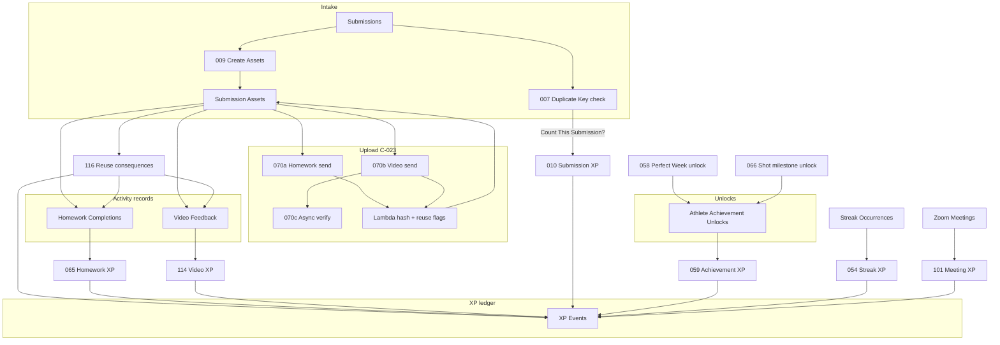

# C-024 — Dedupe field + automation dependency inventory (Stage 2)

**Backlog:** C-024 (rock-solid dedupe keys + safe backfill reruns)  
**Stage:** 2 — Worker A inventory  
**Branch:** `overnight/v2-run/worker-a-s2-c024-inventory`  
**Base SHA:** `c59dca8` (authorized from `f437d4d` lead integration)  
**Environment:** Repo / documentation only — **no PROD**, **no schema writes**, **no automation logic edits**

**Complements:** C-023 (file-byte layer: `File Content Hash`, `Storage Key`, Lambda duplicate detection) vs C-024 (record-identity layer: Source Key, table-native dedupe keys, automation recheck behavior).

**Sources cited:**

- `airtable/schema/current/field-map.md`, `table-map.md`, `automation-trigger-map.md`, `schema-notes.md`
- `airtable/schema/snapshots/schema_doc_appn84sqPw03zEbTT_20260629_045741.md` (PROD schema snapshot — field names/types)
- `docs/deploy-checklists/C-023-production-duplicate-policy.md`, `C-023-schema-impact-stage1.md` (C-023 asset reuse fields)
- Automation docblocks in `airtable/automations/shooting-challenge/{007,009,010,054,058,059,065,066,101,114,116,070a,070b,070c}*.js`

---

## 1. Layer model (C-023 vs C-024)

| Layer | What it dedupes | Primary fields | Primary writers |
|-------|-----------------|----------------|-----------------|
| **C-023 file bytes** | Same uploaded file content / attachment identity | `File Content Hash`, `Storage Key`, `Source Attachment ID`, `Duplicate Match Record`, `Potential Asset Reuse?`, `Asset Reuse Decision` | Lambda (hash/detection), Make writeback, **116** (consequences) |
| **C-024 record identity** | One business event → one ledger/unlock row | `Source Key`, `Milestone Source Key`, `Duplicate Key`, formula `XP Dedupe Key` / `Event Identity ID` | **007–010, 054–066, 101, 114, 116** (XP/unlock writers) |
| **Intake asset rows** | One attachment → one Submission Asset | `Source Attachment ID` per submission | **009** |

Upload senders (**070a/b/c**) prevent **double upload to Drive/S3** when URL/ID already present; they do **not** write XP Source Keys.

---

## 2. Table inventory — dedupe-related fields

### 2.1 Submissions

| Field | Type | Role | Writer(s) | Reader(s) / downstream |
|-------|------|------|-----------|------------------------|
| **Duplicate Key** | formula | Composite identity: Enrollment + Activity Date + stat mode + shot breakdown | *(formula only — never written by script)* | **007** reads; duplicate search |
| **Duplicate Review Status** | singleSelect (`Needs Review`, `Count It`, `Exclude It`) | Human/automation gate for counting | **007** | **Count This Submission?** formula |
| **Count This Submission?** | formula | XP eligibility gate | *(formula)* | **010** trigger; streak/milestone rollups |
| **Submission Key** | text/formula | Legacy display key | varies | **010** legacy Source Key match |
| **XP Award Status** | singleSelect | Idempotency display on submission | **010** → `Awarded` | Trigger views (010 allows rerun for repair) |
| **XP Events** | link | Back-link to ledger row | **010** | Repair/dedupe audits |
| **Total Shots Counted** | formula | Shot volume for XP | *(formula)* | **010** business rule |

**Duplicate Key formula inputs** (schema snapshot): `Enrollment`, `Activity Date`, `Submission Stat Mode`, `2PT Attempted/Made`, `3PT Attempted/Made`, `FT Attempted/Made`, `Shot Total`.

**007 dependency chain:** reads `Duplicate Key` → finds peer submissions → sets `Duplicate Review Status` → `Count This Submission?` gates **010**.

---

### 2.2 Submission Assets

| Field | Type | Role | Writer(s) | Notes |
|-------|------|------|-----------|-------|
| **Source Attachment ID** | singleLineText | Airtable attachment identity | **009** | **009** dedupe key: skip create if same ID already on linked submission |
| **File Content Hash** | singleLineText | SHA-256 content identity (C-023) | Lambda / Make writeback | C-023 exact-duplicate detection |
| **File Hash Algorithm** | singleSelect (`SHA-256`) | Hash algo label | Lambda / Make | **070c** verifies on async path |
| **Storage Key** | singleLineText | S3 object key | Make / Lambda | C-023; **070c** verifies |
| **Canonical File URL** | URL | Stable file URL | Make / Lambda | **070a/b** skip if legacy Drive URL exists; **070c** verifies |
| **Upload Status** | singleSelect | Upload ladder | **009**, **020**, **070a/b**, Make | Not a dedupe key — state machine |
| **Send to Make Trigger** | checkbox | Upload send arm | **070a/b** clear on success; **070c** clear on verify | Retained on failure for retry (Worker B) |
| **Duplicate File Status** | singleSelect | Lambda classification | Lambda | `Unique`, `Exact Duplicate`, `Possible Duplicate`, … |
| **File is Duplicate?** | checkbox | Fast duplicate flag | Lambda | Lookup to HC/VF as `Linked Asset Duplicate?` |
| **Duplicate Match Record** | link (self) | Prior asset with same hash/attachment | Lambda | C-023 review queue |
| **Duplicate Review Status** | singleSelect | Legacy asset-level review | Lambda / operator | Distinct from `Asset Reuse Decision` (C-023 policy) |
| **Asset Reuse Decision** | singleSelect | **Mike-only** final judgment | Mike/OMNI; Lambda init `Not Reviewed` only | Triggers **116** |
| **Duplicate Resolution Applied?** | checkbox | **116** idempotency flag | **116** | Same decision re-fire → skip |
| **Asset Reuse Review Notes** | multilineText | Operator notes | Mike | **116** reads |
| **Homework Completions** / **Video Feedback** | links | Activity route for XP | **020**, **013** | **116** routes to XP by `VIDEO_SUBMISSION\|` / `HOMEWORK_XP\|` |

**C-013 fields** (from `field-map.md`): `Canonical File URL`, `Storage Key` — writers Make/Lambda; readers audits, **070c**.

**009 intake dedupe:** loads existing assets for submission; builds `existingAssetKeys` from `Source Attachment ID`; skips create on collision (no table-wide query by hash).

---

### 2.3 Homework Completions

| Field | Type | Role | Writer(s) | Notes |
|-------|------|------|-----------|-------|
| **Homework Completion Key** | formula | `Enrollment \| Week \| Homework` | *(formula)* | Audit/debug in **065**; not XP Source Key |
| **Award Status** | singleSelect (`Pending`, `Awarded`, …) | XP idempotency gate | **065** → `Awarded`; **116** → `Do Not Award` / restore | Trigger requires `Pending` + empty XP link |
| **XP Events** | link | One completion → one event | **065** links; **116** finds by Source Key | **065** throws if >1 linked |
| **Submission Assets** | link | Uploaded files | **020** | Duplicate context via lookups |
| **Linked Asset Duplicate?** | lookup | From Submission Assets | *(lookup)* | C-023 display; **065** does not read |
| **Linked Asset Duplicate Status** | lookup | From Submission Assets | *(lookup)* | Coach/parent views |
| **Linked Asset Reuse Decision** | lookup | From Submission Assets | *(lookup)* | Stage 5 display; **116** sets upstream |
| **Satisfactory?**, **Review Complete**, **Coach Feedback** | various | **065** preconditions | coach / **064** | Not dedupe keys |

**065 Source Key pattern:** `HOMEWORK_XP|{homeworkCompletionRecordId}` — one HC record → one XP Event.

---

### 2.4 XP Events

| Field | Type | Role | Writer(s) | Notes |
|-------|------|------|-----------|-------|
| **Source Key** | singleLineText | **Canonical automation dedupe key** | **010, 054, 059, 065, 101, 114** | Primary audit target for C-024 |
| **XP Dedupe Key** | formula | `LOWER(enrollmentId \| eventIdentity \| xpSource)` | *(formula)* | **010** reads for candidate match |
| **XP Dedupe Key Normalized** | formula | Normalized variant | *(formula)* | **114** match order #2 |
| **Event Identity ID** | formula | Fallback from Source Key / submission / streak / week IDs | *(formula)* | Feeds **XP Dedupe Key** |
| **Duplicate Status** | singleSelect (`Unique`, `Duplicate - Remove`, …) | Ledger duplicate classification | **116** writes on confirmed duplicate | Drives **Active XP Points** formula |
| **Duplicate Count** | rollup/count | Collisions on same dedupe key | *(computed)* | **Needs Dedupe Review** formula |
| **Needs Dedupe Review** | formula | Flags duplicate count > 1 | *(formula)* | Stage 3 audit candidate |
| **Active?** | checkbox | Whether row counts toward totals | All XP writers default `true`; **054** deactivates extras; **116** deactivates on duplicate | |
| **Active XP Points** | formula | Zero when `Duplicate - Remove` or inactive | *(formula)* | |
| **Submission** | link | Source for shooting XP | **010** | **010** match by link |
| **Homework Completion** | link | Source for homework XP | **065** | |
| **Video Feedback** | link | Source for video XP | **114** | Primary match in **114** |
| **Achievement Unlock** | link | Source for achievement XP | **059** | **059** duplicate check by link + Source Key |
| **Streak Occurrence** | link | Source for streak XP | **054** | **054** match by link + Source Key |
| **Enrollment**, **Week**, **XP Source**, **XP Bucket** | various | Context + secondary matching | all writers | **114** composite bucket match |

---

### 2.5 Athlete Achievement Unlocks

| Field | Type | Role | Writer(s) | Notes |
|-------|------|------|-----------|-------|
| **Milestone Source Key** | singleLineText | Shot milestone dedupe | **066** | Pattern: `SHOT_MILESTONE\|{enrollmentId}\|{shotMilestoneId}` |
| **Source Key** | singleLineText | Perfect Week dedupe | **058** (when field exists) | Pattern: `PERFECT_WEEK\|{enrollmentId}\|{weekId}` |
| **Unlock Key** | formula | Computed composite (Enrollment, Achievement, Week, Shot Milestone, Streak Start) | *(formula)* | **066** docblock: do **not** write — read-only |
| **XP Award Status** | singleSelect | Gates **059** | **066**, **058** → `Pending` | **Ready for 059 XP?** formula |
| **XP Events** | link | Downstream ledger | **059** | One unlock → one XP Event |
| **Source Status** | singleSelect | Unlock pipeline state | **058**, **066** | |
| **Perfect Week Unlock** (on WAS) | link | Back-link from Weekly Athlete Summary | **058** | **058** skips if link already populated |
| **Shot Milestone** | link | Milestone config | **066** | |
| **Enrollment**, **Week**, **Achievement** | links | Unlock identity | **058**, **066** | **058** also queries by Enrollment+Week+Achievement |

**Schema note:** PROD snapshot documents **Milestone Source Key** on unlocks. **Source Key** on unlocks is used by **058** behind `fieldExists` — confirm on DEV/PROD in Stage 3 audit if blank rows found.

---

## 3. Automation writer matrix

Legend for **Recheck-before-create:**

| Code | Meaning |
|------|---------|
| **YES** | Explicit second lookup immediately before `createRecordAsync` |
| **QUERY-FIRST** | Full-table or indexed query before create; no second pass |
| **LINK-GUARD** | Trigger/view requires empty link field; script also checks |
| **SKIP-GUARD** | Early exit if upstream state already satisfied |
| **REPAIR** | Updates existing row instead of creating when match found |
| **N/A** | Not an XP/unlock creator |

### 3.1 Master matrix

| Script | Table(s) written | Dedupe / Source Key pattern | Recheck-before-create | Match methods (priority) | Idempotency / gap notes |
|--------|------------------|------------------------------|------------------------|----------------------------|-------------------------|
| **007** | Submissions | **Duplicate Key** (read-only formula) | N/A | Peer query on same `Duplicate Key` | Does not create XP/assets; respects manual `Exclude It` |
| **009** | Submission Assets | **Source Attachment ID** per submission | QUERY-FIRST | In-memory set of existing IDs for linked submission | Skips duplicate attachment rows; no hash dedupe |
| **010** | XP Events, Submissions | `SUBMISSION_XP\|{submissionId}`; also builds `{enrollmentId}\|{submissionId}\|{xpSource}` dedupe keys | QUERY-FIRST | Source Key, submission link, XP Dedupe Key, normalized key, legacy Submission Key | **REPAIR** on rerun even if `XP Award Status=Awarded`; throws if >1 candidate; **no** explicit "last-chance" second query (race window — Stage 3 gap) |
| **054** | XP Events, Streak Occurrences | `STREAK_XP\|{enrollmentId}\|{achievementId}\|{streakEndDate YYYY-MM-DD}` | QUERY-FIRST | Source Key, Streak Occurrence link, pre-linked XP IDs | Deactivates duplicate XP rows (keeps canonical); marks extras inactive |
| **058** | Athlete Achievement Unlocks, WAS | `PERFECT_WEEK\|{enrollmentId}\|{weekId}` on unlock **Source Key** | QUERY-FIRST | WAS `Perfect Week Unlock` link; unlock query by Source Key; Enrollment+Week+Achievement | Links existing unlock instead of creating |
| **059** | XP Events, Unlocks | Perfect Week: `PERFECT_WEEK\|{enrollmentId}\|{weekId}` (or unlock Source Key fallback); Shot Milestone: `SHOT_MILESTONE\|{enrollmentId}\|{shotMilestoneId}` (or **Milestone Source Key** fallback) | QUERY-FIRST | Source Key equality; Achievement Unlock link | Links existing XP; `linked_existing_duplicate_xp_event` |
| **065** | XP Events, Homework Completions | `HOMEWORK_XP\|{homeworkCompletionId}` | QUERY-FIRST | Linked XP on HC; then full XP table Source Key scan | Trigger expects empty XP link; **no** second recheck before create (race window — Stage 3 gap) |
| **066** | Athlete Achievement Unlocks | `SHOT_MILESTONE\|{enrollmentId}\|{shotMilestoneId}` → **Milestone Source Key** | QUERY-FIRST | Preloaded map `existingUnlockBySourceKey` | Multiple milestones per week valid; skips existing |
| **101** | XP Events, Zoom Meetings, WAS | `ZOOM_ATTEND_BASE\|{zoomMeetingKey}\|{enrollmentId}`; `ZOOM_ATTEND_BONUS_2\|{enrollmentId}`; `ZOOM_ATTEND_BONUS_3\|{enrollmentId}` | QUERY-FIRST | In-memory `sourceKeyIndex` + meeting+enrollment index | Supplemental rerun: only attendees missing base XP for meeting |
| **114** | XP Events, Video Feedback | `VIDEO_SUBMISSION\|{videoFeedbackRecordId}` | **YES** (`10a - Last-Chance XP Event Recheck Before Create`) | Linked VF → Source Key → XP Dedupe Key Normalized → composite Enrollment+Submission+Week+bucket | Refuses to steal XP from different VF; `updated-after-recheck` action |
| **116** | XP Events, HC/VF, Submission Assets, Enrollments | Resolves existing XP by `VIDEO_SUBMISSION\|{vfId}` or `HOMEWORK_XP\|{hcId}` | SKIP-GUARD | `findXpEventBySourceKey`; checks **Duplicate Resolution Applied?** + last decision | Idempotent same decision; reactivates same row on reversal (no delete) |
| **070a** | Submission Assets (status/trigger/error) | Legacy: **Google Drive File URL** / **File ID** | SKIP-GUARD | Pre-send skip if Drive URL/ID present; Lambda `skipped_already_uploaded` | Does not write Source Key; C-023 hash fields written by Lambda |
| **070b** | Submission Assets (same as 070a) | Same | SKIP-GUARD | Same | Async Accepted → retains trigger for **070c** |
| **070c** | Submission Assets (trigger clear) | Writeback field presence | SKIP-GUARD | Idempotent if trigger already cleared (`async_upload_already_verified`) | Verifies hash/URL/storage key; not XP dedupe |

### 3.2 Source Key catalog (XP Events writers)

| Prefix / pattern | Script | XP Source / Bucket | Identity anchor |
|------------------|--------|-------------------|-----------------|
| `SUBMISSION_XP\|{submissionRecId}` | 010 | Submission Base / Shooting Base | One counted submission |
| `STREAK_XP\|{enrollment}\|{achievement}\|{streakEndDate}` | 054 | Streak / Streak | One streak occurrence |
| `PERFECT_WEEK\|{enrollment}\|{week}` | 058 (unlock), 059 (XP) | Perfect Week | One perfect week per enrollment+week |
| `SHOT_MILESTONE\|{enrollment}\|{shotMilestone}` | 066 (unlock), 059 (XP) | Shot Milestone | One milestone crossing |
| `HOMEWORK_XP\|{homeworkCompletionRecId}` | 065, 116 | Homework Completion | One reviewed HC |
| `VIDEO_SUBMISSION\|{videoFeedbackRecId}` | 114, 116 | Video Submission / Video Feedback | One VF record (never enrollment-only) |
| `ZOOM_ATTEND_BASE\|{meetingKey}\|{enrollment}` | 101 | Zoom Meeting Attendance Base | One meeting attendance |
| `ZOOM_ATTEND_BONUS_2\|{enrollment}` | 101 | Bonus 2 | One-time enrollment bonus |
| `ZOOM_ATTEND_BONUS_3\|{enrollment}` | 101 | Bonus 3 | One-time enrollment bonus |

### 3.3 Unlock Source Key catalog (Athlete Achievement Unlocks)

| Field | Pattern | Script |
|-------|---------|--------|
| **Source Key** | `PERFECT_WEEK\|{enrollment}\|{week}` | 058 |
| **Milestone Source Key** | `SHOT_MILESTONE\|{enrollment}\|{shotMilestone}` | 066 → consumed by 059 |

---

## 4. Cross-table dependency graph

---

## 5. Gaps flagged for Stage 3 (`audit-dedupe-key-coverage.js`)

| ID | Gap | Tables | Suggested audit check |
|----|-----|--------|------------------------|
| G-01 | **010** / **065** lack explicit last-chance recheck before create (unlike **114**) | XP Events | Dry-run: duplicate Source Key count > 1 per pattern; simulate concurrent trigger |
| G-02 | **XP Dedupe Key** / **Duplicate Count** may surface collisions scripts did not prevent | XP Events | Report `Needs Dedupe Review` = `Review` |
| G-03 | **058** `Source Key` on unlocks — optional in script (`fieldExists`) | Athlete Achievement Unlocks | Null Source Key on Perfect Week unlocks |
| G-04 | **009** dedupe is attachment-ID scoped to submission only — same file re-uploaded on new submission creates new asset | Submission Assets | Cross-submission hash duplicates (C-023 Lambda) vs record count |
| G-05 | **070a/b** legacy Drive URL guard ≠ C-023 hash dedupe — both can apply | Submission Assets | Rows with hash duplicate but empty Drive URL (and inverse) |
| G-06 | **116** only deactivates XP rows with `[C-023-S5]` audit marker in **XP Reason Debug** | XP Events | Confirmed duplicate asset but XP row missing marker |
| G-07 | **field-map.md** lists `Dedupe Key`; live schema uses **XP Dedupe Key** (formula) | XP Events | Doc/schema name alignment |
| G-08 | **101** bonus keys enrollment-global — verify no cross-meeting collision | XP Events | Orphan `ZOOM_ATTEND_BONUS_*` without meeting context |

---

## 6. Recheck-before-create evidence summary

| Script | Evidence (docblock / debugStep) | Verdict |
|--------|----------------------------------|---------|
| 114 | `"10a - Last-Chance XP Event Recheck Before Create"`; `actionOut=updated-after-recheck` | **Strong** |
| 010 | Step 10 candidate filter on full XP query; throws on multiple matches; no step 10a | **Moderate** — query-first only |
| 054 | Step 8 find existing; deactivate duplicates step 10 | **Moderate** — repair-focused |
| 059 | Step 10 Duplicate Protection | **Moderate** |
| 065 | Step 8 load existing; link-by-key then create step 9+ | **Moderate** — no second query |
| 066 | Map preload + skip existing | **Moderate** |
| 058 | Section 6 duplicate protection query | **Moderate** |
| 101 | `buildXpEventIndexes` per run | **Moderate** |
| 116 | Same-decision skip via resolution fields | **Strong** (consequence idempotency) |
| 070a/b/c | Pre-send / post-verify skip guards | **Strong** (upload, not XP) |

---

## 7. Related docs

- `airtable/schema/current/automation-trigger-map.md` — trigger bindings for listed scripts
- `docs/deploy-checklists/C-023-production-duplicate-policy.md` — file-hash + Asset Reuse Decision contract
- Worker D (Stage 2): `C-024-dedupe-key-contract-stage2.md` — canonical contract (Lead integrates D → A)
- Worker B (Stage 2): upload retry audit — complements **070a/b/c** rows above

---

*Worker A · C-024 Stage 2 · `overnight/v2-run/worker-a-s2-c024-inventory`*
