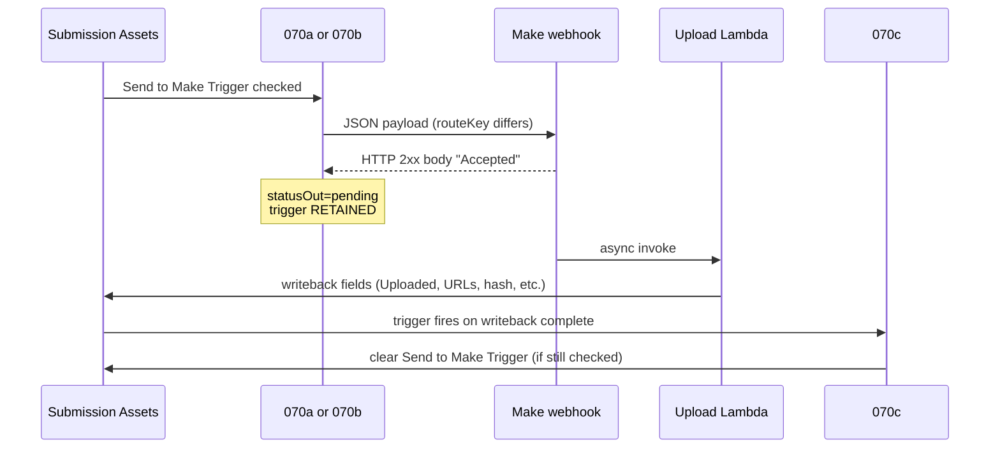

# 070c DEV — Homework + Video async trigger verification

**Date:** 2026-07-12  
**Environment:** DEV only — `appTetnuCZlCZdTCT`  
**PROD:** Do **not** paste, enable, or test. Evidence record `recGQ8EjAMz3bEBiW` protected (video).  
**GitHub script:** `airtable/automations/shooting-challenge/070c-email-notifications-and-external-handoffs-verify-async-video-asset-upload.js`  
**Version:** **v1.1** (idempotent writeback verification)  
**Backlog:** C-013  
**Overnight task:** T8 / Worker A  
**Companion senders:** **070a** v4.4 (homework) · **070b** v4.4 (video)

---

## Purpose

070c completes the **async Make `Accepted`** handoff started by 070a or 070b. When Make returns plain-text `Accepted` (HTTP 2xx), the sender automation returns **`statusOut=pending`** and **retains** `Send to Make Trigger`. Lambda writes back directly to the Submission Asset; 070c verifies those writeback fields and clears the trigger when complete.

**070c is destination-agnostic.** The script does not read `Upload Destination`, `routeKey`, or linked target tables. The same automation slot serves **Homework Completions** and **Video Feedback** assets — but the **Airtable trigger UI must not filter to video only**.

---

## Architecture (070a/070b → Lambda → 070c)

| Stage | Homework | Video |
|---|---|---|
| Sender | **070a** v4.4 | **070b** v4.4 |
| `automationNumber` | `070a` | `070b` |
| `routeKey` | `homework_completion` | `video_feedback` |
| `uploadDestination` / `targetTable` | Homework Completions | Video Feedback |
| Make `Accepted` | `pending` / `lambda_upload_accepted_async` | Same |
| Immediate Lambda JSON success | Sender clears trigger | Same |
| Async writeback verify | **070c** v1.1 | **070c** v1.1 |

---

## Supported upload destinations

| Upload Destination | Sender | 070c script logic | Trigger UI requirement |
|---|---|---|---|
| **Homework Completions** | 070a | Same writeback field checks | **Do not** require `Upload Destination = Video Feedback` only |
| **Video Feedback** | 070b | Same writeback field checks | Proven PROD path; optional destination filter OK for video-only slot |
| **Both (recommended DEV)** | 070a + 070b separate slots | Identical 070c | **Omit** `Upload Destination` filter on 070c **or** use OR: Homework Completions **or** Video Feedback |

**Critical DEV fix if homework async stalls:** If 070c trigger includes `Upload Destination = Video Feedback`, homework assets that received `Accepted` will **never** clear `Send to Make Trigger`. Remove the destination filter or add Homework Completions.

---

## `Accepted` is pending — not failure

| Response | Sender (`070a` / `070b`) | `Send to Make Trigger` | Next step |
|---|---|---|---|
| HTTP 2xx, body exactly **`Accepted`** (case-insensitive) | `statusOut=**pending**`, `actionOut=lambda_upload_accepted_async` | **Retained** | Wait for Lambda writeback → **070c** |
| HTTP 2xx, Lambda JSON verified success | `statusOut=success`, `actionOut=lambda_upload_verified` | **Cleared by sender** | Done (070c may still idempotently succeed) |
| HTTP non-2xx, network error, invalid/unverified JSON | `statusOut=error`, various `error_*` | **Retained** | Operator retry / fix Make-Lambda |

**Do not treat `Accepted` as `error_lambda_response_unverified`.** That was v4.2 behavior; v4.4 + 070c v1.1 explicitly defer verification to 070c.

070c **never** calls Make or Lambda. It only reads Submission Asset fields after Lambda writeback.

---

## State transitions (Submission Assets)

### Upload Status

| Value | Set by | Meaning for 070c |
|---|---|---|
| `Pending Link` | Intake / reset | Pre-send; 070c trigger should **not** match |
| `Processing` | Lambda (claim) | In flight; 070c trigger should **not** match yet |
| `Uploaded` | Lambda writeback | **Required** for 070c writeback pass |
| `Error` | Lambda / sender failure | 070c should **not** match (`Upload Error` usually populated) |

### Send to Make Trigger

| State | When |
|---|---|
| **Checked** | 020 (homework) or intake sets latch; retained after `Accepted`; retained on sender/Lambda failure |
| **Cleared** | 070a/070b on **immediate** verified Lambda JSON; **070c** when async writeback verifies and trigger still checked |
| **Already cleared** | 070c returns idempotent success (`async_upload_already_verified`) — no write |

### Writeback Complete?

Formula checkbox on Submission Assets. 070c requires it **checked** (value `1` / `true`). Gates the automation trigger together with hash, URL, and timestamp fields.

---

## 070c script behavior (v1.1)

### Writeback checks (all must pass)

| Check key | Field | Required value |
|---|---|---|
| `uploadStatusUploaded` | Upload Status | `Uploaded` |
| `canonicalUrlPopulated` | Canonical File URL | non-empty |
| `storageKeyPopulated` | Storage Key | non-empty |
| `fileContentHashPopulated` | File Content Hash | non-empty |
| `fileHashAlgorithmSha256` | File Hash Algorithm | `SHA-256` |
| `uploadedAtPopulated` | Uploaded At | populated |
| `uploadErrorBlank` | Upload Error | empty |
| `writebackCompleteFormula` | Writeback Complete? | checked |

**Not checked by script:** `Upload Destination`, `Homework Completions`, `Video Feedback`, `Airtable Attachment`, `Send to Make Trigger` (trigger state gates **clearing only**, not verification pass/fail).

### Outputs

| Outcome | `statusOut` | `actionOut` | Trigger write |
|---|---|---|---|
| Writeback complete + trigger checked | `success` | `async_upload_verified_trigger_cleared` | **Uncheck** Send to Make Trigger |
| Writeback complete + trigger already unchecked | `success` | `async_upload_already_verified` | None |
| Writeback incomplete | `error` | `async_writeback_verification_failed` | **Retained** if was checked |
| Invalid/missing `recordId` | `error` | `error` | None (throws) |

`writebackChecks` output is JSON string of per-field booleans plus `sendToMakeTriggerChecked`.

---

## Recommended Airtable trigger (070c automation)

**Table:** Submission Assets  
**Type:** When record matches conditions  
**Script input:** `recordId` = triggering record ID

### Required conditions (all must match)

| # | Condition | Notes |
|---|---|---|
| 1 | **Upload Status** equals `Uploaded` | Lambda finished |
| 2 | **Writeback Complete?** is checked | Formula gate |
| 3 | **Canonical File URL** is not empty | |
| 4 | **Storage Key** is not empty | |
| 5 | **File Content Hash** is not empty | |
| 6 | **File Hash Algorithm** equals `SHA-256` | |
| 7 | **Uploaded At** is not empty | |
| 8 | **Upload Error** is empty | |

### Optional / idempotency

| # | Condition | Recommendation |
|---|---|---|
| 9 | **Send to Make Trigger** is checked | **Optional.** Omit so 070c can re-fire after sender already cleared trigger (idempotent `async_upload_already_verified`). PROD runbook recommends **omit**. |

### Destination filter — DEV homework checklist

| Configuration | Homework async path | Video async path |
|---|---|---|
| **No** `Upload Destination` filter | Works | Works |
| `Upload Destination = Video Feedback` only | **Broken** — trigger never fires | Works |
| OR: Homework Completions **or** Video Feedback | Works | Works |

**Do not** duplicate 070a/070b send gates on 070c (e.g. `Pending Link`, `Airtable Attachment` not empty). 070c runs **after** upload completes.

---

## When `Send to Make Trigger` is cleared

| Path | Who clears | When |
|---|---|---|
| **Sync** — Make returns full Lambda JSON with verified success | **070a** or **070b** | Same automation run as webhook |
| **Async** — Make returns `Accepted` | **070c** | After Lambda writeback; all writeback checks pass; trigger still checked |
| **Async** — 070a/070b already cleared (unlikely on Accepted path) | **070c** | No-op success; `async_upload_already_verified` |
| **Failure** — writeback incomplete | **Nobody** | Trigger stays checked for retry / operator |
| **Failure** — sender webhook/Lambda error | **Nobody** | Trigger stays checked; `Upload Error` set by sender |

070c **only** writes `Send to Make Trigger = false`. It does not modify Upload Status, hash fields, or Upload Error.

---

## Retry and idempotency

### Sender retry (070a / 070b)

- Trigger **retained** on `Accepted`, webhook errors, and unverified Lambda responses.
- Operator may **uncheck and recheck** Send to Make Trigger to re-run sender when conditions match.
- Idempotent Lambda `skipped_already_uploaded` clears trigger on sync path.

### 070c retry

- **Incomplete writeback:** `async_writeback_verification_failed`; trigger retained; automation may re-fire when Lambda completes missing fields (conditions become true).
- **Complete writeback + trigger checked:** clears trigger once; subsequent runs impossible unless trigger re-checked manually.
- **Complete writeback + trigger unchecked:** safe to run anytime; `async_upload_already_verified`.
- **v1.1 rule:** Writeback verification is **independent** of trigger state. Failure is never caused by "trigger already unchecked."

### Race: sync success vs 070c

If 070b clears trigger on immediate Lambda JSON, 070c may still run when writeback fields update. Result: idempotent success, no duplicate clear.

---

## DEV UI verification steps (Mike / OMNI)

1. Open DEV base `appTetnuCZlCZdTCT` → **Automations**.
2. Locate or create slot **070c — Verify Async Video Asset Upload** (name may say "Video"; script is shared).
3. Paste GitHub script **v1.1** (skip GitHub header lines 1–24).
4. Confirm input: `recordId` from trigger.
5. Set trigger table = **Submission Assets**.
6. Apply **Required conditions** table above.
7. **Remove** `Upload Destination = Video Feedback` unless adding Homework OR branch.
8. Leave **Send to Make Trigger** condition **off** (recommended idempotent pattern).
9. Keep **070c OFF** until 070a homework E2E is ready; then enable for async tests only.
10. For homework test asset `recWBSmHnblEcSIm1` (see [C-070a-dev-airtable-v4.4-prep](./C-070a-dev-airtable-v4.4-prep.md)):
    - Run 070a with Make returning `Accepted`.
    - Confirm sender run: `statusOut=pending`, `actionOut=lambda_upload_accepted_async`, trigger **still checked**.
    - Wait for Lambda writeback (`Upload Status=Uploaded`, hash fields populated, `Writeback Complete?` checked).
    - Confirm **070c** run: `actionOut=async_upload_verified_trigger_cleared`, trigger **unchecked**.
11. Repeat sanity on video asset in DEV only (not `recGQ8EjAMz3bEBiW` reset on PROD).

---

## Stop conditions and errors

| Symptom | Likely cause | Action |
|---|---|---|
| `Accepted` but trigger never clears | 070c OFF, wrong trigger, or destination filter excludes homework | Fix 070c trigger; enable automation |
| 070c runs but `async_writeback_verification_failed` | Lambda writeback incomplete or `Writeback Complete?` false | Inspect `writebackChecks` output; fix Lambda mapping |
| 070c never runs | Conditions too strict (e.g. still `Processing`) | Wait for Lambda; verify Uploaded + formula |
| Trigger cleared twice concern | N/A — idempotent | Second run → `async_upload_already_verified` |
| 070a/070b error after `Accepted` | Misconfigured — sender should pending, not error | Confirm sender v4.4 pasted |

**Hard stops**

- **PROD:** no paste/enable without promotion checklist.
- **Do not reset** PROD evidence asset `recGQ8EjAMz3bEBiW`.
- **Do not** use 070c as Make sender — it never posts webhooks.

---

## Homework vs video path summary

| Step | Homework (070a) | Video (070b) |
|---|---|---|
| 1. Intake sets trigger | 020 → Send to Make Trigger | Asset intake / review flow |
| 2. Send gate | `Upload Destination = Homework Completions`, Pending Link, attachment + HC link | `Upload Destination = Video Feedback`, Pending Link, attachment + VF link |
| 3. Make `Accepted` | pending, trigger kept | pending, trigger kept |
| 4. Lambda writeback | Same Submission Asset fields | Same fields |
| 5. 070c verify | **Same automation** | **Same automation** |
| 6. Trigger cleared | 070c (async) or 070a (sync JSON) | 070c (async) or 070b (sync JSON) |

---

## Related

- [C-070a-dev-airtable-v4.4-prep.md](./C-070a-dev-airtable-v4.4-prep.md) — 070a homework sender + enable gate
- [C-013-prod-lambda-deployment-2026-07-11.md](./C-013-prod-lambda-deployment-2026-07-11.md) — Lambda writeback field mapping
- [make/documentation/C-013-prod-upload-engine-lambda-runbook.md](../../make/documentation/C-013-prod-upload-engine-lambda-runbook.md) — PROD 070c trigger notes
- Script: `070c-email-notifications-and-external-handoffs-verify-async-video-asset-upload.js` (v1.1)
- Shared helpers/tests: `lib/upload-make-lambda-response.js`, `lib/upload-make-lambda-response.test.js`
