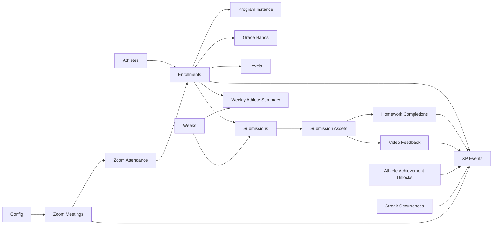

# Relationship Map & Integrity Risks

**Evidence:** `schema-snapshot` linked-record section (2026-07-23 post-ts) + overnight uniqueness audits

---

## Expected paths (canonical)

| Path | Cardinality | Notes |
|------|-------------|-------|
| Enrollment → Config year | via `School Year` text + Config.`Active School Year` match | Not a direct Enrollment→Config link in snapshot |
| Enrollment → Program Instance | single link | Season scoping |
| Enrollment → Grade Band | single | XP / milestones / goals |
| Enrollment → Current Level / Next Level | single each | Written by **042** |
| Submission → Enrollment | single required for pipeline | Orphan submissions break XP/WAS |
| Submission → Week | single | **005** from Activity Date (Sun–Sat Denver) |
| Submission → Submission Assets | multi | File children |
| Asset → Homework Completions / Video Feedback | destination links | Upload routing |
| WAS → Enrollment + Week | one each | Logical unique pair |
| XP Event → Enrollment (+ source link) | single enrollment | Source-specific links optional |
| Unlock → Enrollment + Achievement (+ Week / Milestone) | | Perfect Week / Shot Milestone |
| HC → Enrollment + Week + Homework | | Formula key |
| Zoom Attendance → Enrollment + Zoom Meeting | | Live vs recording credit |
| Video Feedback → Enrollment + Submission Asset | | Activity via Submission |
| Zoom Meeting → Config (Global + Program) | | Effective override formulas |

---

## Mermaid (simplified)

---

## Orphan & ambiguity risks

| Risk ID | Severity | Finding | Evidence |
|---------|----------|---------|----------|
| REL-01 | High | WAS with empty Enrollment (legacy pollution ~392 historically) | overnight CORE-UNIQUENESS / WAS-GUARANTEE |
| REL-02 | High | Concurrent WAS create race: **031 + 101 + 118** | Agent 9 WAS contract |
| REL-03 | Critical | Recording path must never write Zoom Meetings.`Attendees` | foundation matrix; 101 double-credit |
| REL-04 | High | Text stubs on Weeks (`Video Feedback`, `Submission Assets`, `Homework 2`, `XP Events copy`) look like links but are singleLineText | `schema-snapshot` |
| REL-05 | Medium | HC `Weekly Athlete Summary` text field vs `Weekly Athlete Summary Link` — text pretending to be relationship | `schema-snapshot` |
| REL-06 | High | Enrollment↔Config is **not** a direct link; year mismatches possible if School Year text drifts from Config / Program Instance | `schema-snapshot` + config-selection tests |
| REL-07 | Medium | Submissions may link Athlete and Enrollment; Athlete-only paths are ambiguous for multi-year athletes | `schema-snapshot` |
| REL-08 | High | Homework Completions key uses ARRAYJOIN of linked primaries (display names), not RIDs — rename of Week Name / Homework title changes key display identity | formula audit |
| REL-09 | Medium | Grade Band on WAS is both linked and looked up from Enrollment — dual population risk if scripts write WAS Grade Band inconsistently | `inferred` from schema + 031 patterns |

---

## Relationships recreated as text (prefer links)

| Location | Text / formula | Prefer |
|----------|---------------|--------|
| Weeks | `Video Feedback`, `Submission Assets` text | Real links if still needed; else Hide |
| HC | `Weekly Athlete Summary` text | Use `Weekly Athlete Summary Link` only |
| Ach Unlocks | `Week Summary`, `XP Events copy` text | Links already exist |
| XP / WAS | Display-based `Weekly Summary Key` | Prefer `Summary Key` (Enrollment Key + Week Key RIDs) |

---

## Integrity rules for operators

1. Never manually create a second WAS for the same Enrollment+Week.  
2. Never re-point historical XP Events to a different Enrollment year for “cleanup.”  
3. Prefer record IDs in script keys; do not key off athlete display names.  
4. Keep Testing Scenarios links for ETF only — do not use as production joins.
