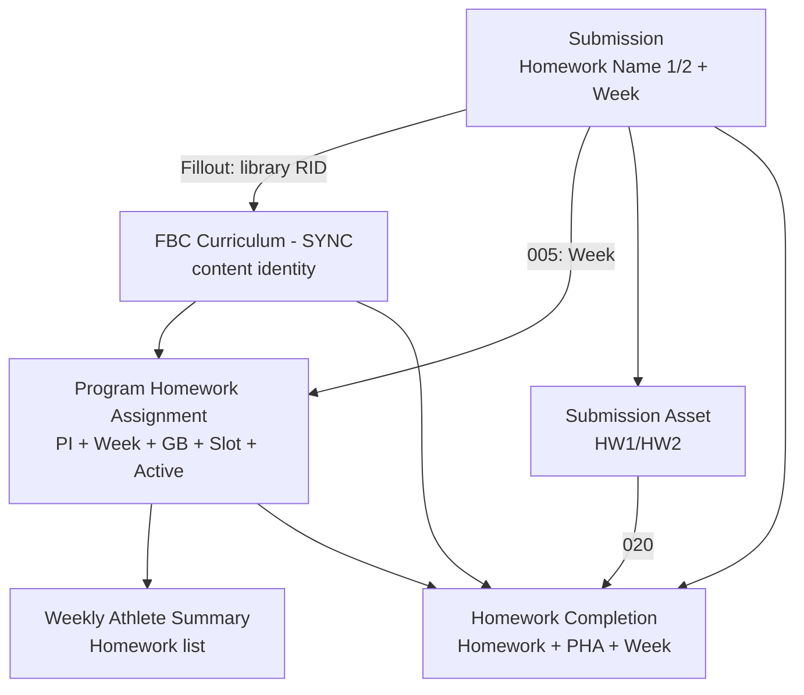
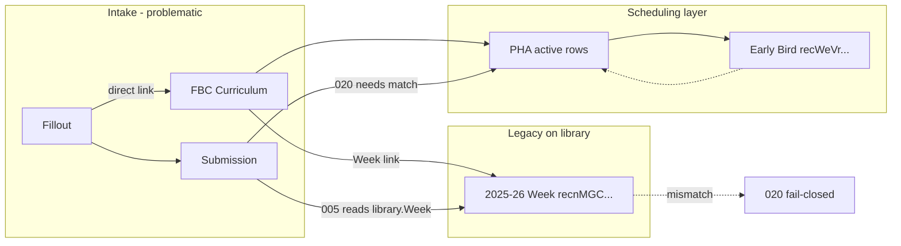
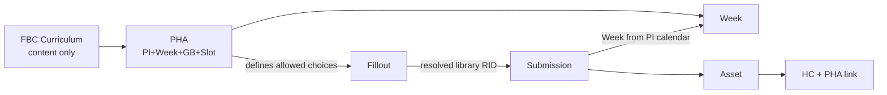

# Homework Library / Program Homework Assignments — Cross-Year Contamination Audit

Date: 2026-08-09  
Environment: PROD `appn84sqPw03zEbTT`  
Controlling doc: [`docs/SHOOTING_CHALLENGE_COMPLETION_MASTER.md`](../../SHOOTING_CHALLENGE_COMPLETION_MASTER.md) (audit only — **not** updated per instructions)

Status: **Audit complete (repo + fixture evidence).** Live PROD readback for the failing submission pair still requires operator run of the new extension audit (see §10).

---

## Executive summary

The intended architecture — **reusable `FBC Curriculum - SYNC` library** plus **season-specific `Program Homework Assignments` (PHA) junction** — is partially implemented in GitHub and PROD schema, but **intake and legacy fields still route athletes through curriculum records directly**, and **legacy `Week` / `Grade Band` links on library rows remain authoritative for Automation 005 and 033 fallback**. That combination explains Automation **020 v3.3.0** failing closed on controlled Schmidt traffic even when an apparently correct PHA row exists.

**Primary root cause class:** **Week identity mismatch** between Submission (from Fillout + 005) and PHA (coach scheduling layer), not a missing PHA for the canonical library homework `rechVLOeyEVIqmy2v` (Shot Tracker Usage).

**Secondary root cause class:** **Historical test fixtures** (Perfect Week `PWTEST|2026-08-05`, Week `reci5GdxEC57vfoS3`) and **legacy 2025–2026 curriculum `Week` links** (`recnMGC2JBHjO0ay6`) still influence display, week assignment, and WAS homework assignment when PHA is absent or misaligned.

**Do not weaken Automation 020.** The fail-closed PHA match is correct. Cleanup must align Submission Week + Homework library RID + PHA Week under the same Program Instance.

---

## 1. Table schemas (PROD)

Schema source: PROD meta probe 2026-08-05 (`docs/testing/homework-assignments/fixtures/_schema-probe.json`), deploy checklist field IDs (`docs/deploy-checklists/program-homework-assignments-mvp.md`), and schema snapshot 2026-06-29 (`airtable/schema/snapshots/schema_raw_appn84sqPw03zEbTT_20260629_045741.json`). PHA table post-dates June snapshot; PHA fields confirmed live Aug 2026.

### 1.1 FBC Curriculum - SYNC (`tblUuxwYlX4EQ9MKE`)

| Role | Field | Type | Notes |
|------|-------|------|-------|
| Primary | `Assignment Full Name` | multilineText | Human label; not unique |
| Display | `Assignment Full Name - Display` | formula | `{Week} \| {Homework Number} \| {Assignment Title}` — **makes library look week-specific** |
| Content identity | `Assignment Title` | singleLineText | e.g. `Shot Tracker Usage` |
| Slot hint (legacy) | `Homework Number` | singleSelect | HW 1 … HW 18 |
| Order | `Assignment Number`, `Order` | number | Sorting |
| **Legacy schedule** | `Week` | link → Weeks | **Single link; historical season week on many rows** |
| **Legacy schedule** | `Grade Band` | link → Grade Bands | Multi-link; all active bands on canonical HW1/HW2 |
| Publish gate | `Active?`, `Published?` | checkbox | 033 legacy path can require both |
| Dedupe hint | `Lesson Key` | formula | `{Week}\|{Grade Band}\|{Assignment Title}` — **year/week baked into identity** |
| Record helper | `Record Id` | formula | `RECORD_ID()` (added PHA MVP) |
| Inverse | `Submissions` / `Submissions copy` | link | HW1 / HW2 intake from Fillout |
| Inverse | `Homework Completions` | link | Completion library link |
| Inverse | `Weekly Athlete Summary` | link | Legacy WAS assignment path |
| Content | Book, Docs, URLs, descriptions | various | Public catalog / coach content |

**Not present on library:** Program Instance, School Year, Homework Slot (HW1/HW2), PHA link.

### 1.2 Program Homework Assignments (`tblhA3maf7xOa8EUS`)

| Role | Field | Type | Notes |
|------|-------|------|-------|
| Primary | `Program Homework Assignment` | singleLineText | Operator label |
| Display | `Program Homework Assignment Display` | formula | Library \| PI \| Week \| GB \| Slot |
| **Schedule: content** | `Homework Assignment` | link → FBC Curriculum - SYNC | Reusable library RID |
| **Schedule: PI** | `Program Instance` | link → Program Instance - Synced | Must match enrollment |
| **Schedule: week** | `Week` | link → Weeks | Authoritative for 020/033/072/076 |
| **Schedule: band** | `Grade Band` | link → Grade Bands | From enrollment |
| **Schedule: slot** | `Homework Slot` | singleSelect | `HW1` / `HW2` |
| **Schedule: active** | `Active?` | checkbox | 020 requires true |
| Identity | `Schedule Key` | formula | `PI RID \| Week RID \| GB RID \| Slot \| Library RID` |
| Lookups | `Program Instance RID`, `Week RID`, `Grade Band RID`, `Homework Assignment RID` | lookup | Feed Schedule Key |
| Inverse | `Homework Completions` | link | Written by 020 |

### 1.3 Submissions (`tblEVjVpGGlPTsYSt`) — homework-related

| Field | Type | Writer | Notes |
|-------|------|--------|-------|
| `Homework Name 1` | link → library | **Fillout** (primary) | Athlete picks curriculum record directly |
| `Homework Name 2` | link → library | Fillout | Same |
| `Week` | link → Weeks | **005** | From library.Week or PI-scoped Activity Date |
| `Week Lkp` | lookup | formula | From Homework Name 1 → library.Week (**legacy display**) |
| `Enrollment` | link | 023 / Fillout | Source of PI + Grade Band |
| `HW Sub 1` / `HW Sub 2` | attachment | Fillout | Transient; 009 copies to assets |
| `Program Instance - Synced` | link | optional | Not primary path for 020 |

### 1.4 Submission Assets (`tblhMLKxQK77agtME`)

| Field | Notes |
|-------|-------|
| `Homework Name 1/2` | Lookups from Submission |
| `Homework Name - Slot Correct` | Formula picks HW1/HW2 name for labeling |
| `Homework Completions` | Written by **020** |
| Triggers **020** when homework asset + attachment + enrollment |

### 1.5 Homework Completions (`tblv58ppTFDBXb3nv`)

| Field | Writer | Notes |
|-------|--------|-------|
| `Homework` | 020, 067 | Library RID |
| `Program Homework Assignment` | **020** | Required match in v3.3 |
| `Enrollment`, `Week`, `Grade Band` | 020, 067 | Week must match submission for 020 PHA resolution |
| `Item Slot` / `Asset Slot` | 020 | HW1/HW2 |
| `Weekly Athlete Summary Link` | 020 | From submission WAS |
| `Homework Completion Key` | formula | Enrollment \| Week name \| library name |

### 1.6 Enrollments (`tbl3PFmwbRoabu1YV`)

| Field | Owner |
|-------|-------|
| `School Year` | Enrollment intake |
| `Program Instance` | 001/002 / registration |
| `Grade Band` | 002 |

### 1.7 Weeks (`tblcsKugv1cla36A6`)

| Field | Owner |
|-------|-------|
| `Program Instance` | Season calendar |
| `Week Name`, `Start Date`, `End Date` | Season config |
| `Active Week?` | Operator |
| `Record ID` | formula |

### 1.8 Program Instance - Synced (`tblMfALZa4YYUy70P`)

| Field | Notes |
|-------|-------|
| `School Year - Linked` | Season |
| `Weeks` | Inverse calendar |
| `Record Id` | formula helper |

### 1.9 Grade Bands (`tblOhHrIqpjcsk2WG`)

Shared across years; five active bands used in PHA MVP.

---

## 2. Ownership model

| Dimension | Should own | Currently owns (problem) |
|-----------|------------|---------------------------|
| Assignment / content identity | **FBC Curriculum - SYNC** (one RID per true assignment) | Correct for canonical HW1/HW2 (`rechVLOeyEVIqmy2v`, `rec6WmXjpLtIWDERo`) |
| School year | **Enrollment.School Year**, **Program Instance** | Also implied by **Week.Program Instance** |
| Program | Program Instance - Synced | OK |
| Program Instance (athlete scope) | **Enrollment.Program Instance** | OK for Schmidt `recCyFEPeATOVNlr9` → `rec5mEM0YPqPqq0hZ` |
| Week (athlete submission) | **Submission.Week** (from PI calendar) | **005 still prefers library.Week** on selected homework |
| Week (scheduled homework) | **PHA.Week** | Legacy: **library.Week**, **033 fallback** |
| Grade Band (athlete) | **Enrollment.Grade Band** | Legacy: **library.Grade Band** in 033 fallback |
| Homework Slot | **PHA.Homework Slot** | Fillout uses HW1/HW2 attachment slots; not on library |
| Active scheduling | **PHA.Active?** | Legacy: library `Active?`/`Published?` for 033 fallback |
| Intake homework choice | Should resolve to **library RID scheduled for athlete's week** | **Fillout links library directly** — no PHA filter |

### Fields that violate the intended model

| Field | Violation |
|-------|-----------|
| `FBC Curriculum - SYNC.Week` | Makes reusable content appear tied to one season week; drives **005** week assignment |
| `FBC Curriculum - SYNC.Grade Band` | Suggests band-specific curriculum duplicates; used by **033 fallback** |
| `Lesson Key` formula | Encodes Week+Band+Title as identity |
| `Assignment Full Name - Display` | Surfaces linked Week in every picker label |
| `Submissions.Homework Name 1/2` | Bypass PHA; athlete can select any published library row |
| `Submissions.Week Lkp` | Propagates legacy library week into UI |
| `033` legacy path | Assigns WAS.Homework from library Week+Band without PI |

---

## 3. Year isolation audit (2025–2026 vs 2026–2027)

### 3.1 Canonical season anchors

| Entity | 2026–2027 RID | Notes |
|--------|---------------|-------|
| Program Instance | `rec5mEM0YPqPqq0hZ` | Shooting Challenge \| 2026-2027 |
| Controlled enrollment | `recCyFEPeATOVNlr9` | Schmidt testing, GB 3-4 |
| Controlled Early Bird Week | `recWeVrSabnsYaHc2` | `Early Bird - Testing` fixture |
| Legacy library Week (2025–26 HW1/HW2) | `recnMGC2JBHjO0ay6` | Still on `rechVLOeyEVIqmy2v` / `rec6WmXjpLtIWDERo` |
| PWTEST Perfect Week | `reci5GdxEC57vfoS3` | `PWTEST\|2026-08-05\|CASE-01\|WEEK` — **must not overlap active PI calendar** |

### 3.2 PHA state (authoritative policy)

Per [`PROGRAM-HOMEWORK-ASSIGNMENTS-JUST-IN-TIME-POLICY-CORRECTION.md`](../2026-08-08/PROGRAM-HOMEWORK-ASSIGNMENTS-JUST-IN-TIME-POLICY-CORRECTION.md) (supersedes the 90-row restoration doc):

| PHA RID | Library | Week | GB | Slot | Status |
|---------|---------|------|-----|------|--------|
| `reca5GM1JkROhXOiy` | `rechVLOeyEVIqmy2v` (Shot Tracker) | **`recWeVrSabnsYaHc2`** (current operator target) | `reclWDQZzKbVBtdhG` | HW1 | Active |
| `reccQhrgOK8e8Yngv` | `rec6WmXjpLtIWDERo` (Website Exploration) | **`recWeVrSabnsYaHc2`** | `reclWDQZzKbVBtdhG` | HW2 | Active |

**Historical note:** Aug 2025 PHA backfill proof (`_pha-backfill-proof.json`) created the same PHA IDs with Week **`reci5GdxEC57vfoS3`** (PWTEST), not Early Bird. If operator later relinked PHA Week to `recWeVrSabnsYaHc2` without fixing submissions / 005 behavior, **020 will fail** whenever Submission.Week ≠ PHA.Week.

### 3.3 Library records (reusable — not year-specific)

Evidence: `_curriculum-candidates.json` (Aug 2026 probe) — **18** named library rows; canonical:

| Library RID | Title | HW # | Legacy `Week` link | Grade bands |
|-------------|-------|------|-------------------|-------------|
| `rechVLOeyEVIqmy2v` | Shot Tracker Usage | HW 1 | `recnMGC2JBHjO0ay6` | All 5 active |
| `rec6WmXjpLtIWDERo` | Website Exploration | HW 2 | `recnMGC2JBHjO0ay6` | All 5 active |

**Finding:** Canonical identities were **not** duplicated per year in the library probe. Contamination is **scheduling/linkage**, not duplicate Shot Tracker curriculum rows.

### 3.4 Contamination mechanisms confirmed

| Mechanism | Evidence | Active harm? |
|-----------|----------|--------------|
| Fillout selects library RID directly | Field map; Fillout → `Homework Name 1/2` | **Yes** — no PHA/week filter |
| 005 assigns Week from library.Week | `005` v4.1 homework-first path | **Yes** — can set Submission.Week to `recnMGC2JBHjO0ay6` |
| 005 PI rejection on mismatched homework week | v4.1 isolation | Partial — falls through to Activity Date |
| 020 requires exact PHA match | v3.3.0 | **Yes** — exposes mismatch as error |
| 033 legacy WAS path | v3.3 fallback to library Week+Band | **Yes** when no PHA for week |
| PWTEST week in PHA history | `_pha-backfill-proof.json` | **Historical** if PHA week corrected |
| PWTEST week name in HC keys | CASE-01 completions | **Harmless** if HC not used for new intake |
| 067 reads library.Week for HW17 | Known issue #120 | **Yes** for Final Reflection season safety |

### 3.5 Failing controlled case (trigger evidence)

| Record | RID | Role |
|--------|-----|------|
| Submission Asset | `recIoGmcCgvxmgEAh` | 020 trigger |
| Submission | `reccRpYDUfh3Pddzy` | Homework Name + Week source |
| Enrollment | `recCyFEPeATOVNlr9` | PI + GB authority |
| Slot | HW1 | Inferred |
| Error | No active PHA for Homework + PI + Week + GB + slot | 020 v3.3 fail-closed |

**Expected resolution tuple for PASS** (given current PHA policy):

```
Library:  rechVLOeyEVIqmy2v
PI:       rec5mEM0YPqPqq0hZ
Week:     recWeVrSabnsYaHc2
GB:       reclWDQZzKbVBtdhG
Slot:     HW1
PHA:      reca5GM1JkROhXOiy
```

**Most likely failure:** `reccRpYDUfh3Pddzy.Week` is **`recnMGC2JBHjO0ay6`**, **`reci5GdxEC57vfoS3`**, or another week ≠ `recWeVrSabnsYaHc2`, while Homework Name 1 still points at `rechVLOeyEVIqmy2v`.

Display like `HW1 | Shot Tracker Usage | PWTEST CASE-01` is consistent with **Week name or Assignment Title** carrying PWTEST fixture text via `Assignment Full Name - Display`, not necessarily a duplicate library RID.

---

## 4. Writers trace (GitHub)

| Component | Reads | Writes | Contamination risk |
|-----------|-------|--------|-------------------|
| **Fillout** daily form | — | `Homework Name 1/2`, attachments, enrollment | **High** — unfiltered library picker |
| **005** v4.1 | library.Week, enrollment PI | `Submission.Week` | **High** — legacy week on library |
| **009** | submission HW names | Submission Assets | Medium — propagates choices |
| **020** v3.3 | submission HW, week, enrollment PI/GB | HC + PHA link | **Detector** — fail-closed |
| **033** v3.3 | PHA, library fallback | `WAS.Homework` | Medium — legacy fallback |
| **063** | enrollment GB | HC GB | Low |
| **064/065** | HC library | XP | Low — uses library RID |
| **067** v2 | library HW17 + **library.Week** | HC | **High** for HW17 season |
| **068** v1.1 | HC week | WAS link repair | Low |
| **071** | HC PHA | email | Validates PHA |
| **072/076** | PHA schedule | email packages | PHA-first |
| **057** Perfect Week | WAS homework rollups | PW flags | Uses WAS homework list |
| **115** ETF | testing scenario | submission HW1 | Test-only |
| **Web** `homework-queries.ts` | PHA + library | — | PHA-first public catalog (#125) |
| Backfills | various | pipeline repair | Operator-only |

---

## 5. Fillout behavior

**Current behavior:** Fillout maps athlete homework choices to **`Submissions.Homework Name 1` / `Homework Name 2`** linked records on **`FBC Curriculum - SYNC`**. It does **not** select PHA rows and does **not** know Program Instance Week.

**Correct behavior (target):**

1. Athlete selects **assignment title** (e.g. Shot Tracker Usage) or slot (HW1/HW2) for the **current week**.
2. Intake resolves to the **canonical library RID** that is **actively scheduled** on PHA for `(Enrollment.Program Instance, Submission.Week, Enrollment.Grade Band, slot)`.
3. Fillout option list should be **filtered** to active PHA schedules (or a synced view), not all published library rows.
4. PWTEST / legacy week names must not appear in athlete-facing labels.

**Gap:** Until Fillout or a pre-intake resolver filters by PHA, athletes can link `rechVLOeyEVIqmy2v` while 005 assigns a **different** Week than the coach PHA row.

---

## 6. Canonical relationship model

### 6.1 Intended chain



### 6.2 RID match rules (020 v3.3)

At **020** execution, these must all agree:

| Step | Must match |
|------|------------|
| Asset → Submission | exactly 1 |
| Asset → Enrollment | exactly 1 = Submission.Enrollment |
| Slot | HW1 or HW2 from asset |
| Submission → Library | exactly 1 `Homework Name {slot}` RID |
| Submission → Week | exactly 1 Week RID |
| Enrollment → PI | exactly 1 = `rec5mEM0YPqPqq0hZ` (Schmidt) |
| Enrollment → GB | exactly 1 |
| PHA lookup | exactly 1 **active** row: `{library, PI, week, GB, slot}` |
| HC create/update | `Homework` = library; `Program Homework Assignment` = PHA; `Week` = submission week |

**Schedule Key** (PHA):

`{Program Instance RID}|{Week RID}|{Grade Band RID}|{HW1|HW2}|{Homework Assignment RID}`

---

## 7. Contamination inventory

### 7.1 Duplicate curriculum identities

| Assignment | Canonical RID | Duplicates found in probe |
|------------|---------------|---------------------------|
| Shot Tracker Usage | `rechVLOeyEVIqmy2v` | **None** in Aug 2026 candidate probe |
| Website Exploration | `rec6WmXjpLtIWDERo` | **None** |

### 7.2 PHAs tied to wrong Program Instance

| PHA | Issue |
|-----|-------|
| All current active PHAs | Scoped to `rec5mEM0YPqPqq0hZ` — **OK** |
| Deleted 90-row restoration | Removed per JIT policy — **OK** |

### 7.3 PHA / Week misalignment (historical)

| PHA | Historical Week | Current intended Week |
|-----|-----------------|----------------------|
| `reca5GM1JkROhXOiy` | `reci5GdxEC57vfoS3` (proof) | `recWeVrSabnsYaHc2` |
| `reccQhrgOK8e8Yngv` | `reci5GdxEC57vfoS3` (proof) | `recWeVrSabnsYaHc2` |

### 7.4 Submissions / assets likely misaligned (requires live readback)

| RID | Concern |
|-----|---------|
| `reccRpYDUfh3Pddzy` | Week ≠ PHA Week for HW1 |
| `recIoGmcCgvxmgEAh` | Blocked by 020 pending submission fix |

### 7.5 Historical / protected fixtures (do not delete blindly)

| RID | Type | Action |
|-----|------|--------|
| `reci5GdxEC57vfoS3` | PWTEST Week | **Protect** Perfect Week CASE-01 evidence; deactivate overlap with PI calendar |
| `recKebuZ79QFTwivA` | PWTEST WAS | Protect |
| `recqXxlOpATQI3sD4`, `rechzFmWrUp1tonto` | CASE-01 HCs | Historical; disposable per PROD rules |
| `reca5GM1JkROhXOiy`, `reccQhrgOK8e8Yngv` | Controlled PHA | **Keep** — update Week only via operator |

### 7.6 Legacy library week links (harmful if 005 homework-first wins)

| Library | Legacy Week RID |
|---------|-----------------|
| `rechVLOeyEVIqmy2v` | `recnMGC2JBHjO0ay6` |
| `rec6WmXjpLtIWDERo` | `recnMGC2JBHjO0ay6` |

### 7.7 Safe to retire (after dependency check)

| Target | Condition |
|--------|-----------|
| Orphan submissions on PWTEST week | No coach reliance |
| Duplicate PHA rows | Same Schedule Key (proof deleted `recJereeSCdlwlNzk`) |
| Non-canonical library duplicates | Only if audit script finds same title + different RID |

---

## 8. Proposed cleanup (smallest safe package — not executed)

**Phase A — Read-only proof (operator, PROD)**

1. Run `airtable/extension-scripts/audits/audit-curriculum-pha-cross-year-integrity.js` (new).
2. Inspect `reccRpYDUfh3Pddzy` + `recIoGmcCgvxmgEAh` — record Submission.Week, Homework Name 1, Enrollment PI/GB.

**Phase B — Data alignment (controlled Schmidt only)**

1. Ensure PHA `reca5GM1JkROhXOiy` Week = `recWeVrSabnsYaHc2`, Active, Schedule Key populated.
2. Set `reccRpYDUfh3Pddzy.Week` = `recWeVrSabnsYaHc2` (if library week or PWTEST week was wrong).
3. Ensure `Homework Name 1` = `rechVLOeyEVIqmy2v` (canonical).
4. Re-run **020** on `recIoGmcCgvxmgEAh` — expect PASS + HC with PHA link.

**Phase C — Structural (separate backlog; no schema without Mike approval)**

1. **Fillout:** filter homework options to active PHA for athlete PI + current week (or HW slot only).
2. **005:** After PHA exists, prefer **PI-scoped week from Activity Date** over library.Week when homework is scheduled on PHA for that week (or stop using library.Week entirely when PHA present).
3. **033:** Remove legacy fallback once JIT PHA is trusted — or gate fallback behind explicit operator flag.
4. **067:** PHA-first HW17 (#120).
5. **Library:** Do **not** mass-edit `Week` links; optional long-term: clear `Week`/`Grade Band` from library after all consumers PHA-only.

**Do not:** loosen 020 matching, recreate Automation 112, or seed full-season PHA without coach action.

---

## 9. Dependency audit (before any change)

| Dependency | Impact if PHA/week/library links change |
|------------|----------------------------------------|
| Formulas | `Schedule Key`, `Lesson Key`, `Assignment Full Name - Display`, WAS rollups |
| **020** | HC + PHA linkage |
| **005** | Submission.Week |
| **033** | WAS.Homework |
| **057** | Perfect Week homework counts on WAS |
| **064/065** | XP (library-based) |
| **071** | Parent email PHA validation |
| **072/076** | Email homework schedule |
| **067/068** | HW17 path |
| **Fillout** | Homework picklists |
| **Make / Lambda** | Asset upload (HC identity) |
| **Web** `/shoot` homework catalog | PHA-first (`homework-queries.ts`) |
| **XP / Perfect Week** | WAS homework satisfactory rollups |

---

## 10. Regression test plan

| # | Test | Expected |
|---|------|----------|
| 1 | Schmidt submission HW1 Shot Tracker, Week = Early Bird `recWeVrSabnsYaHc2` | 020 PASS; HC links `reca5GM1JkROhXOiy` |
| 2 | Same with wrong Week `recnMGC2JBHjO0ay6` | 020 **fail-closed** (current behavior) |
| 3 | 033 on WAS for Early Bird + 3-4 | WAS.Homework = 2 library RIDs from PHA |
| 4 | 057 homework counts | Assigned/satisfactory match PHA |
| 5 | 071 on reviewed HC | PHA active validation PASS |
| 6 | Public homework catalog | Only PHA-scheduled items |
| 7 | PWTEST CASE-01 fixtures | Unchanged; still pass gated formulas |

---

## 11. Required code / config changes (future — not in this audit PR)

| Item | Repo / PROD | Notes |
|------|-------------|-------|
| Fillout mapping | PROD | PHA-filtered options |
| 005 week resolution | `005` script | PHA-aware week assignment |
| 067 HW17 | `067` + #120 | PHA-first |
| Extension audit | `audit-curriculum-pha-cross-year-integrity.js` | Added this package |
| Web catalog | Already PHA-first | Issue #125 alignment |

---

## 12. Diagrams

### Current state (simplified)



### Intended state



---

## 13. Live PROD readback gap

This audit was assembled from GitHub automations, PROD schema probes (2026-08-05), JIT policy docs (2026-08-08), and fixture evidence. **Cloud agent environment has no `AIRTABLE_API_TOKEN`** — operator should run the extension audit in PROD and paste results into a follow-up evidence file:

`docs/prod-completion/2026-08-09/HOMEWORK-CURRICULUM-PHA-LIVE-READBACK.json`

Until that readback confirms `reccRpYDUfh3Pddzy.Week`, treat §3.5 as **high-confidence hypothesis**, not closed proof.

---

## References

- [`PROGRAM-HOMEWORK-ASSIGNMENTS-JUST-IN-TIME-POLICY-CORRECTION.md`](../2026-08-08/PROGRAM-HOMEWORK-ASSIGNMENTS-JUST-IN-TIME-POLICY-CORRECTION.md)
- [`program-homework-assignments-mvp.md`](../../deploy-checklists/program-homework-assignments-mvp.md)
- [`docs/testing/homework-assignments/fixtures/_pha-backfill-proof.json`](../../testing/homework-assignments/fixtures/_pha-backfill-proof.json)
- Automation **020** v3.3.0, **005** v4.1, **033** v3.3
- Issue **#120** (067 PHA), **#125** (public catalog)
