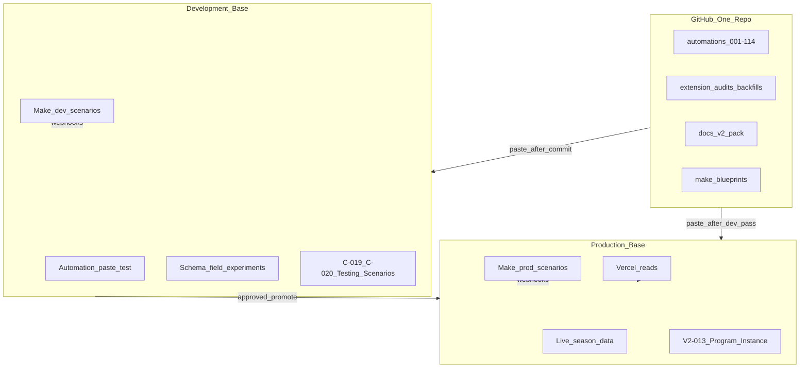

# V2-015 — Development Airtable Base Architecture

**Backlog ID:** V2-015  
**Status:** **Ready — in progress** — `appTetnuCZlCZdTCT`; **not complete** until **066 v3.1** tested in DEV  
**Last updated:** 2026-07-05 (Phase 2 next sequence; OMNI test-flag rejection)

**Setup runbook:** [development-base-setup.md](./development-base-setup.md)

---

## DEV base readiness (2026-07-05)

| Item | Status |
|------|--------|
| Base exists | **Yes** — `appTetnuCZlCZdTCT` |
| Production changed | **No** — scrub and enrollment removal **DEV only** |
| Test enrollments | **6 retained** — Schmidt/testing + **5** additional test enrollments |
| Other enrollments | **Removed from DEV** — all other registered athlete/enrollment records deleted |
| V2-015 complete | **No** — pending **066 v3.1** dev paste + test |

### First testing location (DEV before PROD)

| Work type | DEV first? |
|-----------|------------|
| Automation **066 v3.1** paste | **Yes** — next step (H-002) |
| Automation merge testing | **Yes** |
| Schema changes | **Yes** |
| Extension backfills | **Yes** |
| Testing Scenarios / Schmidt sandbox (C-019, C-020) | **Yes** |
| Make dry-runs | **Yes** — when dev scenarios configured |

Schmidt sandbox in **production** (`Active?` false) remains for small prod smoke tests only — see [testing-and-intake-architecture.md](./testing-and-intake-architecture.md).

### V2-015 completion criteria

| # | Criterion | Status |
|---|-----------|--------|
| 1 | DEV base ID recorded in docs | **Done** |
| 2 | DEV scrubbed to test enrollments only | **Done** (2026-07-05) |
| 3 | Production unchanged | **Confirmed** |
| 4 | **066 v3.1** pasted and tested in DEV | **In progress** — [066 dev deploy checklist](./deploy-checklists/066-v3.1-dev-deploy.md) |
| 5 | Webhook / Make isolation verified | Verify per [development-base-setup.md](./development-base-setup.md) Step 3 |
| 6 | **C-020** **Testing Scenarios** + Testing views on DEV (OMNI); script after field list | **Blocked on OMNI** — after step 4 in next sequence |

**Do not mark V2-015 `done` in backlog until criterion 4 passes.** Criterion 6 is the **next priority DEV build** after 066.

### DEV build sequence (Phase 2 testing priority)

| Order | Work | Status |
|-------|------|--------|
| 1 | **066 v3.1** — paste, audit, sandbox test | **In progress** (H-002) |
| 2 | **C-020** — **Testing Scenarios** table (OMNI) + future script | **Blocked on OMNI field list** |
| 3 | Promotion doc → mirror **Testing Scenarios** to Production | After DEV pass + Mike approval |
| 4 | **C-019** — document enrollment IDs; prod Schmidt smoke optional | With or after C-020 |

See [C-020 — Engineering Test Framework](./testing-and-intake-architecture.md#c-020--engineering-test-framework-testing-scenarios) — **Testing Scenarios** table; script **paused** until OMNI final field list; no test fields on pipeline.

**OMNI rejected (2026-07-05):** No `Is Test Record?`, no `Test Status`, or similar on pipeline tables — [testing-and-intake-architecture.md § OMNI correction](./testing-and-intake-architecture.md#omni-correction--rejected-2026-07-05).

### Phase 2 next sequence (post–Wave 2A planning)

| Step | Action |
|------|--------|
| 1 | **066 DEV audit** + one sandbox test |
| 2 | After DEV pass → Mike decides **066 prod promote** |
| 3 | Approved prod maintenance → delete **112**, retire **043** |
| 4 | Begin **C-020** Engineering Test Framework (**Testing Scenarios** + script after OMNI field list) | DEV |

---

**Related:**

- [v2-014-automation-modernization-roadmap.md](./v2-014-automation-modernization-roadmap.md) — Phase 2; paste automations in dev first
- [testing-and-intake-architecture.md](./testing-and-intake-architecture.md) — C-019 Schmidt enrollment, C-020 Engineering Test Framework
- [v2-change-backlog.md](./v2-change-backlog.md) — V2-013 Program Instance (production multi-year)
- [PROJECT_STATE.md](./PROJECT_STATE.md) — live base IDs
- [deployment-notes.md](./deployment-notes.md) — Vercel / env vars
- [../make/blueprints/README.md](../make/blueprints/README.md) — Make staging clone workflow

---

## Executive recommendation

**Yes.** V2 should include a **permanent Development Airtable base** alongside:

| Layer | Count | Role |
|-------|------:|------|
| **GitHub repository** | **1** | Source of truth for automations, audits, docs, Make blueprint exports |
| **Production Airtable base** | **1** | Live season data; V2-013 Program Instance multi-year history |
| **Development Airtable base** | **1** | Safe sandbox for schema, automation paste, extension writes, Make dry-runs |

This is the **better long-term strategy** than:

- **Forking the GitHub repository** — splits standards, docs, and automation history; solves the wrong problem.
- **Maintaining two production bases** — doubles live ops burden and confuses which base is canonical for parents/coaches.
- **Testing only in production** (Schmidt `Active?` pattern alone) — insufficient for schema changes, destructive backfills, automation slot experiments, and real parent email/webhook paths.

**Dev base + one repo + one production base** is standard platform engineering. It aligns with Phase 2 complexity reduction: *understand and validate before production changes.*

### Locked decisions (owner, 2026-07-05)

| Decision | Choice |
|----------|--------|
| GitHub | **One repo** — no fork for Shooting Challenge V2 |
| Production | **One Airtable base** — no second production base |
| Development | **One permanent DEV base** — clone of prod |
| Schmidt sandbox (C-019) | **Remains** — small production smoke tests only |
| DEV base purpose | Automation paste tests, schema changes, backfills, Make dry-runs, **Testing Scenarios** (C-020) |

---

## Architecture



---

## Comparison matrix

| Strategy | Complexity | Production risk | Fits V2-013 | Fits Phase 2 modernization | Verdict |
|----------|------------|-----------------|-------------|---------------------------|---------|
| **Permanent dev base + 1 prod + 1 repo** | Medium (two base IDs) | **Low** | **Yes** | **Yes** — paste 066, merges, EMC in dev first | **Recommended** |
| **Production-only + Schmidt sandbox (C-019)** | Low | Medium–High | Partial | Partial — good for pipeline rows, not schema/slot work | **Keep as complement**, not replacement |
| **GitHub fork per season/experiment** | High | Medium | No | No — diverging script copies | **Reject** |
| **Two production bases** | High | High (split traffic) | Conflicts | No | **Reject** |
| **Archive + clone replaces prod each year (V2-001)** | High at cutover | Medium | **Superseded** by V2-013 | N/A | **Historical only** |

---

## Tradeoffs

### Benefits

| Benefit | Why it matters |
|---------|----------------|
| **Safe automation deploy** | Paste **066 v3.1**, merges, EMC prototypes without touching live enrollments |
| **Schema experiments** | C-012 Stage K, C-026 Tutorials merge, C-022 Presentation fields — test in dev first |
| **Extension script writes** | `CONFIRM_WRITE` backfills and repairs run against dev before production |
| **Make isolation** | Dev scenarios send to test inboxes / skip Gmail; no parent emails from experiments |
| **Automation capacity testing** | Merge 006+021, retire 112/043 — verify triggers in dev before prod slot changes |
| **OMNI freedom** | Mike can explore formulas/views in dev without production side effects |
| **Audit pack rehearsal** | Stages A–J + 090 on dev matches [v2/08-testing-standards.md](./v2/08-testing-standards.md) pre-season checklist |
| **Single GitHub repo** | No fork drift; dev and prod run the **same** committed script text |

### Costs

| Cost | Mitigation |
|------|------------|
| **Two base IDs** in PAT, docs, Make | Record in [PROJECT_STATE.md](./PROJECT_STATE.md); `.env` / `.env.local` for dev |
| **Schema drift** dev ≠ prod | **Refresh policy** — re-clone or sync schema from prod before major waves (see below) |
| **Double paste** (dev → prod) | Explicit promote checklist; promote **soon after** dev pass — not end-of-project batch ([Structural promote-as-you-go](#structural-promote-as-you-go-permanent-rule)) |
| **Make scenario duplication** | Dev clone of each webhook scenario; blueprint exports in repo name both |
| **Airtable plan limits** | One extra base on workspace — acceptable for national-scale ops |

### What dev base is NOT

- **Not a second production base** — no Fillout intake, no parent-facing web traffic, no close-out audits on dev data
- **Not a substitute for GitHub** — automations still commit to repo first
- **Not where historical seasons live** — production holds V2-013 multi-year history
- **Not Lambda** — stays within Airtable + Make + GitHub stack (consistent with V2-014 deferral)

---

## Structural promote-as-you-go (permanent rule)

> **DEV first. Production soon after approval. Not Production last.**

Approved **structural** changes should be promoted to Production **soon after** they pass DEV testing. Do not wait until the end of Phase 2 or a big launch to update Production schema — batching increases the risk of **missing changes** and **widening dev/prod drift**.

This complements the promotion documentation standard in [doc 04 § Official promotion documentation](./v2/04-ai-development-standards.md#official-promotion-documentation-required): DEV is the lab; GitHub holds the promotion contract; Production receives approved structure **incrementally**, not all at once at project end.

### Workflow

| Step | Action |
|------|--------|
| 1 | **Build/test in DEV** — schema, automations, views, interfaces, config structure |
| 2 | **Confirm result** — audit dry-run, sandbox record, Mike review |
| 3 | **Document exact Production promotion steps** — `docs/deploy-checklists/` ([template](./deploy-checklists/_PROMOTION-STEPS-TEMPLATE.md)) |
| 4 | **Apply approved structural change to Production** — follow the promotion doc only |
| 5 | **Update GitHub docs and `CHANGELOG.md`** — when production-impacting |

**Timing:** After step 2 passes and step 3 is committed, step 4 should happen in the **same wave or the next approved wave** — not deferred to end-of-project.

### Move to Production as we go

Promote these to Production soon after DEV pass + Mike approval:

| Category | Notes |
|----------|-------|
| **Fields** | New columns, link fields, single-select options (when structural) |
| **Formulas** | After plain/link fields exist on prod |
| **Views** | Coach, ops, audit, web-facing view definitions |
| **Interfaces** | Layout and record-detail structure |
| **Automation trigger changes** | Merge, retire, rewire — after dev trigger test |
| **Automation script updates** | Same committed script text as DEV paste |
| **Config table structure** | New columns on Levels, Gates, XP Rules, etc. — not tuning values |

### Do not move until launch / dedicated wave

Hold these in DEV (or docs-only) until an explicit launch or cutover wave with rollback plan:

| Category | Why wait |
|----------|----------|
| **2026–2027 gameplay numbers** | Season-specific; not structural |
| **XP tuning** | Alters live scoring behavior |
| **Level / gate requirements** | Alters progression behavior |
| **New season records** | Program Instance / enrollment rows for go-live |
| **Bulk data imports** | Operational cutover, not schema |
| **Make / Fillout cutovers** | External integration switch — dedicated wave |
| **Changes that could alter historical reporting** | Require rollback plan before prod |

**Rule of thumb:** If it changes **shape** of the base (tables, fields, automations, views), promote as we go. If it changes **live behavior or season data** for athletes/parents, wait for the dedicated wave.

---

## Deployment workflow

### Automations (001–114)

| Step | Environment |
|------|-------------|
| 1. Edit script in GitHub | Repo |
| 2. Commit + review | Repo |
| 3. Paste docblock → end into **dev** automation | Dev base |
| 4. Run matching audit extension (dry-run) on dev | Dev base |
| 5. Test one sandbox record (Schmidt / Testing Scenarios) | Dev base |
| 6. Mike approves promote | — |
| 7. Paste **same** script into **production** automation | Prod base |
| 8. Re-run audit on prod (dry-run) | Prod base |
| 9. `CHANGELOG.md` + [automation-index.md](./automation-index.md) | Repo |

**Wave 2a rule unchanged:** classification in docs does not require prod paste. **Wave 2b+** (e.g. 066 deploy) uses dev-first promote.

### Extension scripts (audits / backfills)

| Type | Dev | Prod |
|------|-----|------|
| Audits (dry-run only) | Always safe | Scheduled audit passes |
| Backfills (`CONFIRM_WRITE`) | **Required first** | Only after dev proves true positive |
| One-time cleanup | Dev rehearsal | Mike-approved prod run |

Category **D** automations ([V2-014](./v2-014-automation-modernization-roadmap.md)) should **never** need production triggers — dev base validates extension behavior.

### Schema / fields / views

Governed by [Structural promote-as-you-go](#structural-promote-as-you-go-permanent-rule): promote structure to prod soon after DEV pass — do not accumulate until project end.

| Change | Workflow |
|--------|----------|
| New field, formula, view | Prototype in **dev** (OMNI or manual) |
| DEV test passed | Confirm result; promote **soon** — same or next approved wave |
| Promotion documented | Cursor writes steps in `docs/deploy-checklists/` ([doc 04 § Official promotion documentation](./v2/04-ai-development-standards.md#official-promotion-documentation-required)) |
| Stage K ownership confirmed | Apply to **prod** using promotion doc only — not from memory |
| Destructive (delete table/field) | Dev only until C-012 sign-off |

Export dev schema snapshots to `airtable/schema/snapshots/` when dev diverges intentionally.

### Web app (`web/`)

| Environment | `AIRTABLE_BASE_ID` |
|-------------|-------------------|
| **Production (Vercel)** | Production base only |
| **Local dev** | Dev base in `.env.local` (optional prod read-only for content QA) |
| **Vercel preview** | Optional dev base — only if preview URLs are private |

Web reads are lower risk than automation writes; **local + dev base** is enough for most UI work.

### Fillout

| Rule |
|------|
| **Production forms** → production base only |
| **Dev forms** (optional) → dev base for intake testing (C-017) |
| Never point production Fillout at dev after go-live |

---

## Make.com impact

Make already documents staging clones ([make/blueprints/README.md](../make/blueprints/README.md): *"Edit scenario in Make dev/staging clone when possible."*

| Scenario type | Production | Development |
|---------------|------------|-------------|
| **070a / 070b** Upload engine | Prod webhook URL in prod automations | Dev webhook URL in dev automations; test Drive folder |
| **074 / 077** Email send | Real Gmail / parent routing | Dev scenario → test inbox or log-only path |
| **071 / 073** Feedback email | Prod | Dev clone; no real parent addresses |

**Blueprint repo:** Each scenario export should note **prod base ID** and **dev base ID** mappings in header comments (not webhook secrets).

**Idempotency:** Dev scenarios must use the same dedupe patterns (C-024) so dev tests predict prod behavior.

---

## Documentation impact

| Doc | Update when V2-015 approved |
|-----|----------------------------|
| [PROJECT_STATE.md](./PROJECT_STATE.md) | Add **Development base** row: name, ID, purpose, refresh date |
| [deployment-notes.md](./deployment-notes.md) | Dev `.env.local` pattern; Vercel stays prod-only |
| [v2/04-ai-development-standards.md](./v2/04-ai-development-standards.md) | Dev-first promote in Phase 3 implementation |
| [v2/08-testing-standards.md](./v2/08-testing-standards.md) | Pre-season checklist targets dev first, then prod |
| [automation-index.md](./automation-index.md) | Note dev/prod paste parity expectation |
| [v2-014-automation-modernization-roadmap.md](./v2-014-automation-modernization-roadmap.md) | Wave 2b+ steps reference dev base |

**New env vars (local / docs only — never commit values):**

```
AIRTABLE_BASE_ID=app...PROD
AIRTABLE_DEV_BASE_ID=app...DEV   # optional; tools/scripts only until wired
```

PAT must include **both** base IDs with appropriate scopes.

---

## Relationship to existing decisions

### V2-013 — Program Instance (production)

Production base holds **all program years** via Program Instance. Dev base may use **one test Program Instance** (e.g. `Shooting Challenge | DEV`) with scrubbed or synthetic rows — not a full copy of every historical enrollment unless needed for a specific audit.

### C-019 / C-020 — Schmidt sandbox (production complement)

| Mechanism | Scope |
|-----------|-------|
| **Schmidt enrollment (`Active?` false)** | Pipeline parity test **inside prod** for a single athlete — still valuable for prod smoke tests |
| **Testing Scenarios (C-020)** | Primary home = **dev base**; script after OMNI field list |
| **Dev base** | Bulk testing, schema work, automation paste, backfills |

**All three coexist.** Dev base reduces reliance on prod for risky work.

### V2-001 archive + clone (superseded)

The old cutover plan used a **temporary clone** for the new season. V2-015 replaces that idea with a **permanent dev clone** that refreshes from prod — not a seasonal production swap.

---

## Dev base refresh policy

Prevent schema drift:

| Trigger | Action |
|---------|--------|
| **Before major Phase 2 wave** (066 deploy, EMC, merge) | Duplicate prod → dev **or** schema export diff |
| **After prod schema change** (Stage K field add) | Mirror to dev within 1 week |
| **After dev structural change approved** | Promote to prod **soon** — do not defer to end of Phase 2 |
| **Quarterly** | Optional full refresh; wipe dev operational data, keep config |
| **Never** | Copy dev schema → prod without review |

Dev operational data (test submissions, XP) can be **truncated freely**. Config tables should track prod unless intentionally experimenting.

---

## Implementation checklist

| # | Task | Owner |
|---|------|-------|
| 1 | Duplicate production base → rename `127SI - SHOOTING CHALLENGE - DEV` | Mike | **Done** |
| 2 | Record dev base ID in [PROJECT_STATE.md](./PROJECT_STATE.md) | Cursor | **Done** — `appTetnuCZlCZdTCT` |
| 3 | Add dev base to PAT scopes | Mike | |
| 4 | Scrub dev: Schmidt + 5 test enrollments; remove all other enrollments | Mike / OMNI | **Done** — prod unchanged |
| 5 | Clone Make scenarios → dev webhooks; document in `make/blueprints/` | Mike | |
| 6 | Paste current automations to dev (parity with prod) | Mike | |
| 7 | **C-020** **Testing Scenarios** + Testing views on **DEV** (OMNI) | OMNI / Mike | **In progress** — script blocked on final field list |
| 8 | Update doc 04 + doc 08 promote workflow | Cursor | **Done** |
| 9 | First use: **066 v3.1** dev paste + audit before prod | Mike / Cursor | **In progress** — [066 dev deploy checklist](./deploy-checklists/066-v3.1-dev-deploy.md) |
| 10 | **C-020** script + DEV test pass | Cursor / Mike | **Blocked** — [checklist](./deploy-checklists/C-020-testing-scenarios-script-checklist.md) |

---

## Decision record

| Date | Decision |
|------|----------|
| 2026-07-05 | **Recommended:** permanent dev base + one GitHub repo + one production base. Reject repo fork and dual production. Schmidt sandbox remains complementary. |
| 2026-07-05 | **Approved** — create Airtable clone (`127SI - SHOOTING CHALLENGE - DEV`). Runbook: [development-base-setup.md](./development-base-setup.md). |

---

## Revision log

| Date | Notes |
|------|-------|
| 2026-07-05 | V2-015 initial architecture evaluation and recommendation |
| 2026-07-05 | Dev base ID recorded: `appTetnuCZlCZdTCT` |
| 2026-07-05 | DEV ready — 6 test enrollments retained; all other enrollments removed; prod unchanged; 066 dev test pending |
| 2026-07-05 | **Structural promote-as-you-go** — DEV first; Production soon after approval; not Production last |
| 2026-07-05 | **C-020 Engineering Test Framework** — **Testing Scenarios** table; script blocked on OMNI field list |
