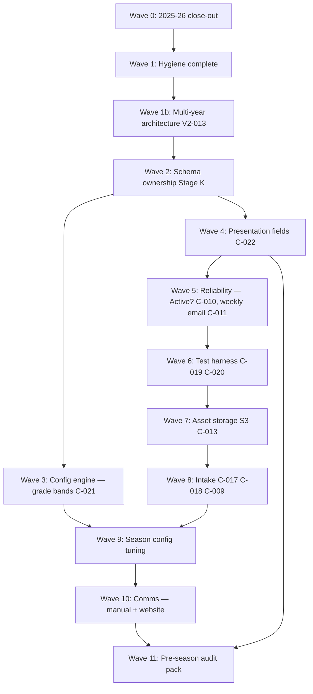

# V2 change backlog — owner request list

**Purpose:** Living list of **everything you want changed** before and during 2026–27 build. Use this to plan **order of work** — some items block others.

**How to use**

1. **Add requests here first** — one row per request, even if rough.
2. Each item gets an **ID** (`C-0xx` from [close-out-considerations.md](./close-out-considerations.md) or new `V2-0xx` below).
3. Note **Depends on** so sequencing stays honest.
4. When ready to implement, pull from this list into a phase — do not start Airtable/production until you approve that phase.
5. AI sessions: read this file + [shooting-challenge-v2-master-direction.md](./shooting-challenge-v2-master-direction.md) before planning work.

**Status key:** `queued` · `planned` · `in-progress` · `done` · `deferred` · `wont-fix`

Last updated: **2026-07-06** (Phase 2B — Engineering Constitution; Wave 2A complete)

---

## Wave status (2026-07-05)

| Wave | Status |
|------|--------|
| **0** — 2025–26 close-out | **Closed** |
| **1** — Hygiene + cutover prep | **Partial** — H-001/H-002 done; V2-001 deferred (see V2-013) |
| **2 — Platform Modernization** | **Current** — **V2-014** automation inventory + capacity roadmap |
| **2+ (schema/features)** | Queued per dependency table below |

**Do not start V2-013 (Program Instance) until its dedicated architecture wave is approved.**

---

## Dependency waves (suggested build order)

Higher waves assume lower waves are stable. **Nothing ships to production until you approve the wave.**

| Wave | Focus | Why this order |
|------|--------|----------------|
| **0** | Finish 2025–26 | **Closed 2026-07-05** |
| **1** | Post-close hygiene (H-001, H-002) | H-001/H-002 **done**; finish V2 roadmap before V2-013 |
| **1b** | **V2-013** Program Instance multi-year architecture | One base, multiple years; config + operational scoping; **do not start until approved wave** |
| **2** | **C-012** Stage K; **C-024** dedupe standard; **C-026** Tutorials table merge | Schema cleanup before new fields or storage |
| **3** | **C-021** grade bands — link-based matching | Must work before tuning **XP Reward Rules** (Wave 9) |
| **4** | **C-022** public display fields | Schema + automations; affects **071**, **072**, web |
| **5** | **C-010**, **C-011**, **066** Airtable deploy | Production safety + automation before heavy testing |
| **6** | **C-019**, **C-020** test sandbox + **Testing Scenarios** | **C-020 DEV functional complete** (115 v1.3; Tests A–D + E/F/G); C-019 Testing views partial; needed before S3 cutover |
| **7** | **C-013** AWS S3 canonical URLs; **C-023** file content hash dedup | **C-013 repo closeout complete / activation pending** — PROD Lambda + Make manual route PASS; secret rotation + one Airtable-triggered Schmidt test remain. **C-023 deferred separately.** |
| **8** | **C-017**, **C-018**, **C-009** intake | Fillout + Weeks + HW17 quiz — after storage model is clear |
| **9** | Levels, gates, XP rules; **C-025** Zoom recording attendance | Config tuning + fair gate path for missed live Zoom |
| **10** | Game manual, `/shoot` hub; **C-027** major-event notifications (SMS TBD) | Comms + optional real-time athlete alerts |
| **11** | Full audit pack + dry-run season | Gate before May 2027 |

---

## Full backlog (all owner requests)

### Wave 0 — 2025–26 close-out (**closed**)

| ID | Request | Detail | Depends on | Status |
|----|---------|--------|------------|--------|
| **C-001** | Restore Lyle Kimm excluded shots | ~300 shots restored; Count It set; XP counted | — | **done** |
| **C-002** | Final summary emails | All families sent via **074** / Make | C-001 optional | **done** |
| **C-003** | Koen HW17 (Final Reflection) coach review + parent email | Graded + **071** email sent **2026-07-05** | — | **done** |
| **C-008** | Turn off Fillout daily form | Form **OFF** **2026-07-05** | — | **done** |

### Wave 1 — Post-close hygiene

| ID | Request | Detail | Depends on | Status |
|----|---------|--------|------------|--------|
| **V2-001** | Archive 2025–26 base; clone for 2026–27 | **Superseded** by **V2-013** (one base + Program Instance). Doc kept: [base-cutover](./shooting-challenge-v2-base-cutover.md) | Wave 0 | **deferred** |
| **H-001** | Fix 090F achievement unlock audit | Audit v1.1 — shot milestones on Milestone Source Key; other on Enrollment+Achievement+Week; **0 data deletes** | Wave 0 | **done** |
| **H-002** | **066** v3.2 V2 rewrite + Week write | GitHub `36a2e95`; DEV verified (Easton Hill idempotency + clean-create); **PROD pasted** v3.2 2026-07-06 (`appn84sqPw03zEbTT`); monitor first natural run | Wave 0 | **done** |
| **H-003** | Award Recipients scope metadata | Accepted for 2025–26; optional cleanup | — | deferred |
| **H-004** | Awards catalog duplicate bucket | `thanks_for_playing` class | — | deferred |

### Wave 1b — Multi-year architecture (dedicated wave — do not start now)

| ID | Request | Detail | Depends on | Status |
|----|---------|--------|------------|--------|
| **V2-013** | **Multi-Year Architecture — Program Instance Integration** | One Airtable base supports multiple program years. **Program Instance** (org table, e.g. `Shooting Challenge \| 2025-2026`) scopes config + operational tables. Historical data stays accurate; config changes must not alter historical reports. Scope: Program Instance links on config tables (Shot Milestones, Levels, Level Gate Rules, XP Reward Rules, Achievements, Weeks, Awards) + operational tables (Enrollments, Submissions, etc.); automation filters; views; interfaces; multi-year reporting. **Investigation 2026-07-05:** read-only review — no records modified; 2026–2027 config already mixed with production — requires dedicated wave, not incremental edits. **Recommendation:** finish planned V2 roadmap first; return when schema/multi-year wave is scheduled. | Wave 1 hygiene, C-012 partial | **queued** |

### Wave 2 — Platform Modernization (automation inventory & capacity) — **current**

| ID | Request | Detail | Depends on | Status |
|----|---------|--------|------------|--------|
| **V2-014** | **Automation Modernization Roadmap** | Master inventory: Category A–F, four-axis evaluation, Complexity Score ([doc 06](./v2/06-automation-standards.md)), modernization priority. **Goal:** reduce complexity first; capacity recovery secondary. **066 v3.1** = V2 reference. **112 OFF**; **013** production. No rewrites until wave approved. | Wave 0, H-002 | **done** (doc) |
| **V2-014a** | Wave 2A — classify all automations | **Planning complete** (2026-07-05) — classification, patterns, Mike decisions; ChatGPT review accepted. **Implementation not complete** — no rewrites/merges/retirements executed. Retirements **approved:** **112**, **043** (pending maintenance window) | V2-014, V2-015 | **planning done** |
| **V2-014c** | Phase 2B — engineering documentation | **Done** (2026-07-06) — [ENGINEERING_CONSTITUTION.md](./ENGINEERING_CONSTITUTION.md), SCRIPT+CONFIG header standard, [phase-2b review](./phase-2b-engineering-review-2026-07-06.md). **No code / no Airtable changes** | V2-014a | **done** (doc) |
| **V2-014b** | Email Message Center (EMC) | Replace **071, 072, 073, 074, 075, 076, 077** with builder + sender automations | V2-014, C-011 | queued |
| **V2-015** | **Permanent Development Airtable base** | **Ready** — `appTetnuCZlCZdTCT`; 6 test enrollments; 066 v3.2 DEV verified + PROD deployed; first test env for merges/schema/backfills/Testing Scenarios/Make | V2-014 | **done** |

Primary doc: [v2-014-automation-modernization-roadmap.md](./v2-014-automation-modernization-roadmap.md) · Dev base: [v2-015-development-base-architecture.md](./v2-015-development-base-architecture.md)

### Wave 2 — Schema, field ownership & dedupe engine

| ID | Request | Detail | Depends on | Status |
|----|---------|--------|------------|--------|
| **C-012** | Stage K — every field has one writer | Field ownership matrix; hide/delete legacy; update field-map | V2-013 | queued |
| **C-026** | Merge **Tutorials** vs **Tutorials & Assets** — keep one, delete duplicate | Two tables with overlapping purpose (~same fields: video link, type, program, descriptions, thumbnails, publish flag). **Repo today:** **`Tutorials`** is live — web `/tutorials`, `/shoutouts`, `/articles` reads `Web - Tutorials Catalog` (`web/lib/airtable/queries.ts`). **`Tutorials & Assets`** is **not** referenced in automations or web; weaker schema (e.g. `Athlete` as hardcoded single-select, multiline video link vs URL). **Work:** row-count + field diff audit → migrate any unique rows → repoint views/interfaces → delete orphan table on 2026–27 clone. Relates to **C-012**, **C-013** (attachments on tutorial images). | C-012 | queued |
| **C-024** | Rock-solid dedupe keys + safe backfill reruns | **Duplicates caught instantly** at every layer — Submissions (**007**), Submission Assets, Homework Completions, XP Events (**Source Key** / **XP Dedupe Key**), achievements. One canonical key per source record; automations + extension backfills **idempotent** — rerunning a repair/backfill must **never** create doubles or corrupt rollups. Audit all writers; document key patterns in engine contract. | C-012 | queued |
| **C-014** | One ladder, spread gates early | **DECIDED** — tune in config Q1 2027, not in docs | C-021, Wave 9 | resolved |

### Wave 3 — Configuration engine (grade bands)

| ID | Request | Detail | Depends on | Status |
|----|---------|--------|------------|--------|
| **C-021** | Grade bands propagate automatically | Grade Bands table = source of truth; **no hardcoded band strings** in scripts; match XP rules by **linked Grade Band**, not `normalizeGradeBandForRule()`. Renaming bands must not break automations or XP Reward Rules. | C-012 (field map) | queued |
| **V2-002** | Config-over-scripts audit | Grep all automations for hardcoded XP amounts, level names, band strings; move to tables per [config-vs-code](./shooting-challenge-v2-config-vs-code.md) | C-021 | queued |

### Wave 4 — Presentation layer (public display)

| ID | Request | Detail | Depends on | Status |
|----|---------|--------|------------|--------|
| **C-022** | Public display fields — not primary/formula | Parents/emails/web use **short Presentation labels only** — never `record.name` / primary field fallback. Example: homework email col 2 should be **Assignment Title**, not **Assignment Full Name** formula. Extend to Weeks (`Week Label - Public`), video/zoom titles. | C-012 | queued |
| **V2-003** | Homework email column fix (**071**) | Remove `homeworkRecord.name` fallback; use Presentation field only | C-022 | queued |
| **V2-004** | Weekly email homework table (**072**) | Same Presentation rule for homework name column | C-022 | queued |

### Wave 5 — Reliability & automation

| ID | Request | Detail | Depends on | Status |
|----|---------|--------|------------|--------|
| **C-010** | Harden `Active?` on Enrollments | Inactive = fully out of XP, emails, summaries, streaks — not just leaderboard | V2-013 partial | queued |
| **C-011** | Fully automatic weekly parent emails | No `Build Weekly Email Now?` / `Send to Make?`; scheduled 072→074 | C-010, C-022 | queued |
| **C-006** | 090F duplicate unlock prevention | Root cause was audit dedupe key — **fixed in H-001**; **066** v3.1 prevents empty Week going forward | H-002 | **done** |

### Wave 6 — Testing & sandbox

| ID | Request | Detail | Depends on | Status |
|----|---------|--------|------------|--------|
| **C-019** | Schmidt test enrollment | `Active?` = false for standings only; **no test flags** on pipeline rows; **Testing** views on 8 pipeline tables — [manual UI checklist](./deploy-checklists/C-019-testing-views-verification-checklist.md) | C-010 partial | queued |
| **C-020** | **Engineering Test Framework** | **115 v1.3 DEV functional complete** — Tests A–D + functional live E/F/G (Daily, Video 2-file, Homework 2-file). [Checklist](./deploy-checklists/C-020-testing-scenarios-script-checklist.md), [upload workflow](./upload-workflow-homework-video.md). **Not tested:** Homework XP, Make/S3, combined HW+Video. Production paste pending. | C-019, V2-013 | **DEV functional complete** |
| **C-020a** | C-020 Homework branch (115 v1.1) | Tests A/B PASS on DEV | C-020 | **done (DEV)** |
| **C-020b** | C-020 Video branch (115 v1.3) | Tests C/D PASS; Intake Attachments → Video Upload | C-020a | **done (DEV)** |

### Wave 7 — Asset storage

| ID | Request | Detail | Depends on | Status |
|----|---------|--------|------------|--------|
| **C-013** | AWS S3 canonical URLs | **PROD Lambda + Make manual route PASS (2026-07-11)** on Schmidt asset `recGQ8EjAMz3bEBiW`: upload + independent writeback probe + idempotency + invalid route all PASS. Sanitized blueprint, tests, runbooks, and closeout docs committed. **070b remains OFF.** Remaining definition-of-done gates: rotate exposed PROD upload secret (AWS/Make/local), re-smoke, verify 070b v4.2 + isolation view, and one Mike-approved Airtable-triggered Schmidt test. Attachment retirement/hash-dedup expansion is **C-023**, not C-013. | C-012, C-020 | **repo complete / activation pending** |
| **C-023** | File dedup by **content hash**, not title/filename | **Stage 4C** PASS · **4D-R** Parts A–E PASS · **H3b–H3p** matrix **16/16 PASS** · **Stage 5 DEV complete** — automation **116** (`992677d`) live validated: S5 **12/12 PASS**; confirm + reversal PASS on `recF86pJTIMFoEypJ` / XP `recx2MvUh2WP0tbjO` (same row restored; no duplicate XP); retired **008** slot-neutral. Prod paste pending. | C-013, C-024 | **in progress** |
| **C-013-SEC** | Rotate DEV Lambda/Airtable secrets after validation | **Done (2026-07-09)** — PAT + `UPLOAD_WEBHOOK_SECRET` rotated; Lambda env synced; HTTP verify PASS. Exposed PAT revoked in Airtable UI. Script: `tools/airtable/c013_dev_rotate_secrets.py` | C-013 | **done** |

### Wave 8 — Intake & calendar

| ID | Request | Detail | Depends on | Status |
|----|---------|--------|------------|--------|
| **C-017** | Fillout → Athletes validation | Stronger Fillout rules; Athletes field hygiene; trust identity before pipeline | C-012 | queued |
| **C-018** | Intake open vs challenge run | Two calendars in **Weeks** table; **005** maps by date range | V2-013 | queued |
| **C-009** | Redo HW17 Fillout quiz intake (no attachment today) | **067** creates Homework Completion **without** Submission Asset / attachment — breaks coach views, **020**, **070**, **071**, satisfactory path (see C-003). **Owner:** pursuing Fillout.com **attachment export** for quiz PDF. **V2 paths:** (A) PDF attachment → normal file pipeline (preferred if Fillout delivers); (B) attachment-less dual path with explicit schema + automation redesign. Fix **Final Reflection Quiz Submissions** table + **067** + related views regardless. | C-013, C-024 | queued |

### Wave 9 — Season config (numbers)

| ID | Request | Detail | Depends on | Status |
|----|---------|--------|------------|--------|
| **V2-005** | Tune Level Gate Rules | Spread gates early (e.g. 1 HW past level 1); numbers in Airtable only | C-021, V2-013 | queued |
| **V2-006** | Tune XP Reward Rules | Per-band rules via **links**; streak economics review (**053**) | C-021 | queued |
| **V2-007** | Tune Levels table | Thresholds for 2026–27 | V2-005 | queued |
| **C-025** | Zoom **recording** attendance — partial credit path | Legitimate misses happen; kids should not be **fully blocked** from higher levels for one missed live Zoom. **Today:** **101** awards live **Attendees** only; docblock mentions supplemental re-run when staff manually add attendees after live award — **no parent-facing recording-watch flow**, no separate XP amount for recording. **Target:** defined alternative when athlete watches **Zoom recording** — e.g. lower XP via **XP Reward Rules**, counts toward **Level Gate Rules** zoom requirement at reduced weight (config, not script constants). Needs intake/attestation (form or coach confirm) + **Source Key** so live + recording cannot double-award. | C-024, V2-006, V2-005 | queued |

### Wave 10 — Communication & website

| ID | Request | Detail | Depends on | Status |
|----|---------|--------|------------|--------|
| **V2-008** | Game manual | Published from config tables before Day 1 | Wave 9 | queued |
| **V2-009** | `/shoot` rules + progress hub | Website mirrors config; not rankings-only | Wave 9, C-022 | queued |
| **V2-010** | Pre-season parent comms | Rules explained before first submission | V2-008 | queued |
| **C-027** | **Major-event** notifications — level up, milestones (not daily XP) | **Today:** parent comms are **email** via Make (**071**, **072**, **074**) — batch/weekly or coach-triggered; **no instant athlete alert** on level change (**041** → **042**) or achievement unlock (**059**, **066**). **Owner idea:** notify kids **immediately** on meaningful events (level up, shot milestone, perfect week, gate cleared) — **not** every daily submission. **Possible channel:** SMS/text — **`Athlete Cell Number`** / **`Parent Cell Number`** exist on Enrollments/Athletes. **TBD discussion:** Twilio vs Make vs other; parent vs athlete recipient; opt-in/consent; quiet hours; message templates; idempotent send key (**C-024**); web push later. | C-010, C-024, V2-008 | queued |
| **V2-028** | **Generate Media Kits** — end-of-season publicity from Airtable | **2025–26 manual phase done** — 10 newspaper packets + 12 radio kits sent **2026-07-05**. Platform automation (config-driven generate) remains future work. | C-013, C-022, Wave 0 close-out | **done** (2025–26) / queued (platform) |

### Wave 11 — Launch gate

| ID | Request | Detail | Depends on | Status |
|----|---------|--------|------------|--------|
| **V2-011** | Full pre-season audit pack | Stages A–J + new audits (grade bands, Presentation fields, S3) | All above | queued |
| **V2-012** | Dry-run season on Schmidt test | Full pipeline on clone before enrollment wave | C-020, Wave 7–9 | queued |

---

## Engine principles — deduplication & idempotency (C-023, C-024)

**Owner intent:** Duplicates are caught **instantly** at intake — not repaired weeks later. Backfills are **safe to rerun**.

### Today vs target

| Layer | Today | Gap | Target (C-023 / C-024) |
|-------|--------|-----|------------------------|
| **Submissions** | **007** — `Duplicate Key` from enrollment + date + shot stats | Same stats, different intent; no file awareness | Keep stat key; add file-hash cross-check when attachments present |
| **Submission Assets** | **009** — skip if same `sourceAttachmentId` on same submission | Re-upload same bytes, new attachment id / filename passes | **`File Content Hash` (SHA-256)** at upload; same-enrollment contextual match → **manual review** (never auto-block/reuse object) — [C-023 policy](./deploy-checklists/C-023-production-duplicate-policy.md) |
| **Homework Completions** | Partial keys / manual duplicates (C-004) | Re-submits create multiple rows | One completion key per enrollment + assignment + week |
| **XP Events** | **Source Key** + **XP Dedupe Key** formula | Some paths weak; backfills risky | Document every **Source Key** pattern; create = recheck key first (**010**, **065**, **101**, **114**) |
| **Achievements** | **066** duplicate unlocks (H-001) | Audit fixed — not data; **066** v3.1 idempotent Source Key + Week write |
| **Backfill extensions** | Mixed — some `CONFIRM_WRITE`, uneven idempotency | Fear of re-running | Standard: dry-run default; writes skip unchanged; **Source Key** guard on every create |

### File hash (C-023)

- Fields exist on **Submission Assets**: `File Content Hash`, `File Hash Algorithm` (incl. **Exact SHA-256 Hash**).
- Wire hash computation at upload (Lambda); store algorithm on row.
- **Never** dedupe on filename/title alone.
- **Never** auto-reuse another asset's S3 object — flag same-enrollment contextual reuse for Mike's review queue.

### Safe backfills (C-024)

- Every repair/backfill extension: **find-by-key → skip if exists → create if missing**.
- Rerunning after partial failure must be **boring** — no double XP, no duplicate assets, no duplicate emails.
- Add audit: `audit-dedupe-key-coverage.js` (dry-run) before 2026–27 launch.

### HW17 quiz / no attachment (C-009)

- **067** path bypasses asset pipeline — tables/views assume attachment.
- **Preferred:** Fillout exports **PDF attachment** → normal **009 → 020 → 070** path.
- **Fallback:** explicit attachment-less schema (bigger change); do not leave hybrid broken state.

### Zoom recording attendance (C-025)

- Live path: **101** + `Attendees` link → full zoom XP + gate credit.
- Recording path (design TBD): attest watch → partial XP (config in **XP Reward Rules**) + partial gate credit (**Level Gate Rules**).
- **101** already supports supplemental attendee add after live award — extend into **first-class recording workflow**, not manual-only ops.
- **Source Key** must distinguish `ZOOM_LIVE` vs `ZOOM_RECORDING` for same meeting + enrollment.

---

## New components — content & notifications (C-026, C-027)

### Tutorials table consolidation (C-026)

| Table | Status in repo | Recommendation (pending audit) |
|-------|----------------|--------------------------------|
| **Tutorials** | **Production** — web catalog, 13 fields, `Tutorial Type` multi-select | **Keep** as canonical content table |
| **Tutorials & Assets** | Schema only — no code references; duplicate field set | **Candidate to retire** after row migration |

**Decision checklist:** Which table has more/current rows? Any Softr/interface views still on `Tutorials & Assets`? After **C-013**, consolidate image fields to canonical URL pattern on the surviving table.

### Major-event notifications (C-027)

**In scope (discuss):**

| Event | Likely trigger | Not in scope |
|-------|----------------|--------------|
| Level up / gate cleared | **042** level assignment change | Daily shooting XP (**010**) |
| Shot milestone unlock | **066** → **059** | Homework submitted |
| Streak milestone | **054** | Routine coach feedback |
| Perfect week | **058** | Weekly summary email (stays email) |

**Open questions for owner:**

1. Text **athlete** cell, **parent** cell, or both?
2. Provider: Twilio, Make SMS module, other?
3. Opt-in on enrollment form?
4. Same message for test enrollment (**C-019**)?

---

## Owner requests — append new rows here

*Copy a blank row when you think of something new. We'll assign an ID and slot it into a wave.*

| ID | Wave | Request (your words) | Detail | Depends on | Added | Status |
|----|------|----------------------|--------|------------|-------|--------|
| *(new)* | ? | | | | | queued |

### Recent captures (2026-07-04)

| ID | Your request | Captured as |
|----|--------------|-------------|
| — | Grade bands should auto-propagate; changing bands may break automations + XP Reward Rules | **C-021** |
| — | Public display should use exactly what you need — not primary/formula (homework email) | **C-022**, **V2-003**, **V2-004** |
| — | Keep adding to fix list before start so order of change is right | **This document** |
| — | Duplication checking on file **HASH**, not just title | **C-023** |
| — | Fix HW17 quiz table / **067** — no attachment; trying to get Fillout to add attachment | **C-009** (updated) |
| — | Dedupe keys rock solid beginning to end; duplicates caught instantly | **C-024** |
| — | No danger rerunning backfill scripts | **C-024** |
| — | Plan if kid misses live Zoom but watches recording — partial attendance/XP so gates stay fair | **C-025** |
| — | Two duplicate tables: **Tutorials** and **Tutorials & Assets** — pick one, delete the other | **C-026** |
| — | Notify kids immediately on level up / milestones (not daily submissions); maybe SMS via cell number | **C-027** |
| — | Publicity / media kits as permanent platform feature; `media/` folder + Generate Media Kits | **V2-028** |

---

## Cross-reference index

| Topic | Primary doc |
|-------|-------------|
| Watchlist IDs C-001–C-027 | [close-out-considerations.md](./close-out-considerations.md) |
| Grade bands + public display detail | [platform-config-improvements.md](./platform-config-improvements.md) |
| Testing / intake C-017–C-020 | [testing-and-intake-architecture.md](./testing-and-intake-architecture.md) |
| Upload workflow (homework + video) | [upload-workflow-homework-video.md](./upload-workflow-homework-video.md) |
| S3 assets C-013 | [asset-storage-migration.md](./asset-storage-migration.md) |
| Locked season decisions | [shooting-challenge-v2-master-direction.md](./shooting-challenge-v2-master-direction.md) |
| Config vs code | [shooting-challenge-v2-config-vs-code.md](./shooting-challenge-v2-config-vs-code.md) |
| Post-close hygiene H-001–H-004 | [post-close-hygiene-2025-26.md](./post-close-hygiene-2025-26.md) |
| Multi-year Program Instance V2-013 | [v2-change-backlog.md](./v2-change-backlog.md) § Wave 1b |
| Automation V2 standard (066 v3.1) | [v2/06-automation-standards.md](./v2/06-automation-standards.md) |
| Testing — fix the audit, not the data | [v2/08-testing-standards.md](./v2/08-testing-standards.md) |
| Media kits V2-028 | [media-kits.md](./media-kits.md), [../media/2025-2026/future-enhancements/ROADMAP.md](../media/2025-2026/future-enhancements/ROADMAP.md) |

---

## Revision log

| Date | Notes |
|------|-------|
| 2026-07-05 | Wave 0 closed; H-001 audit fix; H-002 066 v3.1 V2 standard; V2-013 Program Instance queued; V2-001 deferred; V2-028 2025–26 media done |
| 2026-07-04 | C-026 Tutorials table merge; C-027 major-event SMS notifications (discussion) |
